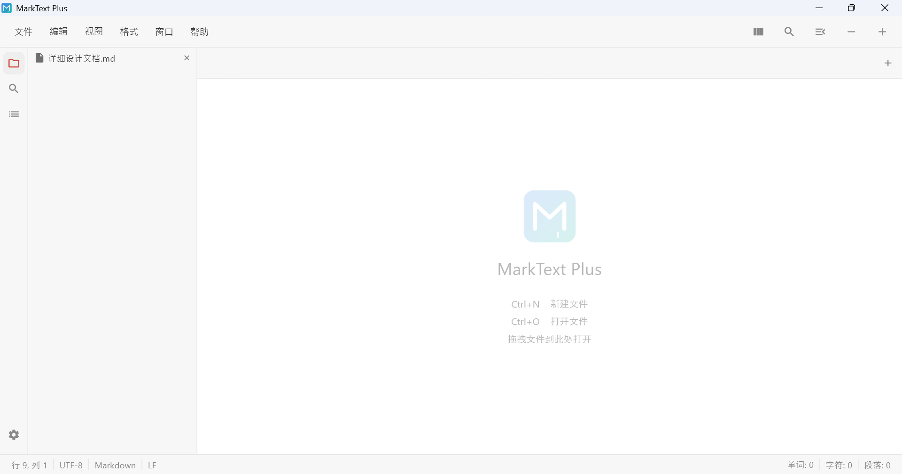

<div align="center">

# MarkText Plus

**A lightweight, cross-platform Markdown editor that makes writing a pleasure**

[](https://github.com/yourusername/marktext-plus/releases)
[](LICENSE)
[](https://flutter.dev)
[](https://github.com/yourusername/marktext-plus)

[简体中文](docs/i18n/README_zh-CN.md) | [日本語](docs/i18n/README_ja-JP.md) | [한국어](docs/i18n/README_ko-KR.md) | [Deutsch](docs/i18n/README_de-DE.md) | [Français](docs/i18n/README_fr-FR.md) | [Italiano](docs/i18n/README_it-IT.md) | [Русский](docs/i18n/README_ru-RU.md) | [Español](docs/i18n/README_es-ES.md) | [Português](docs/i18n/README_pt-PT.md) | [العربية](docs/i18n/README_ar-SA.md) | [Português (Brasil)](docs/i18n/README_pt-BR.md)



</div>

---

## 💡 What is MarkText Plus?

MarkText Plus is a **modern Markdown editor** reimagined from the original [MarkText](https://github.com/marktext/marktext), rebuilt with Flutter for true cross-platform support. It solves the pain points of traditional Markdown editors:

- ❌ Heavy and slow startup times → ✅ **Lightning-fast** with self-built parser
- ❌ Limited theme options → ✅ **5 beautiful themes** (light & dark)
- ❌ Poor cross-platform experience → ✅ **Native performance** on Windows, macOS, Linux
- ❌ Complex setup → ✅ **3 commands to get started**

## 🚀 Quick Start

Get up and running in less than 30 seconds:

```bash
git clone https://github.com/yourusername/marktext-plus.git
cd marktext-plus/code
flutter pub get && flutter run
```

That's it! The editor will launch with a sample document ready to edit.

## ✨ Features

| Feature | Description |
|---------|-------------|
| **📝 Three Edit Modes** | Source code with syntax highlighting, live preview, and split-view |
| **🎨 5 Beautiful Themes** | Red Graphite, Shibuya, Dark Graphite, Dieci OLED, Nord |
| **🌍 12 Languages** | English, Chinese, Japanese, Korean, German, French, Italian, Russian, Spanish, Portuguese, Arabic, Brazilian Portuguese |
| **⚡ Lightning Fast** | Self-built Markdown parser & renderer — no heavy dependencies |
| **🔍 Find & Replace** | Full-featured search with regex support |
| **📂 File Tree** | Sidebar navigation with drag-and-drop folder support |
| **⌨️ Customizable Shortcuts** | Fully configurable keyboard bindings |
| **💾 Auto Save** | JSON-based persistent configuration, never lose your work |

## 🎨 Themes

<table>
  <tr>
    <td align="center"><b>Red Graphite</b><br/></td>
    <td align="center"><b>Shibuya</b><br/></td>
  </tr>
  <tr>
    <td align="center"><b>Dark Graphite</b><br/></td>
    <td align="center"><b>Dieci OLED</b><br/></td>
  </tr>
  <tr>
    <td align="center" colspan="2"><b>Nord</b><br/></td>
  </tr>
</table>

## 📦 Installation

### Download Pre-built Binaries

Download the latest release for your platform from [Releases](https://github.com/yourusername/marktext-plus/releases).

| Platform | Architecture | Format |
|----------|-------------|--------|
| Windows | x64 | `.exe` installer |
| macOS | ARM64 | `.dmg` |
| Linux | x64 / ARM64 | `.deb` / `.rpm` |

### Build from Source

> **Prerequisites**: Flutter 3.x+, Dart 3.x+

```bash
git clone https://github.com/yourusername/marktext-plus.git
cd marktext-plus/code
flutter pub get && flutter run
```

<details>
<summary><b>Release Build Commands</b></summary>

```bash
# Windows
flutter build windows

# macOS
flutter build macos

# Linux
flutter build linux
```
</details>

<details>
<summary><b>macOS Users: Bypass Unsigned App Warning</b></summary>

> macOS may show "Apple couldn't verify MarkText Plus..." warning. After dragging to Applications:
>
> ```bash
> xattr -cr /Applications/MarkText\ Plus.app
> sudo codesign --force --deep --sign - /Applications/MarkText\ Plus.app
> ```
</details>

## 🏗️ Architecture

```
code/lib/
├── main.dart           # Entry point
├── app.dart            # MaterialApp with theme/locale/i18n binding
├── core/               # Theme tokens, config, i18n (12 languages)
├── models/             # TabInfo, FileNode
├── services/           # Markdown parser, file I/O, keybinding
├── providers/          # Riverpod state management
└── ui/
    ├── editor/         # Source editor, preview renderer, split view
    ├── screens/        # Home, Settings
    └── widgets/        # Menu bar, sidebar, tab bar, status bar
```

Four-layer architecture: **UI** → **State** (Riverpod) → **Service** → **Platform**

### Running Tests

```bash
cd code && flutter test
```

## 🤝 Contributing

Contributions are welcome! Please feel free to submit a Pull Request.

1. Fork the repository
2. Create your feature branch (`git checkout -b feature/amazing-feature`)
3. Commit your changes (`git commit -m 'Add amazing feature'`)
4. Push to the branch (`git push origin feature/amazing-feature`)
5. Open a Pull Request

## 📄 License

MIT License - see [LICENSE](LICENSE) for details.

Based on [MarkText](https://github.com/marktext/marktext) by Luo Ran and contributors.

## 🙏 Acknowledgments

- [MarkText](https://github.com/marktext/marktext) — the original project that inspired this editor
- [Flutter](https://flutter.dev) — the cross-platform framework
- All open source libraries used in this project
