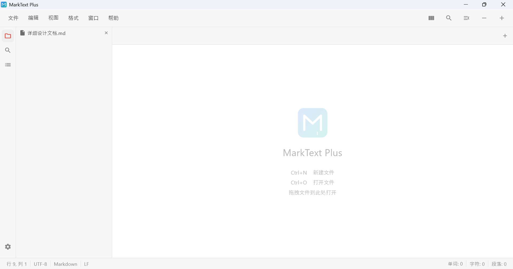
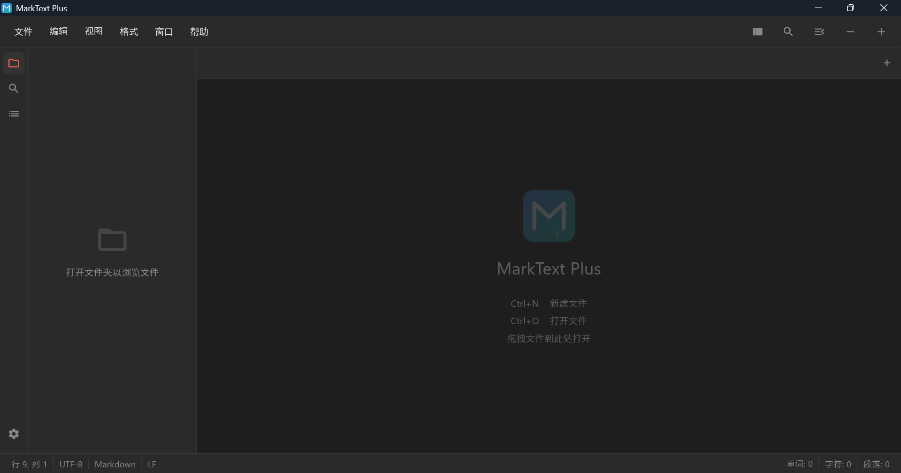
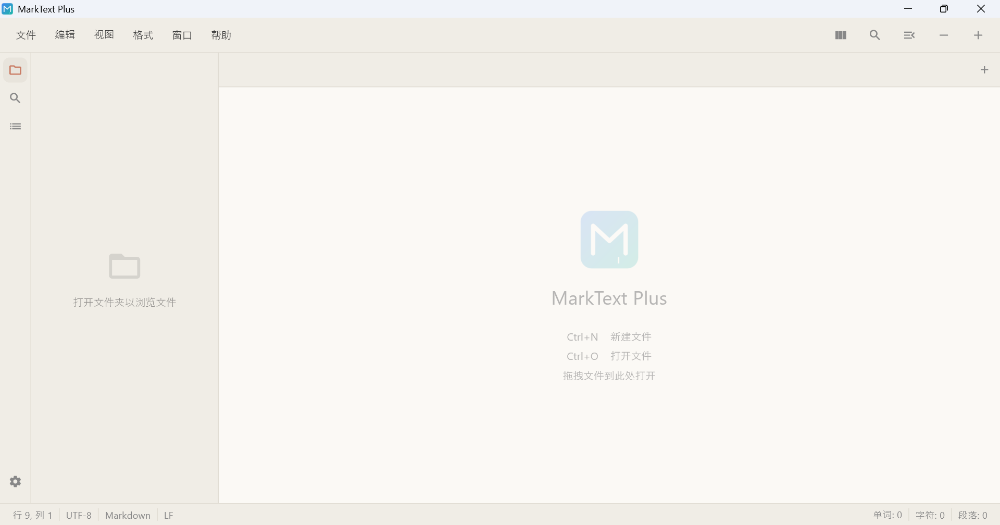
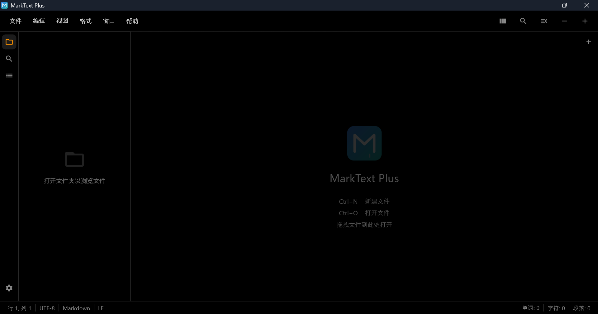
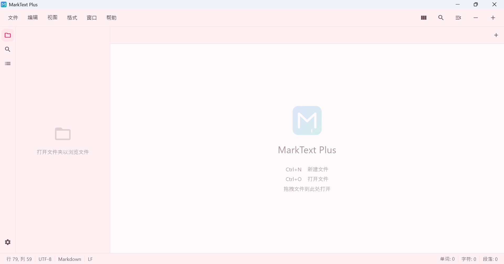
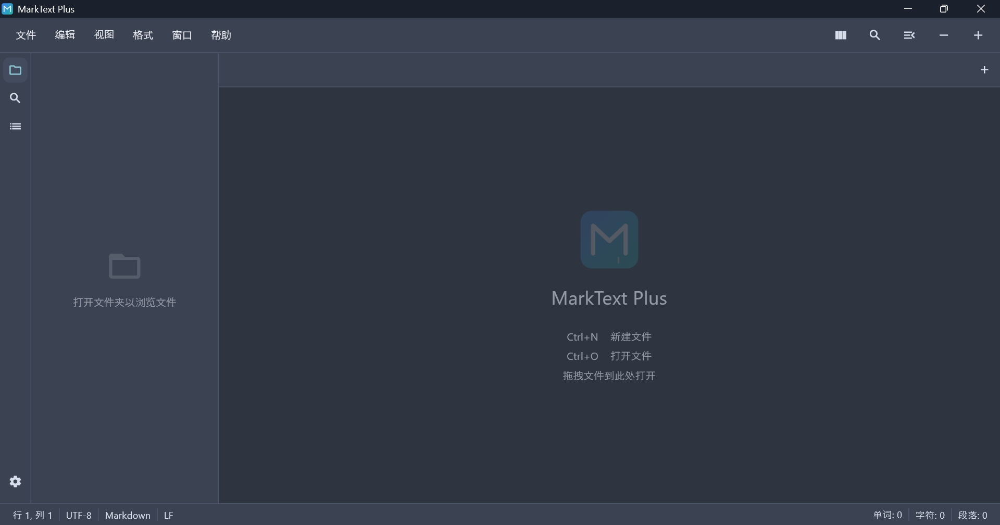
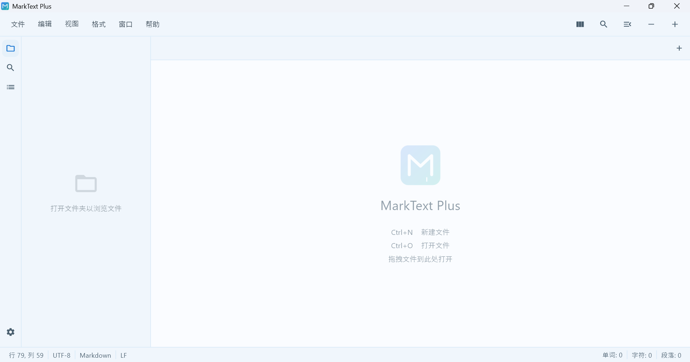
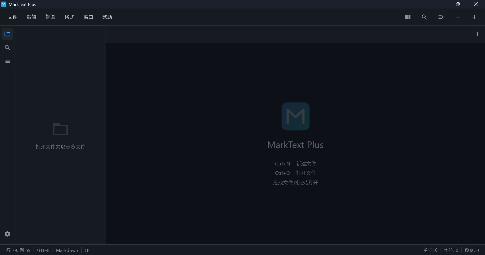

<div align="center">

# MarkText Plus

**A lightweight, cross-platform Markdown editor that makes writing a pleasure**

[](https://github.com/marktext-plus/marktext-plus/releases)
[](LICENSE)
[](https://flutter.dev)
[](https://github.com/marktext-plus/marktext-plus)

[简体中文](docs/i18n/README_zh-CN.md) | [日本語](docs/i18n/README_ja-JP.md) | [한국어](docs/i18n/README_ko-KR.md) | [Deutsch](docs/i18n/README_de-DE.md) | [Français](docs/i18n/README_fr-FR.md) | [Italiano](docs/i18n/README_it-IT.md) | [Русский](docs/i18n/README_ru-RU.md) | [Español](docs/i18n/README_es-ES.md) | [Português](docs/i18n/README_pt-PT.md) | [العربية](docs/i18n/README_ar-SA.md) | [Português (Brasil)](docs/i18n/README_pt-BR.md)



</div>

---

## 💡 What is MarkText Plus?

MarkText Plus is a **modern Markdown editor** reimagined from the original [MarkText](https://github.com/marktext/marktext), rebuilt with Flutter for true cross-platform support. It solves the pain points of traditional Markdown editors:

- ❌ Heavy and slow startup times → ✅ **Lightning-fast** with a self-built parser and renderer
- ❌ Diagrams need an embedded browser → ✅ **22 Mermaid diagram types drawn in pure Dart**, no WebView
- ❌ Limited theme options → ✅ **8 beautiful themes** (light & dark)
- ❌ Poor cross-platform experience → ✅ **Native performance** on Windows, macOS, Linux
- ❌ Complex setup → ✅ **3 commands to get started**

Staying light is a standing constraint, not a launch slogan: 22 direct dependencies,
no embedded browser, no editor framework. The parser, the renderer, the syntax
highlighter and the diagram engine are all written here.

## 🚀 Quick Start

Get up and running in less than 30 seconds:

```bash
git clone https://github.com/marktext-plus/marktext-plus.git
cd marktext-plus/code
flutter pub get && flutter run
```

That's it! The editor will launch with a sample document ready to edit.

## ✨ Features

### Editing

| Feature | Description |
|---------|-------------|
| **📝 Three Edit Modes** | Source with syntax highlighting, live preview, and a draggable split view |
| **✏️ Edit in the Preview** | Double-tap a block to open it as Markdown in place; `Esc` discards, arrow keys step to the block above or below. Task boxes tick with a single click, diagrams get an edit button |
| **⌨️ Command Palette & `/` Menu** | `Ctrl+Shift+P` to run anything by name; `/` in the editor to insert a block |
| **📊 Table Editing** | Insert and delete rows and columns, set per-column alignment |
| **🔀 Move Blocks** | Lift a paragraph, list or fence up and down the document with one shortcut |
| **🔍 Find & Replace** | Whole-word and regular-expression search, with replace-all across the document |
| **🔗 Paste a Link** | Select some words, paste a web address over them, and they become a link — as they do everywhere else |
| **📐 Tidy a Table** | Lay a table's pipes out again without changing what it says. A CJK character counts as two columns, so a table of Chinese lines up in the source the way it does on screen |
| **🖼️ Images** | Paste or drop a picture and it is filed next to the document and linked |

### Rendering

| Feature | Description |
|---------|-------------|
| **📈 Mermaid Diagrams** | **22 diagram types** drawn in pure Dart, **no WebView**: flowchart, sequence, class, state, ER, user journey, git graph, mindmap, pie, Gantt, timeline, kanban, radar, quadrant, requirement, sankey, block, C4, treemap, architecture, packet and XY chart |
| **∑ Math** | LaTeX inline and block formulas via KaTeX-compatible rendering |
| **📋 CommonMark + GFM** | Tables, task lists, strikethrough, autolinks, footnotes, front matter, `<ruby>` annotations |
| **🎨 8 Beautiful Themes** | Red Graphite, Shibuya, Pink Blossom, Sky Blue, Dark Graphite, Dieci OLED, Nord, Midnight |
| **🌍 12 Languages** | English, Chinese, Japanese, Korean, German, French, Italian, Russian, Spanish, Portuguese, Arabic, Brazilian Portuguese — Arabic laid out right-to-left |

### Files & Output

| Feature | Description |
|---------|-------------|
| **📤 Export** | HTML, PDF and Word `.docx`. An exported HTML file fetches nothing over the network — diagrams and highlighted code travel inside it — unless the document contains maths, which still asks for KaTeX |
| **🔤 Encodings** | UTF-8, UTF-16 and GBK detected on open (with or without a byte order mark) and written back as they were found |
| **📂 File Tree** | Sidebar navigation with drag-and-drop folder support |
| **👀 External Changes** | A document edited by another program is noticed while it is open |
| **💾 Safe Saving** | Atomic writes, so an interrupted save cannot leave a half-written file |
| **⌨️ Customizable Shortcuts** | Fully configurable keyboard bindings |

### Built to stay light

| | |
|---------|-------------|
| **🧩 Open plugins** | Discover public plugins through [GitHub Topic: `marktext-plus-plugin`](https://github.com/topics/marktext-plus-plugin); every plugin is labelled Community/Unverified and runs out of process |
| **⚡ Fast start** | No embedded browser, no editor framework, 22 direct dependencies |
| **📄 Large files** | Parsing, highlighting and search are all single-pass and budgeted by tests that fail if a change makes them slower |
| **🧪 Tested** | 2021 tests covering the parser, the exporters, the providers and the editor widgets |

## ⚖️ How it compares

Against the editor it is reimagined from, and against the best-known one in
this space. Everything in the MarkText column was read out of its source at
`v0.20.0-dev`; the Typora column is from its published documentation, since it
is closed source and cannot be checked the same way.

The start-up figures come from one Windows machine, all three programs on it.
This one's are instrumented — it writes a `startup-trace.log` of its own, and
the numbers are four launches of it — while the other two were timed by hand,
so treat them as the rougher pair. Most of this program's start-up is not its
own code: of the 0.7 s, about 0.5 s is Windows loading the executable and the
Flutter engine booting, and 0.15 s is everything the editor itself does.

| | **MarkText Plus** | **MarkText** (upstream) | **Typora** |
|---|---|---|---|
| **Runtime** | Flutter — compiled, no embedded browser | Electron 42 | Electron |
| **Cold start** (to the document on screen) | ~0.7 s warm, ~1.4 s cold | 2–3 s | 2–3 s |
| **Direct dependencies** | 22 | 56 (desktop package) | closed source |
| **Licence** | MIT, free | MIT, free | Paid, closed source |
| **Editing** | Source, preview, and a split view whose halves follow each other; blocks are edited in place in the preview | Live preview (WYSIWYG), plus a source mode | Live preview (WYSIWYG), plus a source mode |
| **Diagrams** | 22 Mermaid types, drawn in Dart with no WebView | Mermaid, flowchart.js, Vega-Lite, PlantUML — all through JavaScript | Mermaid, flowchart.js, js-sequence, PlantUML |
| **Maths** | KaTeX-compatible | KaTeX | KaTeX |
| **Export** | HTML, PDF, Word — all built in | HTML, PDF, Markdown; more formats if pandoc is installed | Many formats, most of them through pandoc |
| **Themes** | 8 | 32 | Many, and a large community collection |
| **Interface languages** | 12 | 10 | Several |
| **Platforms** | Windows, macOS, Linux (x64 and arm64) | Windows, macOS, Linux | Windows, macOS, Linux |

### Where the others are ahead

Worth saying plainly, because a comparison that only flatters the thing writing
it is not worth reading.

- **Live preview.** Typora and MarkText both edit the rendered document
  directly, with no mode to switch. This editor gives you three panes and lets
  you open a block in place; that is a different thing, and for someone used to
  Typora it is the difference they will notice first.
- **Themes.** Thirty-two against eight, and Typora has years of community CSS
  behind it.
- **Diagram breadth.** PlantUML and Vega-Lite are not implemented here.
- **Years.** Typora has been refined for a decade. This is a young program and
  reads like one in places.

### Where this one is ahead

- **No embedded browser.** The parser, the renderer, the syntax highlighter and
  the diagram engine are all written here and compiled in. That is the whole
  reason for the project, and the start-up figures above are what it buys.
- **Diagrams without JavaScript.** Twenty-two Mermaid types drawn by a Dart
  painter, so they render in the PDF and the Word file as pictures rather than
  as a script the reader's machine has to run.
- **Word export without pandoc.** No second program to install.
- **Free and open**, which Typora is not.

## 🎨 Themes

<table>
  <tr>
    <th align="center">Light Themes</th>
    <th align="center">Dark Themes</th>
  </tr>
  <tr>
    <td align="center"><b>Red Graphite</b><br/></td>
    <td align="center"><b>Dark Graphite</b><br/></td>
  </tr>
  <tr>
    <td align="center"><b>Shibuya</b><br/></td>
    <td align="center"><b>Dieci OLED</b><br/></td>
  </tr>
  <tr>
    <td align="center"><b>Pink Blossom</b><br/></td>
    <td align="center"><b>Nord</b><br/></td>
  </tr>
  <tr>
    <td align="center"><b>Sky Blue</b><br/></td>
    <td align="center"><b>Midnight</b><br/></td>
  </tr>
</table>

## 📦 Installation

### Download Pre-built Binaries

Download the latest release for your platform from [Releases](https://github.com/marktext-plus/marktext-plus/releases).

| Platform | Architecture | Format |
|----------|-------------|--------|
| Windows | x64 | `.exe` installer |
| macOS | ARM64 | `.dmg` |
| Linux | x64 / ARM64 | `.deb` / `.rpm` |

### Build from Source

> **Prerequisites**: Flutter 3.x+, Dart 3.x+

```bash
git clone https://github.com/marktext-plus/marktext-plus.git
cd marktext-plus/code
flutter pub get && flutter run
```

<details>
<summary><b>Release Build Commands</b></summary>

```bash
# Windows
flutter build windows

# macOS
flutter build macos

# Linux
flutter build linux
```
</details>

<details>
<summary><b>macOS Users: Bypass Unsigned App Warning</b></summary>

> macOS may show "Apple couldn't verify MarkText Plus..." warning. After dragging to Applications:
>
> ```bash
> xattr -cr /Applications/MarkText\ Plus.app
> sudo codesign --force --deep --sign - /Applications/MarkText\ Plus.app
> ```
</details>

## 🏗️ Architecture

```
code/lib/
├── main.dart           # Entry point
├── app.dart            # MaterialApp with theme/locale/i18n binding
├── core/               # Theme tokens, config, i18n (12 languages)
├── models/             # TabInfo, FileNode
├── services/           # Markdown parser, file I/O, keybinding
├── providers/          # Riverpod state management
└── ui/
    ├── editor/         # Source editor, preview renderer, split view
    ├── screens/        # Home, Settings
    └── widgets/        # Menu bar, sidebar, tab bar, status bar
```

Four-layer architecture: **UI** → **State** (Riverpod) → **Service** → **Platform**

### Running Tests

```bash
cd code && flutter test
```

## 🤝 Contributing

Contributions are welcome! Please feel free to submit a Pull Request.

1. Fork the repository
2. Create your feature branch (`git checkout -b feature/amazing-feature`)
3. Commit your changes (`git commit -m 'Add amazing feature'`)
4. Push to the branch (`git push origin feature/amazing-feature`)
5. Open a Pull Request

## 📄 License

MIT License - see [LICENSE](LICENSE) for details.

Based on [MarkText](https://github.com/marktext/marktext) by Luo Ran and contributors.

## 🙏 Acknowledgments

- [MarkText](https://github.com/marktext/marktext) — the original project that inspired this editor
- [Flutter](https://flutter.dev) — the cross-platform framework
- All open source libraries used in this project
