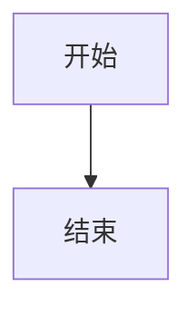

# 标题一

正文含 **粗体**、*斜体*、`代码`、~~删除线~~、[链接](https://example.com)、以及脚注[^a]。

## 列表

- 项目一
- 项目二
  - 嵌套

1. 有序
2. 第二

- [ ] 未完成
- [x] 已完成

> 引用第一行
> 引用第二行

| 列 A | 列 B |
| :--- | ---: |
| 1 | 2 |
| 中文 | text |

```dart
void main() => print('hi');
```

$$
E = mc^2
$$

行内数学 $a^2 + b^2$ 也要。



<div>原始 HTML</div>

---

[^a]: 脚注内容，带 [链接](https://x.com)
