# Showcase

This document exercises every block and inline construct the parser handles,
plus every mermaid diagram type the renderer draws. It doubles as a manual
check: open it in the app and everything below should render, not appear as
raw syntax.

## Inline formatting

Plain text, **bold**, *italic*, ***bold italic***, `inline code`,
~~strikethrough~~, ==highlight==, ^superscript^, ~subscript~, and a
[link](https://example.com "with a title").

An image: 

Inline math $E = mc^2$ sits in a sentence. A footnote reference[^note] too.

[^note]: The footnote definition itself.

Characters that must survive escaping: a < b, x & y, "quoted", 'single'.

## Headings

# Heading 1
## Heading 2
### Heading 3
#### Heading 4
##### Heading 5
###### Heading 6

## Lists

- bullet one
- bullet two
  - nested bullet

1. ordered one
2. ordered two

- [ ] unchecked task
- [x] checked task

## Blockquote

> A quote with **bold** and a [link](https://example.com) inside, to check that
> exports render the formatting rather than printing the markers.

## Code

```dart
void main() {
  print('hello');
}
```

```
plain fence, no language
```

## Table

| Left | Centre | Right |
|:-----|:------:|------:|
| a    | b      | c     |
| 1    | 2      | 3     |

## Math block

$$
\int_0^1 x^2 \, dx = \frac{1}{3}
$$

## Horizontal rule

---

## HTML block

<div class="note">Raw HTML passes through.</div>

## Diagrams

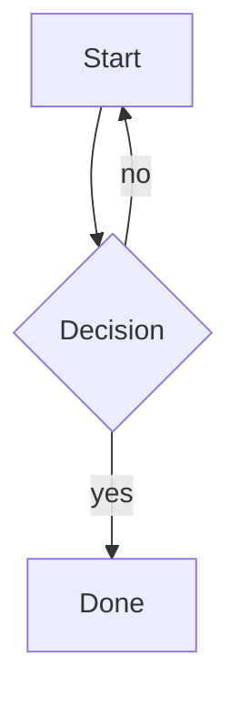

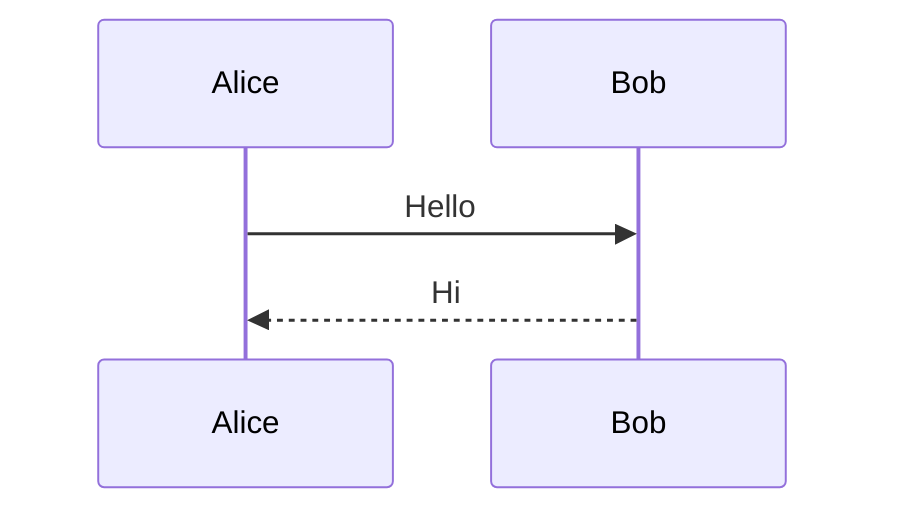

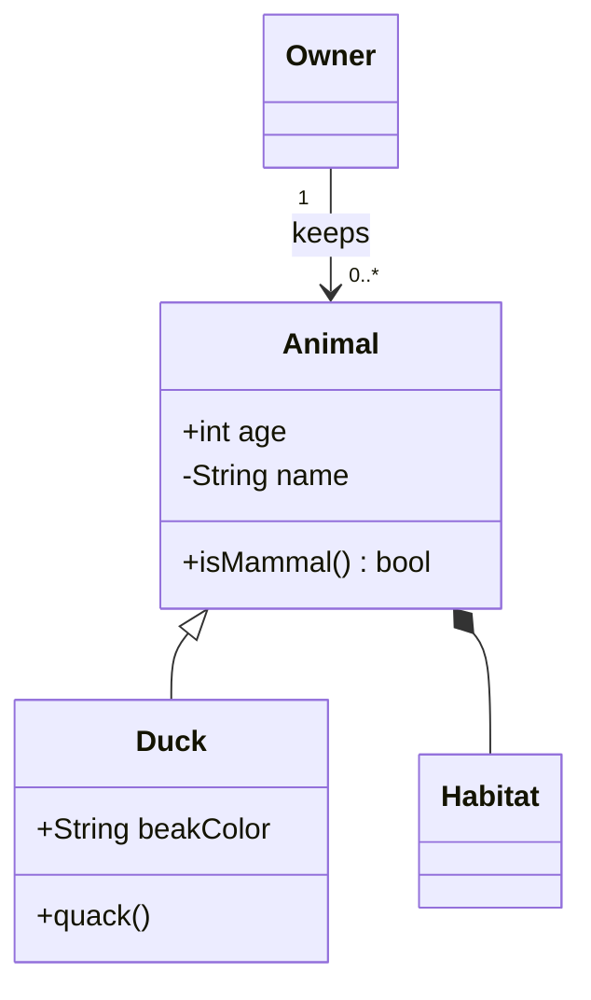

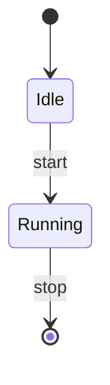

```mermaid
erDiagram
  CUSTOMER["Client record"] ||--o{ ORDER : places
  ORDER ||--|{ LINE_ITEM : contains
  CUSTOMER {
    string name
    string custNumber PK
    int age
  }
```

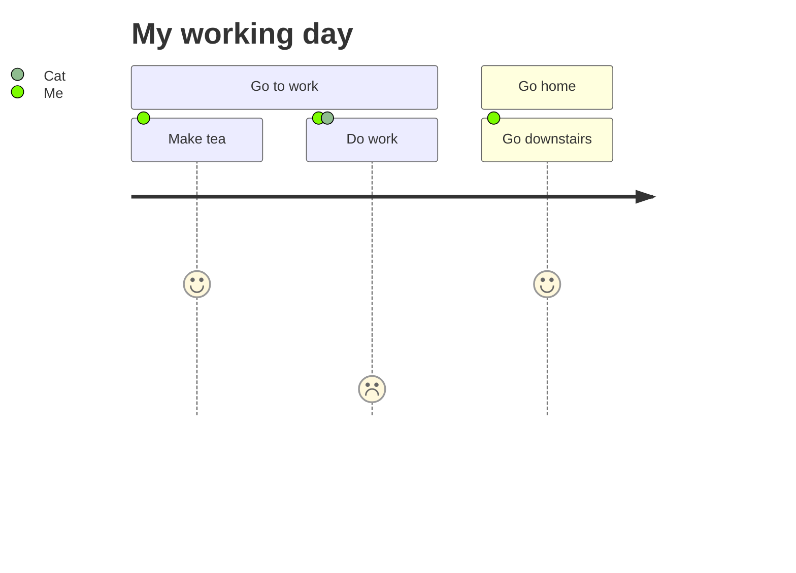

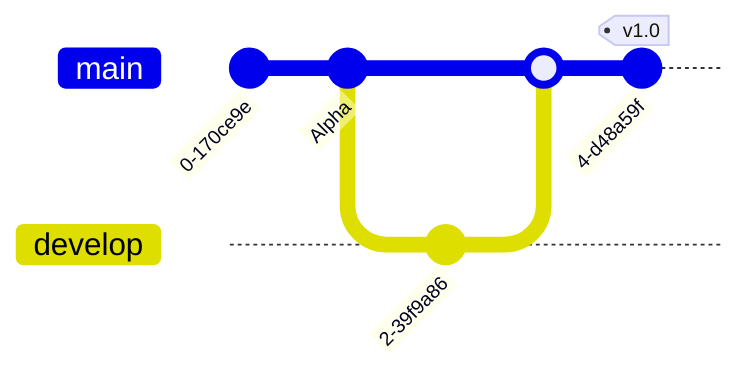

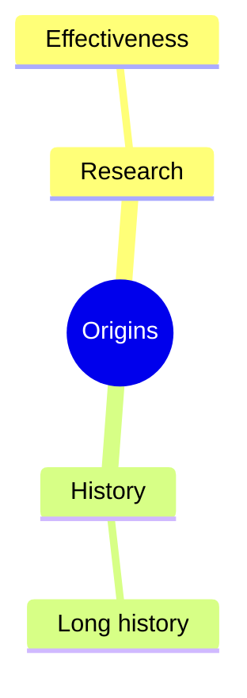

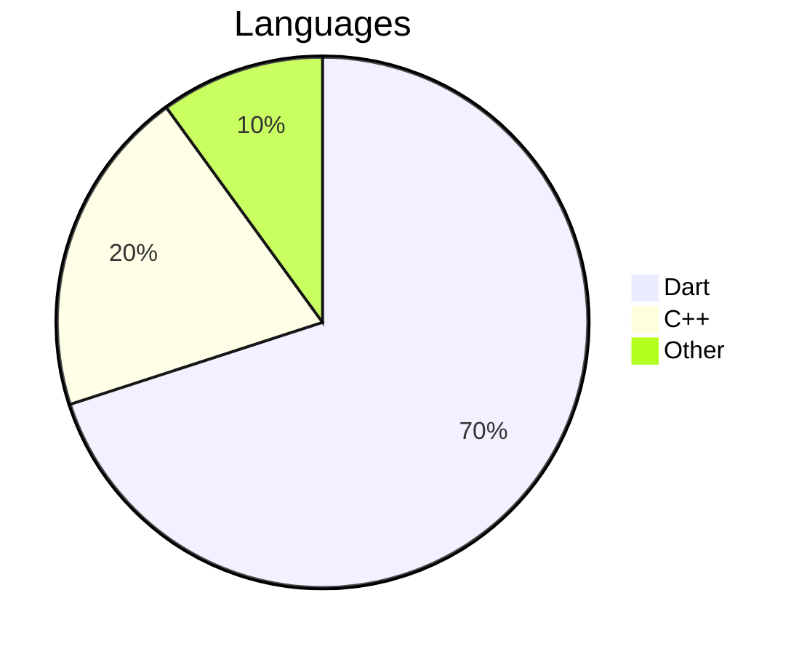

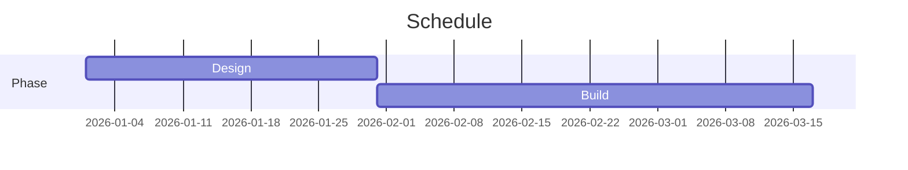

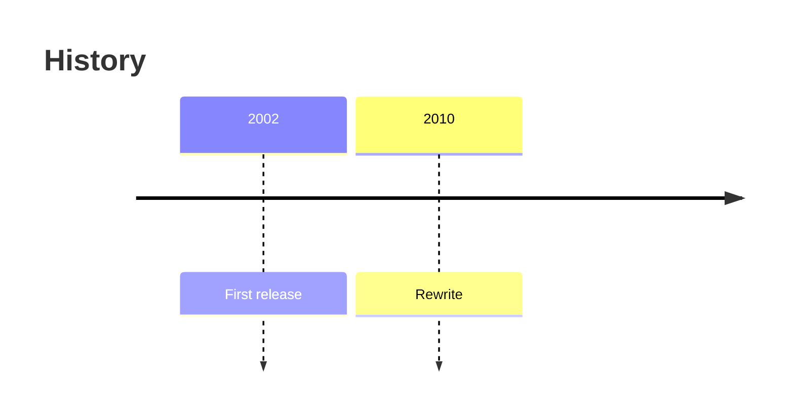

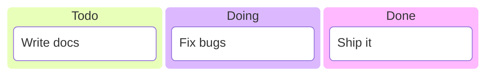

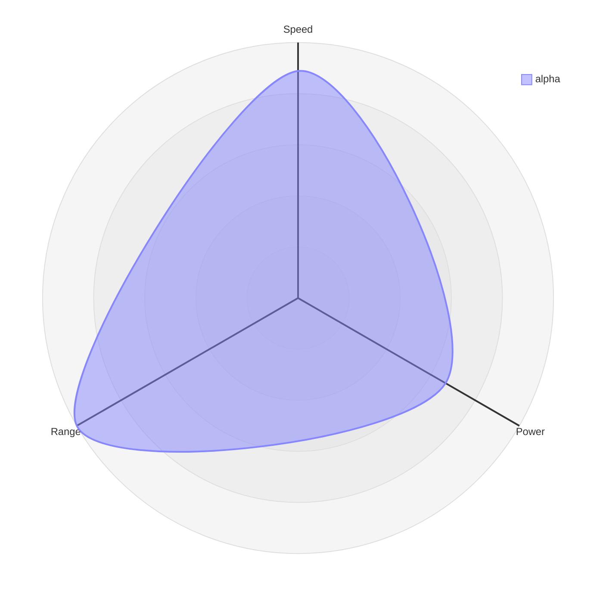

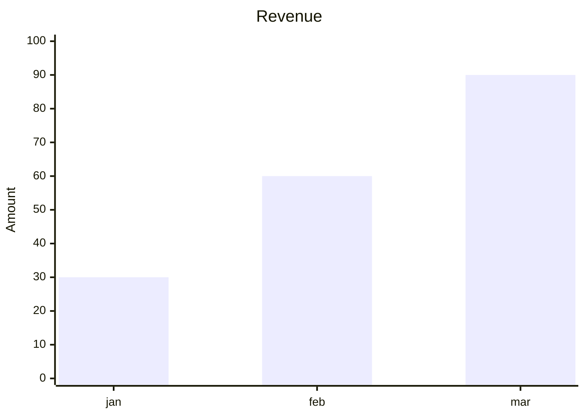

## Diagram syntax variants

These follow the shapes used in mermaid's own documentation, to check that the
parsers accept more than the one spelling each was first written against.

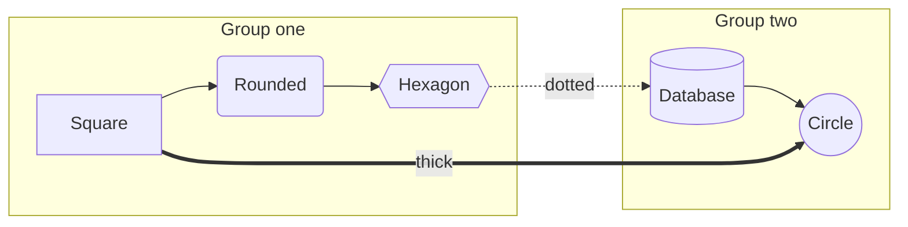

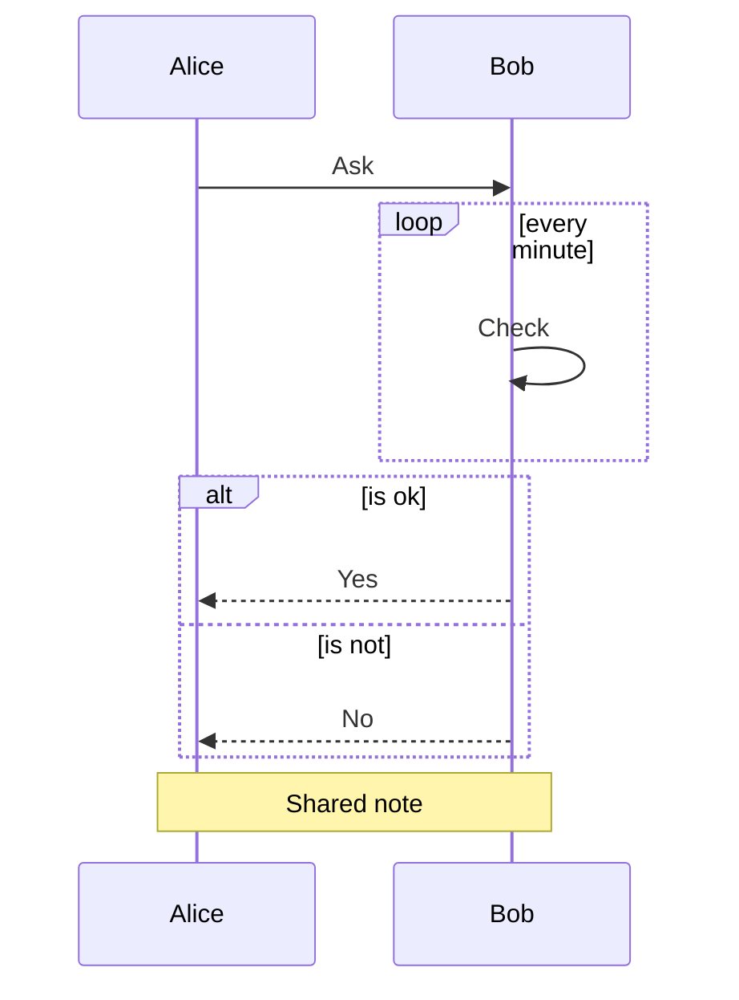

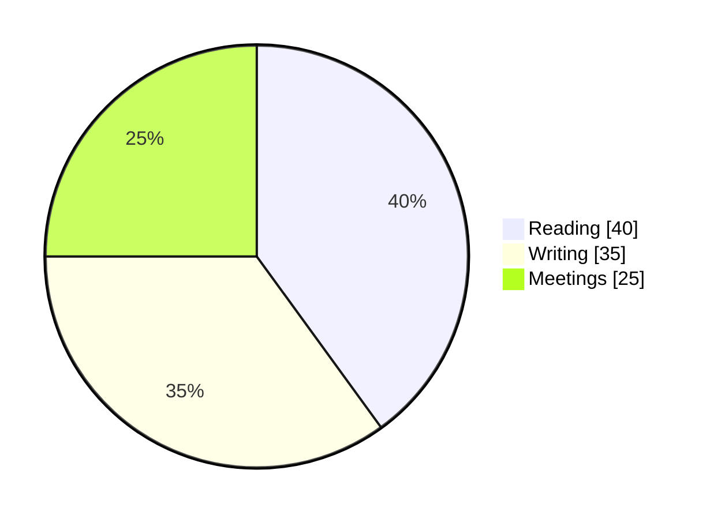

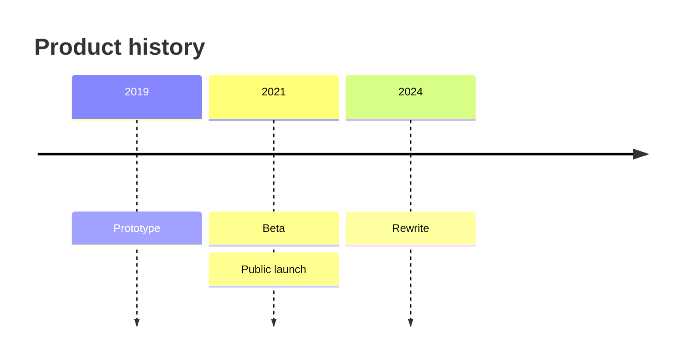

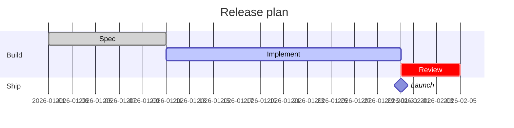

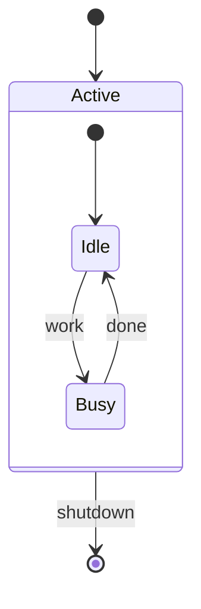

```mermaid
quadrantChart
  title Reach and engagement of campaigns
  x-axis Low Reach --> High Reach
  y-axis Low Engagement --> High Engagement
  quadrant-1 We should expand
  quadrant-2 Need to promote
  quadrant-3 Re-evaluate
  quadrant-4 May be improved
  Campaign A: [0.3, 0.6]
  Campaign B: [0.45, 0.23]
  Campaign C: [0.57, 0.69] radius: 10, color: #ff0000
  Campaign D: [0.78, 0.34]
```

```mermaid
requirementDiagram
  requirement test_req {
    id: 1
    text: the test text.
    risk: high
    verifymethod: test
  }
  functionalRequirement test_req2 {
    id: 1.1
    text: the second test text.
    risk: low
    verifymethod: inspection
  }
  element test_entity {
    type: simulation
    docref: reference
  }
  test_entity - satisfies -> test_req2
  test_req - traces -> test_req2
```

~~~python
# a tilde fence: the # above is a comment, not a heading
print("hello")
~~~

````markdown
```dart
void main() {}
```
````

> Quoted blocks keep their structure:
>
> - a quoted list item
> - another one
>
> ```dart
> void quoted() {}
> ```
>
> > and a quote inside a quote

1. A numbered step
   - with a bulleted sub-point
   - and another
2. The next step
   1. renumbered from one
   2. inside this step

[](https://ci.example.com)

```mermaid
graph LR
  A["Start here"] -- yes --> B{Choice}
  B -. maybe .-> C[(Store)]
  B <--> D((Done))
  A --> E & F
```

```mermaid
graph TD
  开始 --> 判断{是否继续}
  判断 -- 是 --> 处理[执行任务]
  判断 -- 否 --> 结束
```

```mermaid
sequenceDiagram
  用户->>+系统: 登录
  Note over 用户,系统: 认证流程
  alt 凭证正确
    系统-->>-用户: 成功
  else 凭证错误
    系统-->>用户: 请重试
  end
```

```mermaid
---
title: Energy flow
---
sankey-beta
Coal,Electricity,100
Gas,Electricity,45
Electricity,Households,80
Electricity,"Industry, heavy",65
```

```mermaid
block-beta
  columns 3
  frontend["Web UI"] api("Gateway") db[("Storage")]
  space:2 cache{{"Cache"}}
  frontend --> api
  api -- "reads" --> db
```
