# Showcase

This document exercises every block and inline construct the parser handles,
plus every mermaid diagram type the renderer draws. It doubles as a manual
check: open it in the app and everything below should render, not appear as
raw syntax.

## Inline formatting

Plain text, **bold**, *italic*, ***bold italic***, `inline code`,
~~strikethrough~~, ==highlight==, ^superscript^, ~subscript~, and a
[link](https://example.com "with a title").

An image: 

Inline math $E = mc^2$ sits in a sentence. A footnote reference[^note] too.

[^note]: The footnote definition itself.

Characters that must survive escaping: a < b, x & y, "quoted", 'single'.

## Headings

# Heading 1
## Heading 2
### Heading 3
#### Heading 4
##### Heading 5
###### Heading 6

## Lists

- bullet one
- bullet two
  - nested bullet

1. ordered one
2. ordered two

- [ ] unchecked task
- [x] checked task

## Blockquote

> A quote with **bold** and a [link](https://example.com) inside, to check that
> exports render the formatting rather than printing the markers.

## Code

```dart
void main() {
  print('hello');
}
```

```
plain fence, no language
```

## Table

| Left | Centre | Right |
|:-----|:------:|------:|
| a    | b      | c     |
| 1    | 2      | 3     |

## Math block

$$
\int_0^1 x^2 \, dx = \frac{1}{3}
$$

## Horizontal rule

---

## HTML block

<div class="note">Raw HTML passes through.</div>

## Diagrams

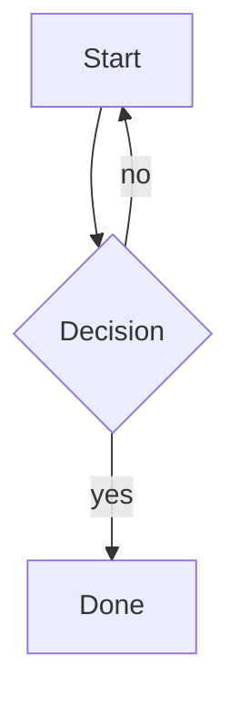

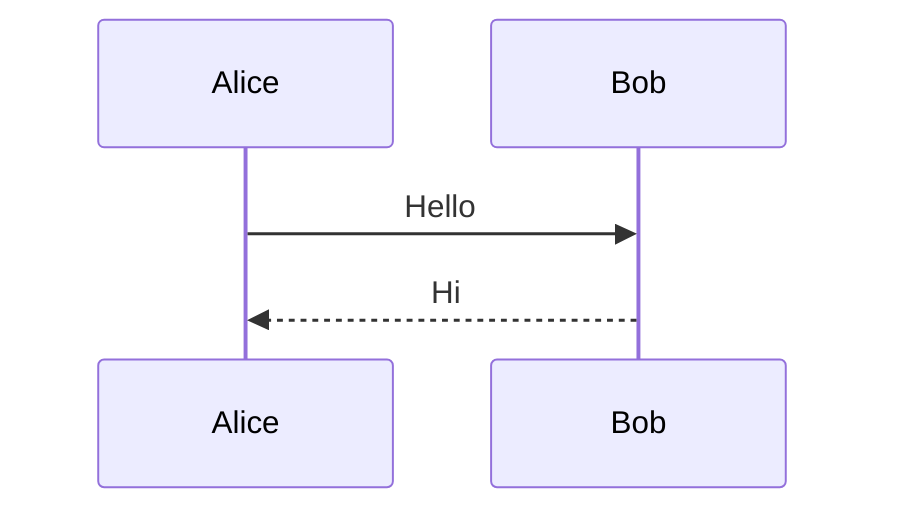

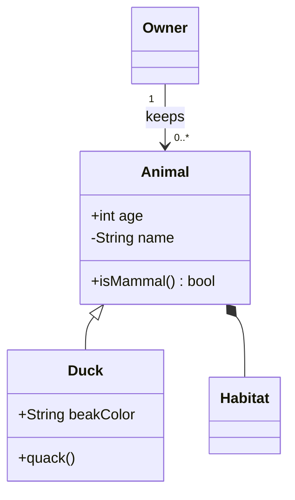

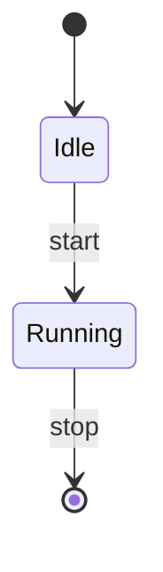

```mermaid
erDiagram
  CUSTOMER["Client record"] ||--o{ ORDER : places
  ORDER ||--|{ LINE_ITEM : contains
  CUSTOMER {
    string name
    string custNumber PK
    int age
  }
```

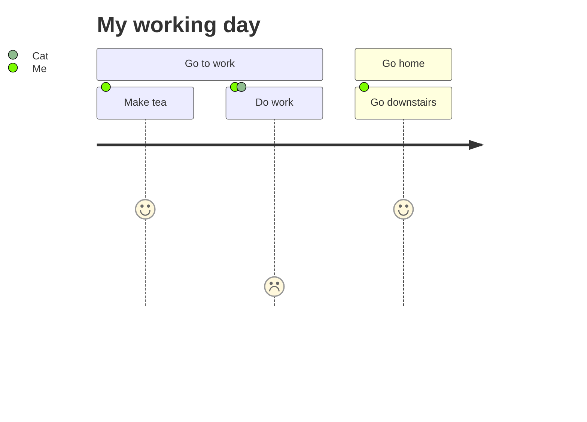

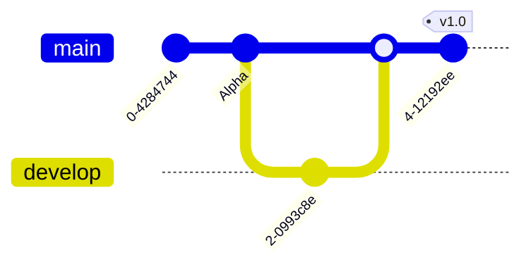

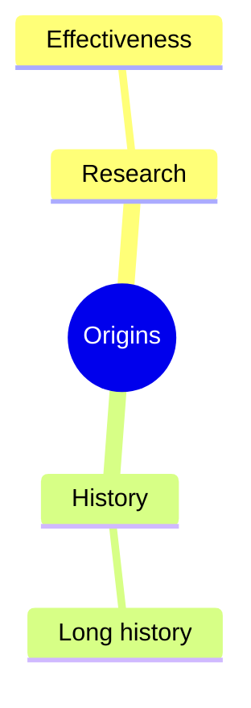

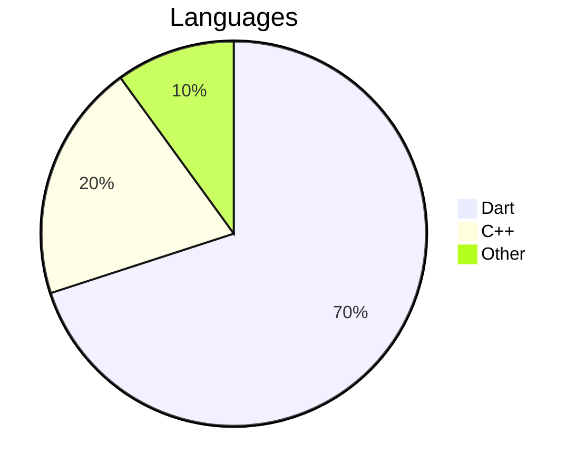

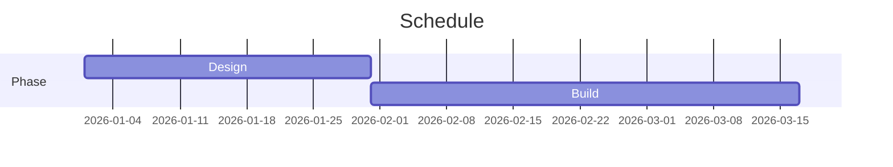

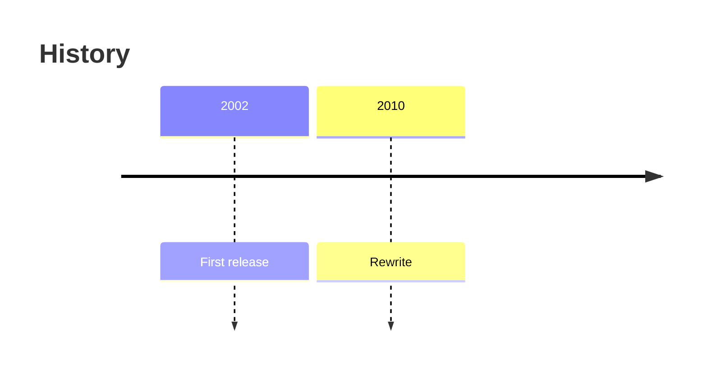

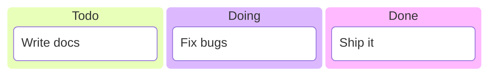

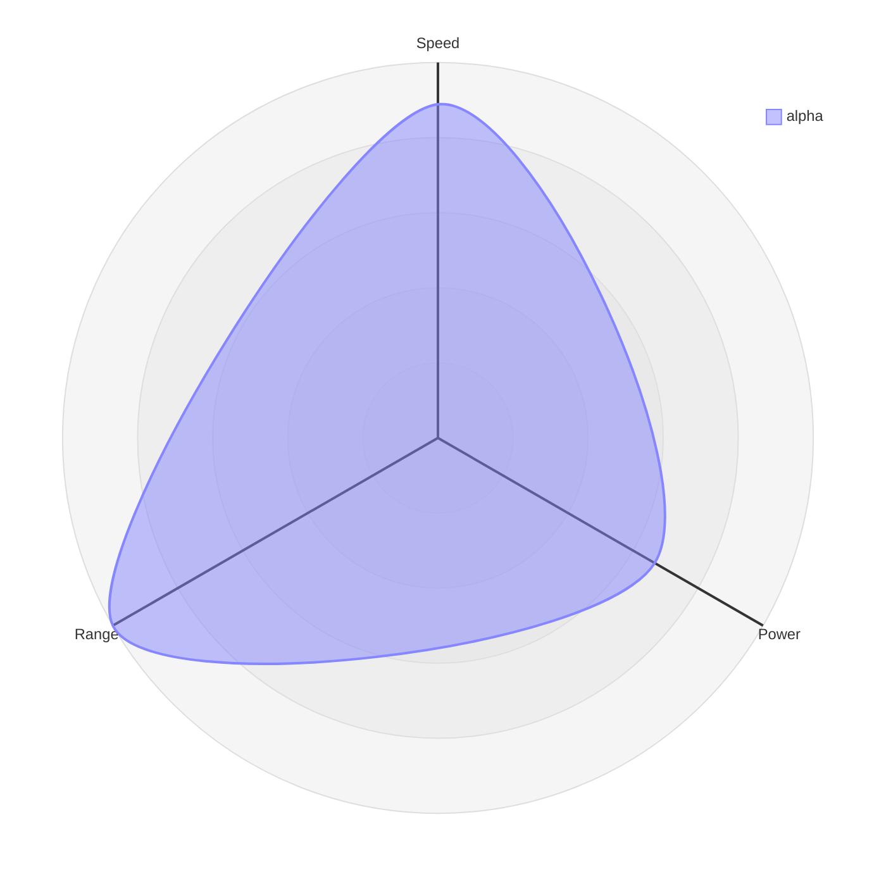

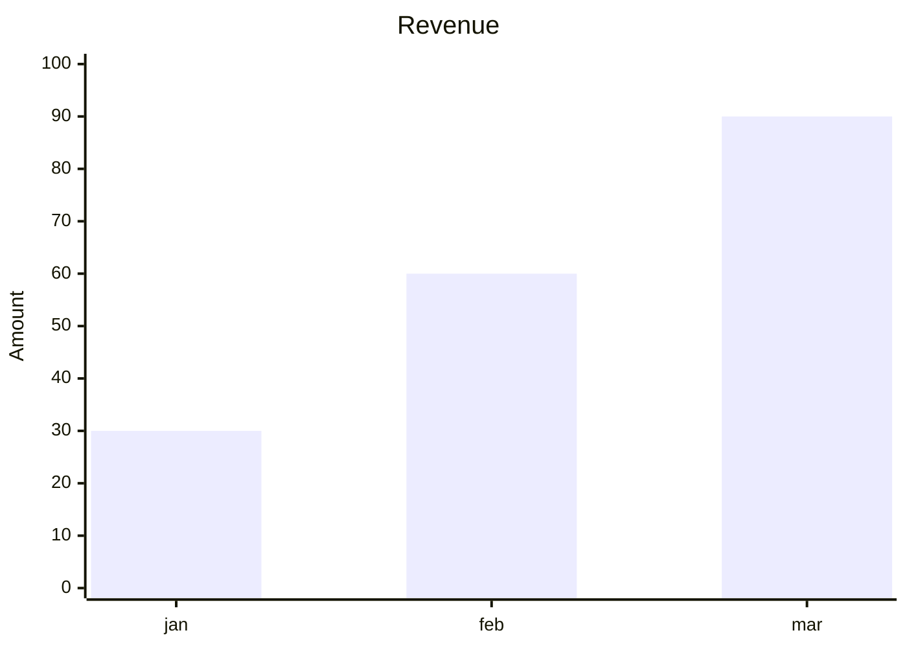
