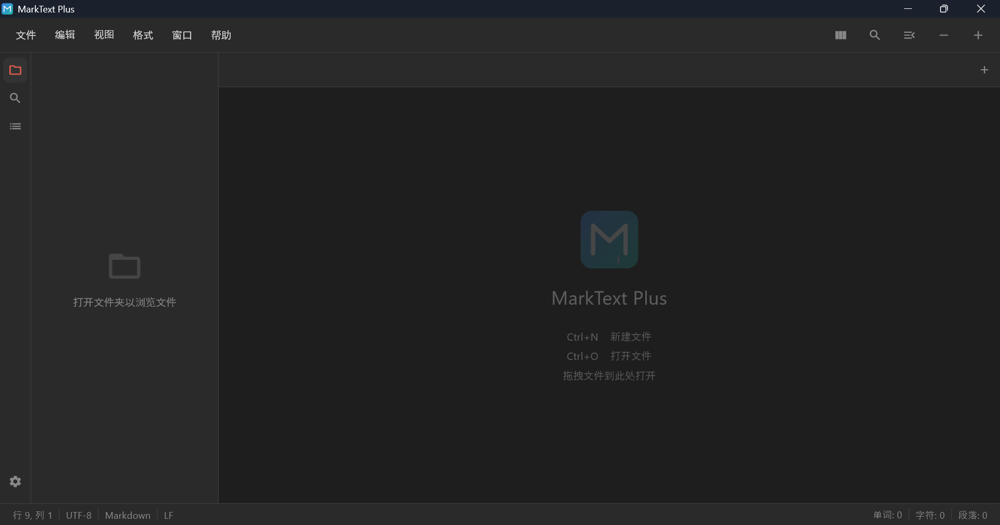
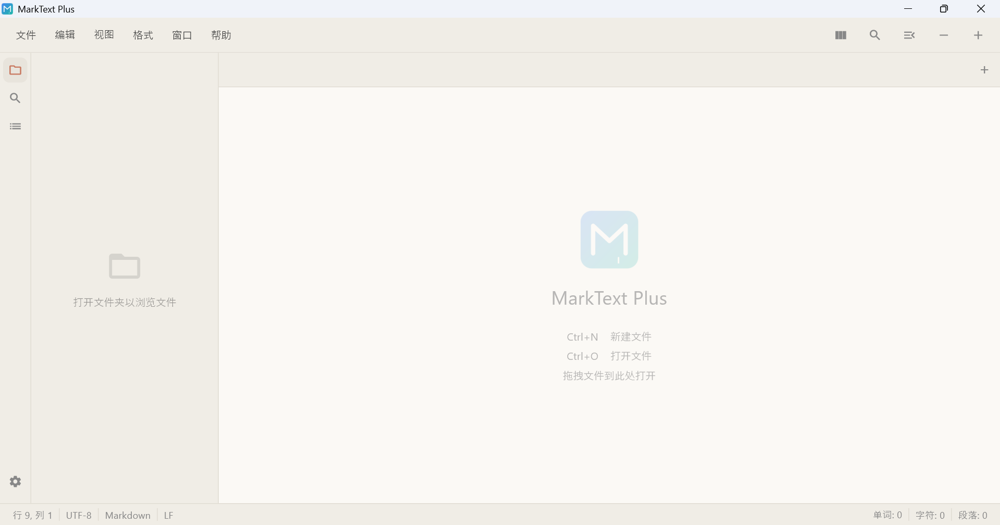
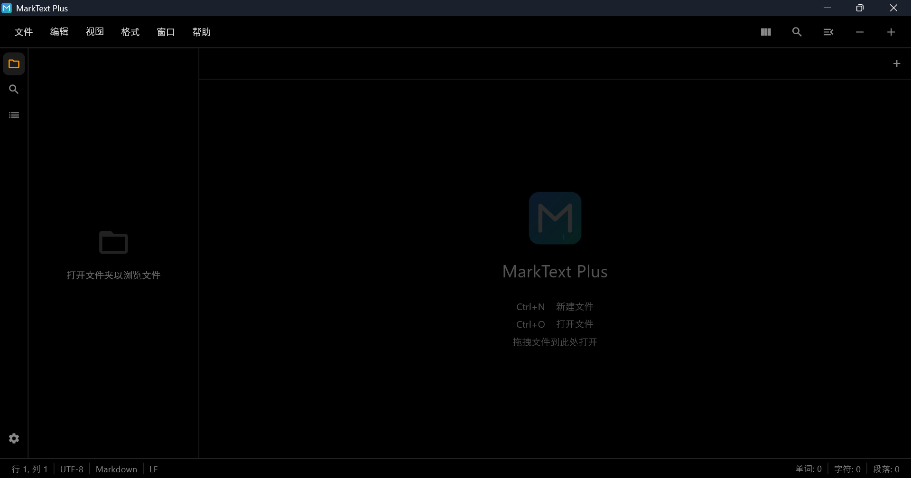
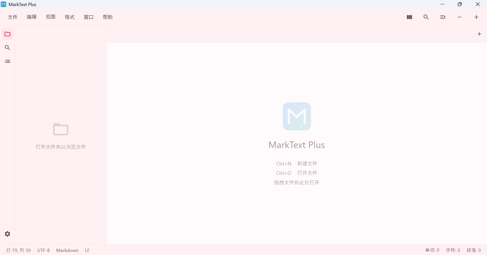
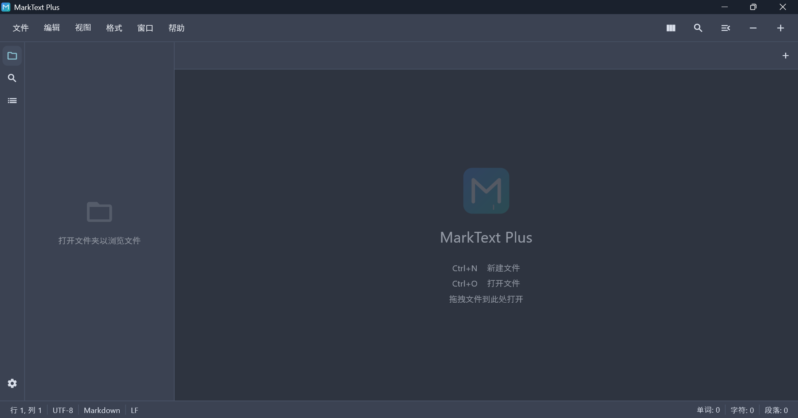
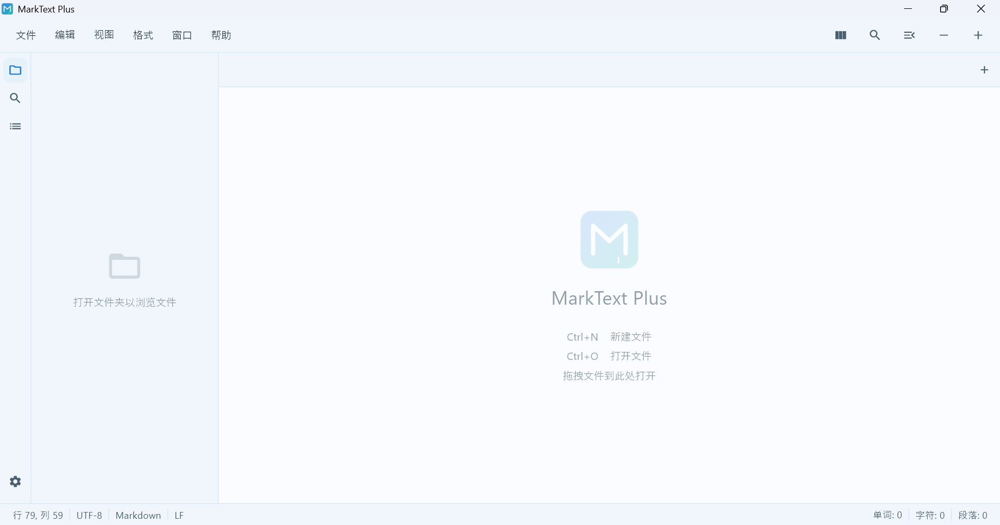
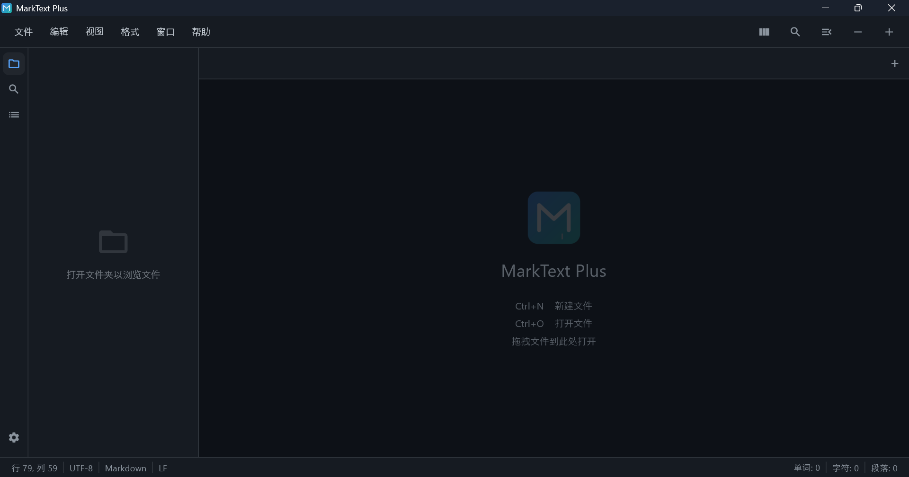

<div align="center">

# MarkText Plus

**Un editeur Markdown leger et multiplateforme reconstruit avec Flutter, inspire de l’original [MarkText](https://github.com/marktext/marktext).**

[English](../../README.md) | [简体中文](README_zh-CN.md) | [日本語](README_ja-JP.md) | [한국어](README_ko-KR.md) | [Deutsch](README_de-DE.md) | [Italiano](README_it-IT.md) | [Русский](README_ru-RU.md) | [Español](README_es-ES.md) | [Português](README_pt-PT.md) | [العربية](README_ar-SA.md) | [Português (Brasil)](README_pt-BR.md)


</div>

---

## 💡 Qu’est-ce que MarkText Plus ?

MarkText Plus est un **editeur Markdown moderne**, reinvente a partir de [MarkText](https://github.com/marktext/marktext) et reconstruit avec Flutter pour une vraie experience multiplateforme. Il corrige les points faibles habituels des editeurs Markdown traditionnels.

- ❌ Lourd et lent au demarrage → ✅ **Ultra rapide** avec un parseur maison
- ❌ Peu d’options de theme → ✅ **8 beaux themes** (clair & sombre)
- ❌ Experience multiplateforme mediocre → ✅ **Performances natives** sur Windows, macOS et Linux
- ❌ Configuration compliquee → ✅ **Demarrage en 3 commandes**

## 🚀 Demarrage rapide

Pret en moins de 30 secondes.

```bash
git clone https://github.com/yourusername/marktext-plus.git
cd marktext-plus/code
flutter pub get && flutter run
```

C’est tout. L’editeur se lance avec un document d’exemple pret a etre modifie.

## ✨ Fonctionnalites

| Feature | Description |
|---------|-------------|
| **📝 Trois modes d’edition** | Code source avec coloration syntaxique, apercu en direct et vue partagee |
| **🎨 8 beaux themes** | Red Graphite, Shibuya, Pink Blossom, Sky Blue, Dark Graphite, Dieci OLED, Nord, Midnight |
| **🌍 12 langues** | Anglais, chinois, japonais, coreen, allemand, francais, italien, russe, espagnol, portugais, arabe et portugais bresilien |
| **⚡ Tres rapide** | Parseur et moteur de rendu Markdown maison, sans dependances lourdes |
| **🔍 Rechercher et remplacer** | Recherche complete avec prise en charge des expressions regulieres |
| **📂 Arborescence de fichiers** | Navigation laterale avec prise en charge du glisser-deposer des dossiers |
| **⌨️ Raccourcis personnalisables** | Assignations clavier entierement configurables |
| **💾 Sauvegarde automatique** | Configuration persistante basee sur JSON pour ne jamais perdre son travail |

## 🎨 Themes

<table>
  <tr>
    <th align="center">Light Themes</th>
    <th align="center">Dark Themes</th>
  </tr>
  <tr>
    <td align="center"><b>Red Graphite</b><br/></td>
    <td align="center"><b>Dark Graphite</b><br/></td>
  </tr>
  <tr>
    <td align="center"><b>Shibuya</b><br/></td>
    <td align="center"><b>Dieci OLED</b><br/></td>
  </tr>
  <tr>
    <td align="center"><b>Pink Blossom</b><br/></td>
    <td align="center"><b>Nord</b><br/></td>
  </tr>
  <tr>
    <td align="center"><b>Sky Blue</b><br/></td>
    <td align="center"><b>Midnight</b><br/></td>
  </tr>
</table>

## 📦 Installation

### Telecharger les binaires precompiles

Telechargez la derniere version adaptee a votre plateforme depuis [Releases](https://github.com/yourusername/marktext-plus/releases).

| Platform | Architecture | Format |
|----------|-------------|--------|
| Windows | x64 | `.exe` installer |
| macOS | ARM64 | `.dmg` |
| Linux | x64 / ARM64 | `.deb` / `.rpm` |

### Compiler depuis les sources

> **Prerequis** : Flutter 3.x+, Dart 3.x+

```bash
git clone https://github.com/yourusername/marktext-plus.git
cd marktext-plus/code
flutter pub get && flutter run
```

<details>
<summary><b>Commandes de build de release</b></summary>

```bash
# Windows
flutter build windows

# macOS
flutter build macos

# Linux
flutter build linux
```
</details>

<details>
<summary><b>Utilisateurs macOS : contourner l’avertissement d’application non signee</b></summary>

> macOS peut afficher l’avertissement "Apple n’a pas pu verifier que MarkText Plus ne contient pas de logiciel malveillant...". Apres avoir glisse l’application dans le dossier "Applications", executez les commandes suivantes.
>
> ```bash
> xattr -cr /Applications/MarkText\ Plus.app
> sudo codesign --force --deep --sign - /Applications/MarkText\ Plus.app
> ```
</details>

## 🏗️ Architecture

```
code/lib/
├── main.dart           # Point d’entree de l’application
├── app.dart            # MaterialApp avec liaison theme/locale/i18n
├── core/               # Jetons de theme, configuration, i18n (12 langues)
├── models/             # TabInfo, FileNode
├── services/           # Parseur Markdown, E/S fichiers, raccourcis clavier
├── providers/          # Gestion d’etat Riverpod
└── ui/
    ├── editor/         # Editeur source, rendu de l’aperçu, vue partagee
    ├── screens/        # Accueil, Parametres
    └── widgets/        # Barre de menus, barre laterale, barre d’onglets, barre d’etat
```

Architecture a quatre couches : **UI** → **Etat** (Riverpod) → **Service** → **Plateforme**

### Executer les tests

```bash
cd code && flutter test
```

## 🤝 Contribuer

Les contributions sont les bienvenues. Envoyez vos Pull Requests.

1. Fork the repository
2. Create your feature branch (`git checkout -b feature/amazing-feature`)
3. Commit your changes (`git commit -m 'Add amazing feature'`)
4. Push to the branch (`git push origin feature/amazing-feature`)
5. Open a Pull Request

## 📄 Licence

Licence MIT - voir [LICENSE](../../LICENSE) pour les details.

Base sur [MarkText](https://github.com/marktext/marktext) de Luo Ran et des contributeurs.

## 🙏 Remerciements

- [MarkText](https://github.com/marktext/marktext) — le projet original qui a inspire cet editeur
- [Flutter](https://flutter.dev) — le framework multiplateforme
- Toutes les bibliotheques open source utilisees dans ce projet
