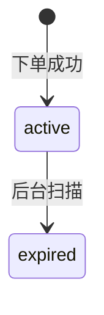

# V1.2.2 Bug 修复记录

| 编号 | 日期 | 标题 | 优先级 | 状态 |
|------|------|------|--------|------|
| BUG-001 | 2026-05-01 | 预览模式 Ctrl+C 复制选中内容时复制了整个文档 | P0 | 已修复 |
| BUG-002 | 2026-05-01 | 特定 Markdown 文件无法解析（Windows 换行符问题） | P1 | 已修复 |
| BUG-003 | 2026-05-01 | Mermaid 图表过宽时被截断，无法缩放和拖动 | P2 | 已修复 |
| BUG-004 | 2026-05-01 | stateDiagram-v2 语法无法识别 | P1 | 已修复 |
| BUG-005 | 2026-05-22 | 解析文件时 replaceAll 替换换行符导致大文件卡顿 | P0 | 已修复 |
| BUG-006 | 2026-05-22 | Mermaid 图表过宽仍被截断，需要全屏放大查看 | P1 | 已修复 |
| BUG-007 | 2026-05-22 | stateDiagram-v2 渲染样式混乱 | P1 | 已修复 |
| BUG-008 | 2026-05-22 | 单独打开的文件未在侧边栏持久化 | P1 | 已修复 |
| BUG-009 | 2026-05-22 | Mermaid 内联视图未自适应缩放 + 全屏窗口霸占整屏 | P1 | 已修复 |
| BUG-010 | 2026-05-22 | stateDiagram 出现两个结束节点 + 长标签互相覆盖 | P1 | 已修复 |
| BUG-011 | 2026-05-25 | 首次打开大文件主线程卡住 | P0 | 已修复 |
| BUG-012 | 2026-05-25 | 带 UTF-8 BOM 的文件第一行一级标题预览不显示 | P1 | 已修复 |
| BUG-013 | 2026-05-25 | 打开文件预览时 SelectionRegistrarScope 报 Duplicate keys | P0 | 已修复 |

---

## BUG-001 — 预览模式 Ctrl+C 复制选中内容时复制了整个文档

| 字段 | 内容 |
|------|------|
| 优先级 | P0 |
| 状态 | 已修复 |

### 现象

在预览模式下选中部分文字后按 Ctrl+C，粘贴出来的是整个文档的内容，而非选中的部分。

### 根因分析

`markdown_renderer.dart` 的 `onKeyEvent` 拦截了 Ctrl+C，无条件调用 `_copyAsHtml()` 将整个文档的 Markdown 转为 HTML 写入剪贴板，完全忽略了 `SelectionArea` 的选中内容。

### 修复方案

1. 移除 `_copyAsHtml()` 方法
2. 改为 `_enhanceClipboardWithHtml()`：先让 `SelectionArea` 处理 Ctrl+C（复制选中纯文本到剪贴板），延迟 100ms 后读取剪贴板中的纯文本，将其作为 Markdown 解析为 HTML，再用 `ClipboardService.copyWithHtml()` 同时写入纯文本和 HTML 格式
3. 如果剪贴板为空（没有选中内容），不做任何操作

### 涉及文件

- `lib/ui/editor/markdown_renderer.dart`

---

## BUG-002 — 特定 Markdown 文件无法解析（Windows 换行符问题）

| 字段 | 内容 |
|------|------|
| 优先级 | P1 |
| 状态 | 已修复 |

### 现象

用户的某个 Markdown 文件无法正常解析，标题后的换行删掉再重新按回车才能正常显示。

### 根因分析

`MarkdownParser.parse()` 使用 `markdown.split('\n')` 分割行，但如果文件使用 Windows 换行符（`\r\n`），每行末尾会残留 `\r`，导致正则表达式（如 `_headingRe = RegExp(r'^(#{1,6})\s+(.+)$')`）匹配失败——`$` 锚点前有 `\r` 字符。

### 修复方案

在 `parse()` 方法开头统一换行符：
```dart
final lines = markdown.replaceAll('\r\n', '\n').replaceAll('\r', '\n').split('\n');
```

### 涉及文件

- `lib/services/markdown_parser.dart`

---

## BUG-003 — Mermaid 图表过宽时被截断，无法缩放和拖动

| 字段 | 内容 |
|------|------|
| 优先级 | P2 |
| 状态 | 已修复 |

### 现象

Mermaid 图表如果节点较多或标签较长，超出容器宽度的部分会被截断，用户无法看到完整图表。

### 修复方案

将 `MermaidRenderer` 从 `StatelessWidget` 改为 `StatefulWidget`，添加交互模式：

1. 默认模式：图表正常显示，底部提示"双击图表进入缩放模式"
2. 交互模式（双击激活）：
   - 使用 `InteractiveViewer` 包裹图表
   - Ctrl+鼠标滚轮缩放（0.3x ~ 3.0x）
   - 鼠标拖动平移
   - 标题栏显示"重置"按钮恢复原始缩放
3. 再次双击退出交互模式

### 涉及文件

- `lib/ui/widgets/mermaid_renderer.dart`

---

## BUG-004 — stateDiagram-v2 语法无法识别

| 字段 | 内容 |
|------|------|
| 优先级 | P1 |
| 状态 | 已修复 |

### 现象

以下 Mermaid 内容无法识别，报错：


### 根因分析

`mermaid_parser.dart` 中 `stateDiagram` 类型的处理直接返回 `null`（line 167: `// TODO: Implement`），没有实际的解析器实现。

### 修复方案

创建 `StateDiagramParser`：
1. 解析 `-->` 转换语法，提取源状态、目标状态和标签
2. `[*]` 识别为起始/结束状态（圆形节点，显示为 ●）
3. 普通状态使用圆角矩形节点
4. 复用 flowchart 的布局引擎（`MermaidDiagramData` 结构兼容）

### 涉及文件

- `lib/ui/editor/mermaid/parser/state_diagram_parser.dart`（新增）
- `lib/ui/editor/mermaid/parser/mermaid_parser.dart`

---

## BUG-005 — 解析文件时 replaceAll 替换换行符导致大文件卡顿

### 现象

打开较大文件时非常卡。

### 根因分析

`MarkdownParser.parse()` 之前使用 `markdown.replaceAll('\r\n', '\n').replaceAll('\r', '\n').split('\n')`，每次解析都会两次扫描整个字符串并创建中间字符串拷贝。对于大文件来说开销很大，而且每次重新解析（编辑、搜索高亮等）都要重复执行。

### 修复方案

改用 `dart:convert` 的 `LineSplitter().convert(markdown)`：单次 O(n) 扫描，同时处理 `\n`、`\r\n` 和 `\r`，不创建中间完整字符串拷贝。

### 涉及文件

- `lib/services/markdown_parser.dart`

---

## BUG-006 — Mermaid 图表过宽仍被截断，需要全屏放大查看

### 现象

Mermaid 图表如果太宽，右侧内容被截断。需要全屏视图来查看完整图表。

### 修复方案

重写 `MermaidRenderer`：

1. **内联模式自适应**：用 `LayoutBuilder` + `SingleChildScrollView(scrollDirection: Axis.horizontal)`，超出宽度时可水平滚动
2. **双击/点击"全屏"按钮**：弹出全屏覆盖层 `_MermaidFullscreenView`
3. **全屏视图**：
   - `InteractiveViewer` 自动适配窗口大小
   - `Listener` 监听 `Ctrl+滚轮` 实现缩放（0.2x ~ 5.0x）
   - 鼠标拖动平移
   - `KeyboardListener` 监听 `Esc` 键关闭
   - 右上角"重置"和"关闭"按钮
   - 底部提示操作方式

### 涉及文件

- `lib/ui/widgets/mermaid_renderer.dart`

---

## BUG-007 — stateDiagram-v2 渲染样式混乱

### 现象

stateDiagram-v2 虽然能识别但布局混乱，文字重叠。

### 根因分析

之前的 `StateDiagramParser` 返回 `DiagramType.stateDiagram`，但 `MermaidDiagram` 的 `_getLayoutEngine` 对此类型回退到 `SimpleLayoutEngine`，没有专门的状态机布局算法，导致节点位置错乱。

### 修复方案

1. 让 `StateDiagramParser` 返回 `DiagramType.flowchart`，复用成熟的 `DagreLayout` 和 `FlowchartPainter`
2. 用 `NodeShape.stadium`（药丸形）渲染普通状态，更接近 Mermaid 风格
3. `[*]` 用 `NodeShape.circle` 渲染（黑色实心圆）
4. 多次出现的 `[*]` 创建独立的起始/结束节点（避免重叠）
5. ID 规范化保留中文字符（`一-龥` 区间）
6. 自动跳过 `note ...` 和 `%%` 注释行

### 涉及文件

- `lib/ui/editor/mermaid/parser/state_diagram_parser.dart`

---

## BUG-008 — 单独打开的文件未在侧边栏持久化

### 现象

单独打开一个文件后该文件出现在侧边栏，但软件重启后侧边栏只剩本次打开的文件，之前的丢失。

### 根因分析

之前的持久化只保存 `sideBarDirectory`（打开的文件夹路径），没有保存 `tabState.openedFiles`（侧边栏的"已打开文件"列表）。

### 修复方案

1. `AppConfig` 添加 `sideBarOpenedFiles: List<String>` 字段
2. `TabNotifier` 在 `addTab` 添加新文件、`removeOpenedFile` 移除文件时调用 `_persistOpenedFiles()` 同步到配置
3. 启动时 `HomeScreen._restoreSideBarDirectory()` 调用 `tabProvider.notifier.restoreOpenedFiles(config.sideBarOpenedFiles)`，仅填充侧边栏列表，不打开任何 tab
4. 恢复前检查文件是否仍存在（避免幽灵条目）

### 涉及文件

- `lib/core/config/app_config.dart`
- `lib/providers/tab_provider.dart`
- `lib/ui/screens/home_screen.dart`

---

## BUG-009 — Mermaid 内联视图未自适应缩放 + 全屏窗口霸占整屏

### 现象

1. Mermaid 图表过宽时仍然被截断（之前的修复只是水平滚动，没有自动缩放）
2. 双击图表后弹出的全屏窗口直接占满整个应用窗口，没有自动缩放，使用体验不好

### 修复方案

1. **内联自适应**：将 `SingleChildScrollView(scrollDirection: horizontal)` 替换为 `FittedBox(fit: BoxFit.scaleDown)`，超出容器宽度时自动等比缩小
2. **全屏窗口改为 Dialog**：从 `PageRouteBuilder`（占满整屏）改为 `showDialog`，通过 `insetPadding` 限制为屏幕的 80% 大小
3. Dialog 增加标题栏（含工具栏按钮）、内容区（`InteractiveViewer` + `Ctrl+滚轮` 缩放 + 拖动）、底部提示栏

### 涉及文件

- `lib/ui/widgets/mermaid_renderer.dart`

---

## BUG-010 — stateDiagram 出现两个结束节点 + 长标签互相覆盖

### 现象

1. 一个状态图中如果有多个 `state --> [*]` 表达式，渲染出多个独立的结束节点
2. 当一条边的标签较长（如"取消自动续订(auto_renew=0, status保持active*)"）时，会覆盖到其他边的标签

### 根因分析

1. 之前的解析器为每个 `[*]` 创建独立节点（`__end_0__`, `__end_1__` ...），逻辑错误
2. Dagre 布局基于固定的 `nodeSpacingX`/`Y`，没有根据 edge label 长度调整间距

### 修复方案

1. `[*]` 作为源时统一为 `__start__`，作为目标时统一为 `__end__`，所有指向 `[*]` 的边汇聚到同一个结束节点
2. `MermaidRenderer._buildStyle()` 扫描代码估算最长 edge label 宽度（CJK 字符算 2 倍宽），按 `每字符 +10px` 动态增加 `nodeSpacingX`/`nodeSpacingY`，最多增加 200px

### 涉及文件

- `lib/ui/editor/mermaid/parser/state_diagram_parser.dart`
- `lib/ui/widgets/mermaid_renderer.dart`

---

## BUG-011 — 首次打开大文件主线程卡住

| 字段 | 内容 |
|------|------|
| 优先级 | P0 |
| 状态 | 已修复 |

### 现象

首次打开稍大且样式丰富（含较多代码块、表格等）的 Markdown 文件时，软件明显卡住数秒，UI 无响应。

### 根因分析

1. `home_screen.dart` 的 `_openStartupFiles()` 使用了同步 API `File(path).readAsStringSync()`，在 UI 线程上阻塞读盘
2. `_buildCodeBlock` 对所有有语言标记的代码块都跑 `flutter_highlight` 的 `highlight.parse`，这是纯 Dart 同步语法树解析，对超长代码段（几十 KB 以上）开销很大，再加上递归构造 TextSpan 树，会进一步拉长首次构建时间
3. 这两步都发生在 `build()` 路径或同步初始化阶段，叠加起来造成首次打开卡顿

### 修复方案

1. `home_screen.dart`：将 `readAsStringSync()` 改为 `await File(path).readAsString()`，避免同步阻塞主线程
2. `markdown_renderer.dart` 的 `_buildCodeBlock`：对长度超过 20000 字符的代码块跳过 `flutter_highlight`，回退为不高亮的纯文本渲染（仍保留等宽字体和样式）。AST 缓存机制保证了后续重建不会重复执行解析

### 涉及文件

- `lib/ui/screens/home_screen.dart`
- `lib/ui/editor/markdown_renderer.dart`

---

## BUG-012 — 带 UTF-8 BOM 的文件第一行一级标题预览不显示

| 字段 | 内容 |
|------|------|
| 优先级 | P1 |
| 状态 | 已修复 |

### 现象

部分 Markdown 文件首行的一级标题（`# Title`）在预览模式下不显示，被当作普通段落渲染。源码模式下内容看起来是正常的。

### 根因分析

Windows 上某些工具（记事本、PowerShell `>` 重定向、部分编辑器另存为 UTF-8）保存的文件会在文件开头插入 UTF-8 BOM (`U+FEFF`)。文件读取后第一行实际是 `# Title`，而 `MarkdownParser._headingRe = RegExp(r'^(#{1,6})\s+(.+)$')` 因为开头是 BOM 而无法匹配，导致一级标题被识别为普通段落。同样地，`MarkdownRenderer._findHeadingLines` 也无法找到首行 heading，TOC 跳转和滚动联动会错位。

### 修复方案

在解析入口处剥离 BOM：
1. `MarkdownParser.parse()` 开头：如果首字符为 `0xFEFF`，调用 `markdown.substring(1)` 去掉
2. `MarkdownRenderer._findHeadingLines()` 同样处理一遍，保证 TOC 与 AST 行号一致

### 涉及文件

- `lib/services/markdown_parser.dart`
- `lib/ui/editor/markdown_renderer.dart`

---

## BUG-013 — 打开文件预览时 SelectionRegistrarScope 报 Duplicate keys

| 字段 | 内容 |
|------|------|
| 优先级 | P0 |
| 状态 | 已修复 |

### 现象

某些 Markdown 文件在预览模式下打开会抛 `Duplicate keys found. Column has multiple children with key [GlobalKey#xxx]` 异常，预览渲染失败。

### 根因分析

`MarkdownRenderer.build()` 之前用 `_headingKeys.putIfAbsent(lineNum, () => GlobalKey())` 给 heading 分配 GlobalKey。当 `_findHeadingLines` 找到的行号数量与解析器 `parse()` 产生的 `HeadingNode` 数量不一致（例如 `# H` 出现在引用块或代码块外的特殊上下文）时，多个 HeadingNode 会用 `lineNum=-1` 共用同一个 GlobalKey；又因为 `_headingKeys` 是 State 字段在多次 build 之间复用，重复使用同一 GlobalKey 在 Column 兄弟节点中触发断言失败。

### 修复方案

1. 每帧 build 开头清空 `_headingKeys`，避免跨帧复用
2. 为每个 HeadingNode 都分配新的 `GlobalKey()`，互不共用
3. 仅当 `lineNum > 0` 时把首个 key 注册到 `_headingKeys` 用于 TOC 滚动定位（用 `putIfAbsent` 避免重复行号覆盖）

### 涉及文件

- `lib/ui/editor/markdown_renderer.dart`
