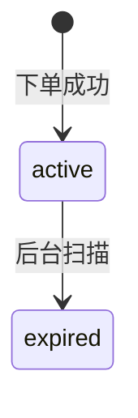

# V1.2.2 Bug 修复记录

| 编号 | 日期 | 标题 | 优先级 | 状态 |
|------|------|------|--------|------|
| BUG-001 | 2026-05-01 | 预览模式 Ctrl+C 复制选中内容时复制了整个文档 | P0 | 已修复 |
| BUG-002 | 2026-05-01 | 特定 Markdown 文件无法解析（Windows 换行符问题） | P1 | 已修复 |
| BUG-003 | 2026-05-01 | Mermaid 图表过宽时被截断，无法缩放和拖动 | P2 | 已修复 |
| BUG-004 | 2026-05-01 | stateDiagram-v2 语法无法识别 | P1 | 已修复 |

---

## BUG-001 — 预览模式 Ctrl+C 复制选中内容时复制了整个文档

| 字段 | 内容 |
|------|------|
| 优先级 | P0 |
| 状态 | 已修复 |

### 现象

在预览模式下选中部分文字后按 Ctrl+C，粘贴出来的是整个文档的内容，而非选中的部分。

### 根因分析

`markdown_renderer.dart` 的 `onKeyEvent` 拦截了 Ctrl+C，无条件调用 `_copyAsHtml()` 将整个文档的 Markdown 转为 HTML 写入剪贴板，完全忽略了 `SelectionArea` 的选中内容。

### 修复方案

1. 移除 `_copyAsHtml()` 方法
2. 改为 `_enhanceClipboardWithHtml()`：先让 `SelectionArea` 处理 Ctrl+C（复制选中纯文本到剪贴板），延迟 100ms 后读取剪贴板中的纯文本，将其作为 Markdown 解析为 HTML，再用 `ClipboardService.copyWithHtml()` 同时写入纯文本和 HTML 格式
3. 如果剪贴板为空（没有选中内容），不做任何操作

### 涉及文件

- `lib/ui/editor/markdown_renderer.dart`

---

## BUG-002 — 特定 Markdown 文件无法解析（Windows 换行符问题）

| 字段 | 内容 |
|------|------|
| 优先级 | P1 |
| 状态 | 已修复 |

### 现象

用户的某个 Markdown 文件无法正常解析，标题后的换行删掉再重新按回车才能正常显示。

### 根因分析

`MarkdownParser.parse()` 使用 `markdown.split('\n')` 分割行，但如果文件使用 Windows 换行符（`\r\n`），每行末尾会残留 `\r`，导致正则表达式（如 `_headingRe = RegExp(r'^(#{1,6})\s+(.+)$')`）匹配失败——`$` 锚点前有 `\r` 字符。

### 修复方案

在 `parse()` 方法开头统一换行符：
```dart
final lines = markdown.replaceAll('\r\n', '\n').replaceAll('\r', '\n').split('\n');
```

### 涉及文件

- `lib/services/markdown_parser.dart`

---

## BUG-003 — Mermaid 图表过宽时被截断，无法缩放和拖动

| 字段 | 内容 |
|------|------|
| 优先级 | P2 |
| 状态 | 已修复 |

### 现象

Mermaid 图表如果节点较多或标签较长，超出容器宽度的部分会被截断，用户无法看到完整图表。

### 修复方案

将 `MermaidRenderer` 从 `StatelessWidget` 改为 `StatefulWidget`，添加交互模式：

1. 默认模式：图表正常显示，底部提示"双击图表进入缩放模式"
2. 交互模式（双击激活）：
   - 使用 `InteractiveViewer` 包裹图表
   - Ctrl+鼠标滚轮缩放（0.3x ~ 3.0x）
   - 鼠标拖动平移
   - 标题栏显示"重置"按钮恢复原始缩放
3. 再次双击退出交互模式

### 涉及文件

- `lib/ui/widgets/mermaid_renderer.dart`

---

## BUG-004 — stateDiagram-v2 语法无法识别

| 字段 | 内容 |
|------|------|
| 优先级 | P1 |
| 状态 | 已修复 |

### 现象

以下 Mermaid 内容无法识别，报错：


### 根因分析

`mermaid_parser.dart` 中 `stateDiagram` 类型的处理直接返回 `null`（line 167: `// TODO: Implement`），没有实际的解析器实现。

### 修复方案

创建 `StateDiagramParser`：
1. 解析 `-->` 转换语法，提取源状态、目标状态和标签
2. `[*]` 识别为起始/结束状态（圆形节点，显示为 ●）
3. 普通状态使用圆角矩形节点
4. 复用 flowchart 的布局引擎（`MermaidDiagramData` 结构兼容）

### 涉及文件

- `lib/ui/editor/mermaid/parser/state_diagram_parser.dart`（新增）
- `lib/ui/editor/mermaid/parser/mermaid_parser.dart`
